# Diagramas UML

Diagramas em [Mermaid](https://mermaid.js.org/) do Axiom. Renderizados automaticamente no GitLab, GitHub e VS Code (extensão *Markdown Preview Mermaid Support*).

## Índice

1. [Diagrama de Implantação (Deployment)](#1-diagrama-de-implantação-deployment)
2. [Diagrama de Componentes do Sistema](#2-diagrama-de-componentes-do-sistema)
3. [Diagrama de Componentes dos Módulos Backend](#3-diagrama-de-componentes-dos-módulos-backend)
4. [ERD — Módulo Financeiro](#4-erd--módulo-financeiro)
5. [ERD — Módulo Segurança](#5-erd--módulo-segurança)
6. [ERD — Módulo Biblioteca e Planejamento](#6-erd--módulo-biblioteca-e-planejamento)
7. [Diagrama de Classes — Camada de Serviços Frontend](#7-diagrama-de-classes--camada-de-serviços-frontend)
8. [Diagrama de Classes — Camada de Views Backend](#8-diagrama-de-classes--camada-de-views-backend)
9. [Diagrama de Estado — Autenticação](#9-diagrama-de-estado--autenticação)
10. [Diagrama de Estado — Cofre (Vault)](#10-diagrama-de-estado--cofre-vault)
11. [Pipeline de Agentes de IA — Componentes](#11-pipeline-de-agentes-de-ia--componentes)
12. [Pipeline de Agentes de IA — Sequência de Streaming](#12-pipeline-de-agentes-de-ia--sequência-de-streaming)
13. [ERD — Módulo Agentes](#13-erd--módulo-agentes)

---

## 1. Diagrama de Implantação (Deployment)

Infraestrutura Docker Compose (desenvolvimento/staging) e Kubernetes (produção).

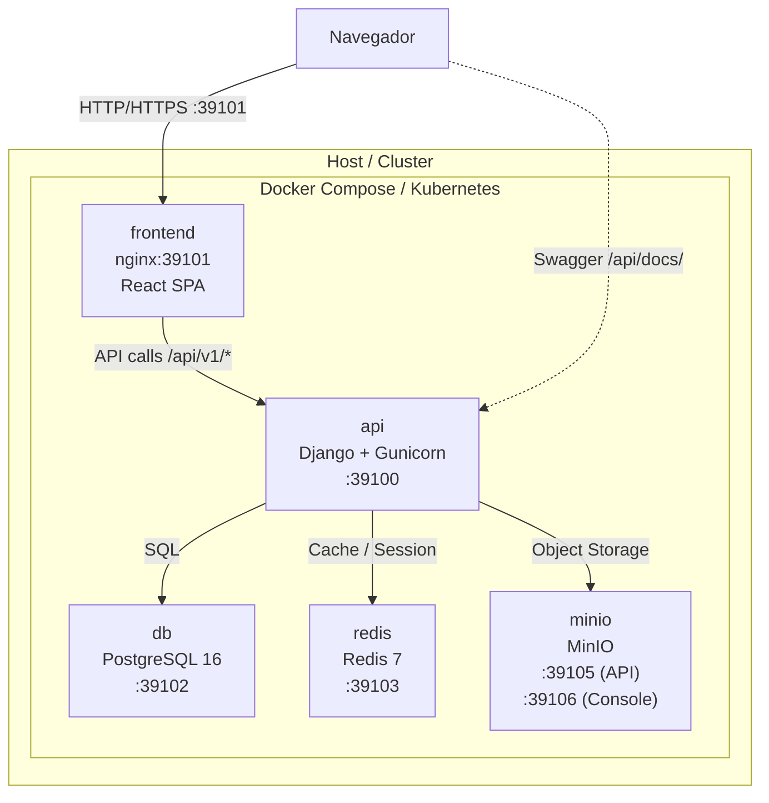

---

## 2. Diagrama de Componentes do Sistema

Visão de alto nível das camadas e responsabilidades.

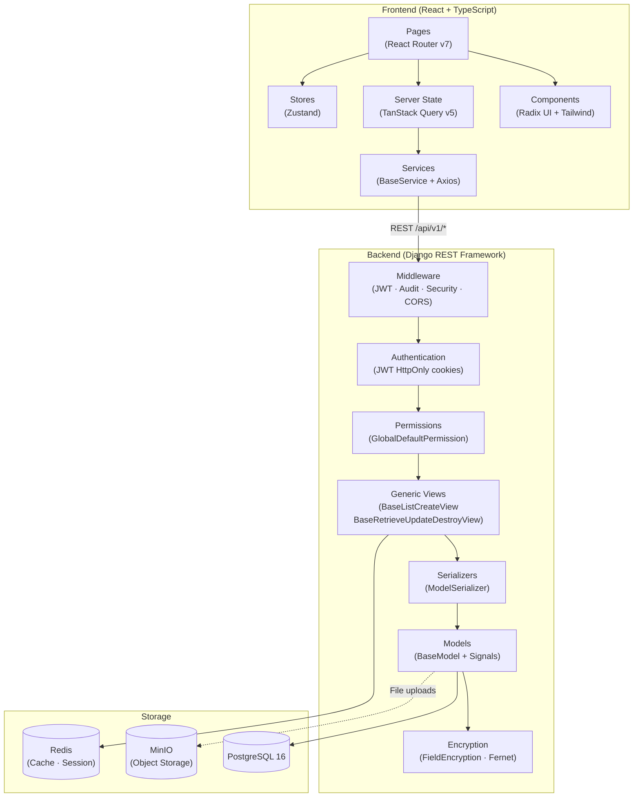

---

## 3. Diagrama de Componentes dos Módulos Backend

Módulos Django e suas dependências internas.

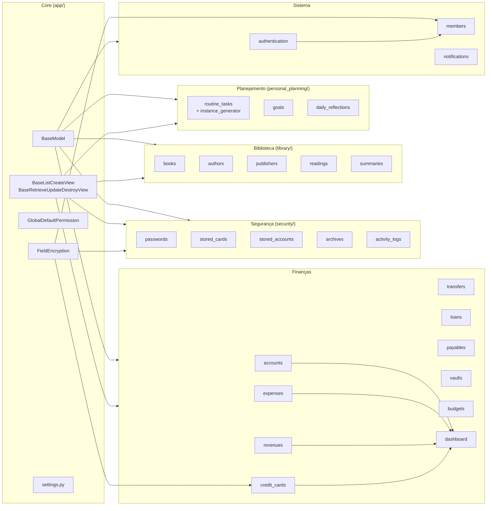

---

## 4. ERD — Módulo Financeiro

Entidades principais do módulo financeiro e seus relacionamentos.

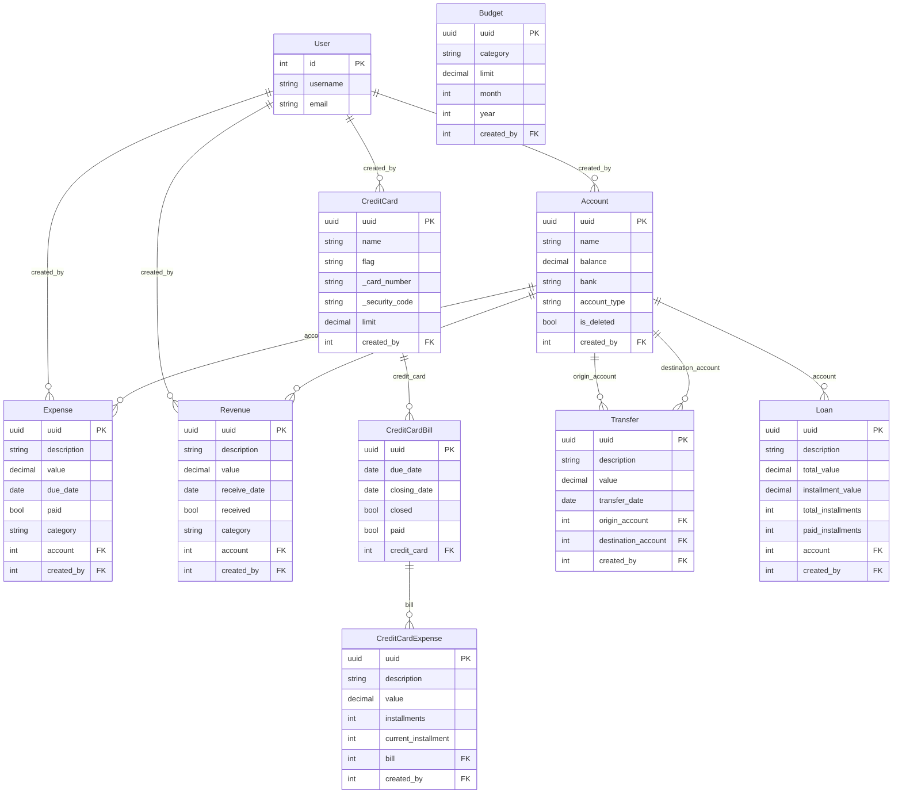

---

## 5. ERD — Módulo Segurança

Entidades do cofre de segurança (dados sensíveis criptografados com Fernet).

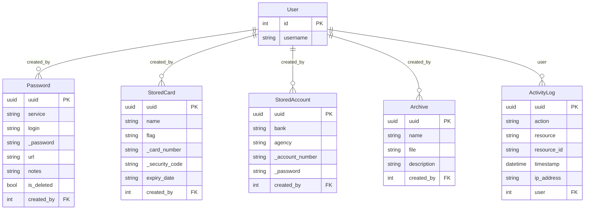

---

## 6. ERD — Módulo Biblioteca e Planejamento

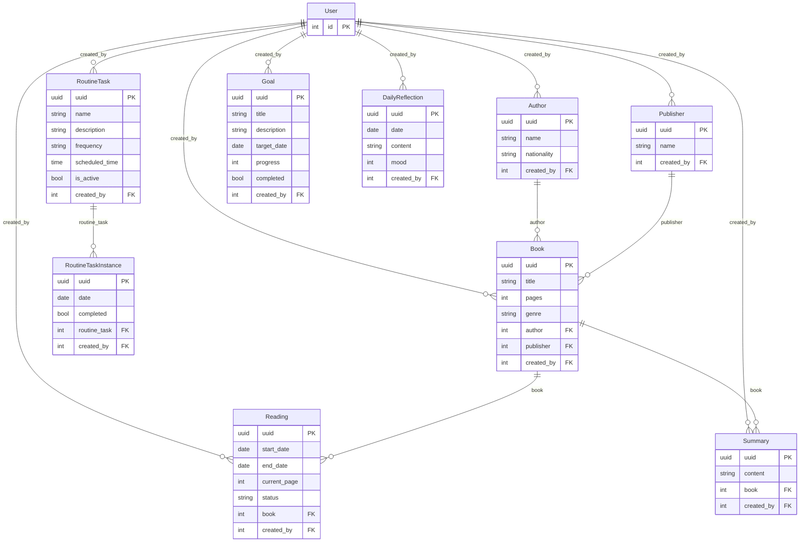

---

## 7. Diagrama de Classes — Camada de Serviços Frontend

Hierarquia de classes de serviço e padrão singleton.

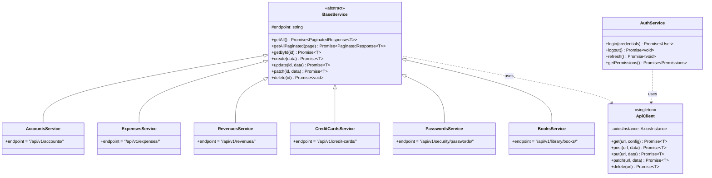

---

## 8. Diagrama de Classes — Camada de Views Backend

Hierarquia de views Django REST Framework.

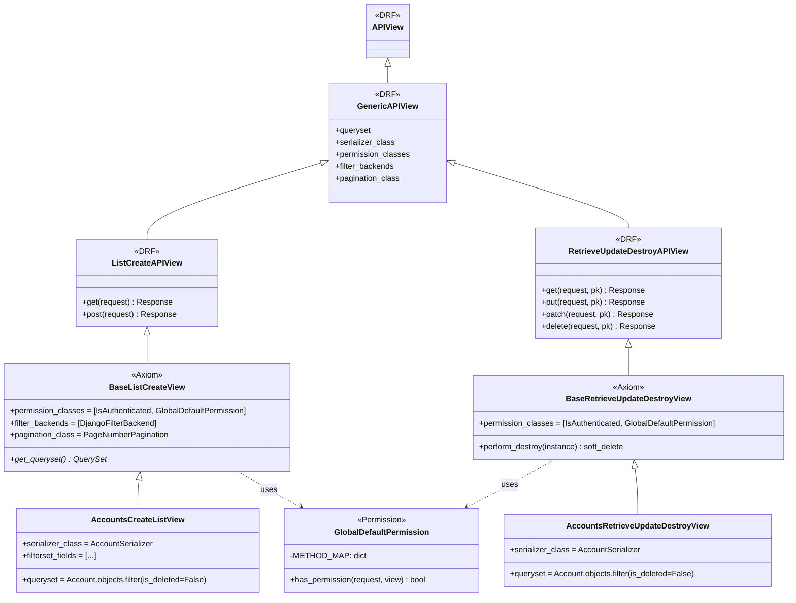

---

## 9. Diagrama de Estado — Autenticação

Estados possíveis da sessão do usuário.

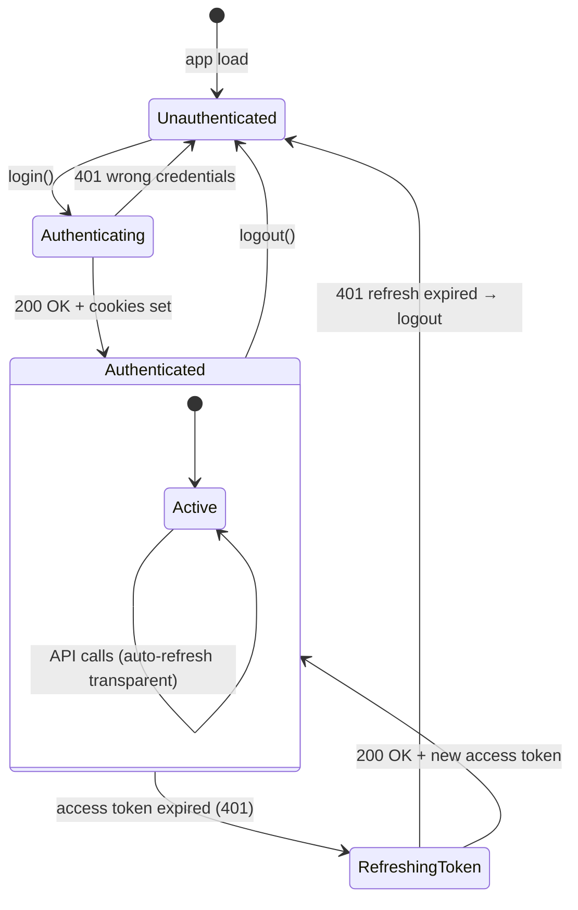

---

## 10. Diagrama de Estado — Cofre (Vault)

Estados do cofre de segurança pessoal.

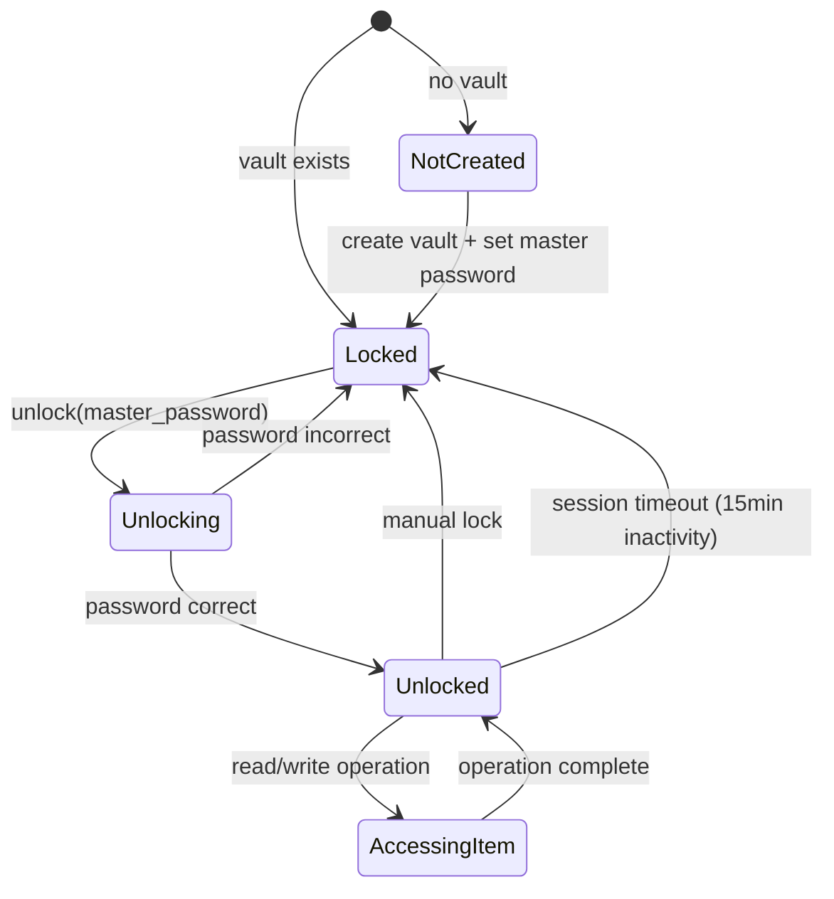

---

---

## 11. Pipeline de Agentes de IA — Componentes

Visão dos componentes do módulo `api/agents/` e suas dependências.

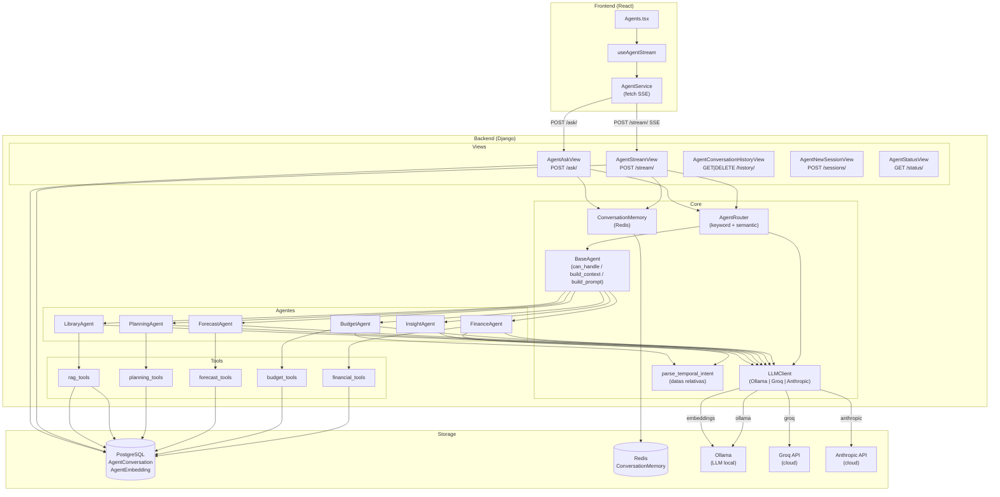

---

## 12. Pipeline de Agentes de IA — Sequência de Streaming

Fluxo detalhado do modo streaming (SSE) desde a digitação do usuário até a resposta completa no frontend.

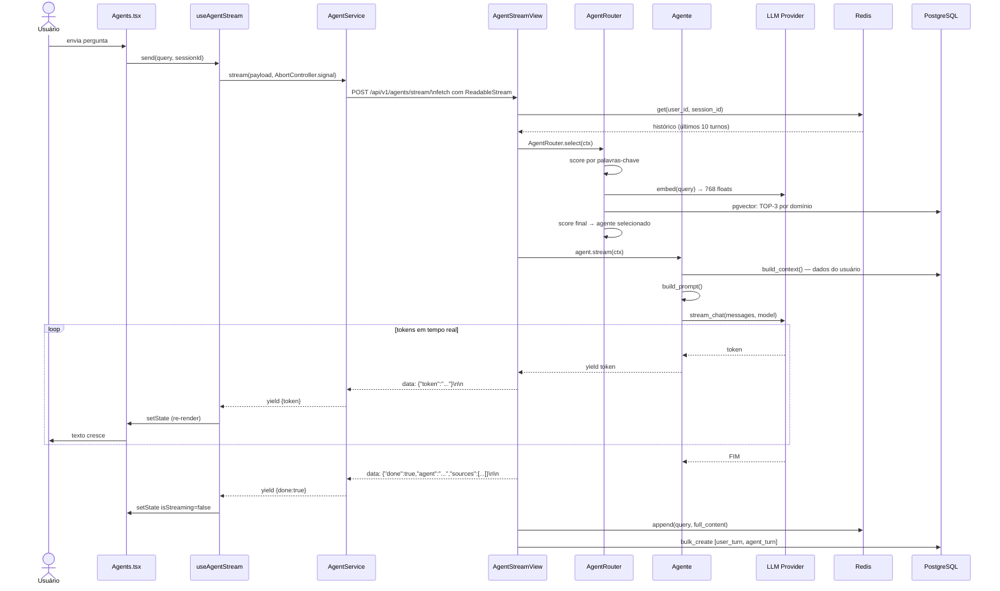

---

## 13. ERD — Módulo Agentes

Modelos de dados do módulo de agentes de IA.

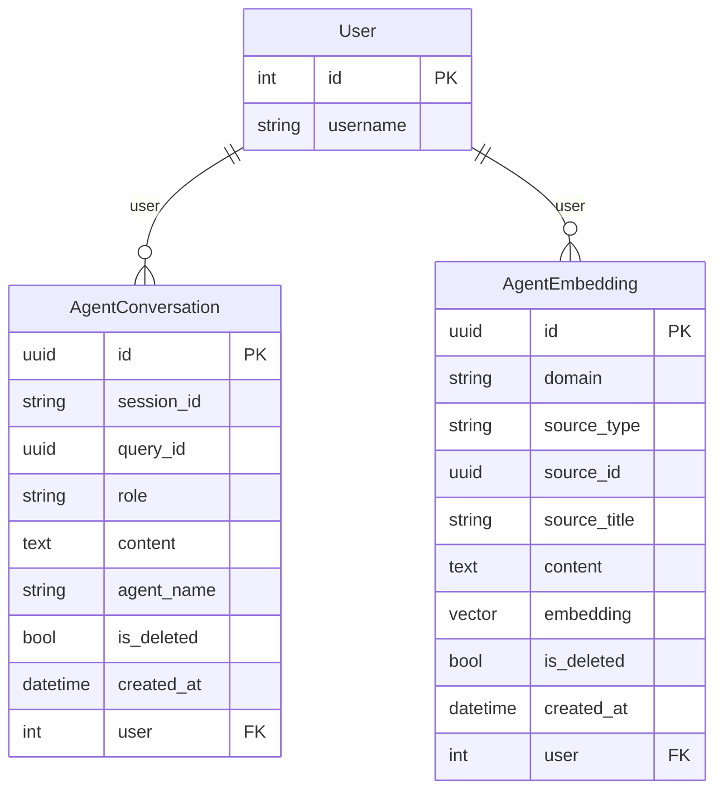

---

[Voltar ao índice de Arquitetura](README.md) · [Voltar ao índice da documentação](../README.md)
