# Diagramas UML

Diagramas em [Mermaid](https://mermaid.js.org/) do Axiom. Renderizados automaticamente no GitLab, GitHub e VS Code (extensão *Markdown Preview Mermaid Support*).

> Auditados e reescritos em 2026-08 contra o estado real do código (`apps/api/*/models.py`). Cobrem todos os apps em `INSTALLED_APPS` (`apps/api/app/settings.py`), incluindo módulos que haviam crescido sem documentação (extensão "Intellect" da biblioteca, gamificação e bem-estar emocional do planejamento pessoal).

## Índice

1. [Diagrama de Implantação (Deployment)](#1-diagrama-de-implantação-deployment)
2. [Diagrama de Componentes do Sistema](#2-diagrama-de-componentes-do-sistema)
3. [Diagrama de Componentes dos Módulos Backend](#3-diagrama-de-componentes-dos-módulos-backend)
4. [ERD — Módulo Financeiro (Core)](#4-erd--módulo-financeiro-core)
5. [ERD — Cartões de Crédito](#5-erd--cartões-de-crédito)
6. [ERD — Automação, Tags e Divisão de Despesas](#6-erd--automação-tags-e-divisão-de-despesas)
7. [ERD — Valores a Pagar/Receber, Cofres e Orçamentos](#7-erd--valores-a-pagarreceber-cofres-e-orçamentos)
8. [ERD — Conciliação Bancária, Planejamento Mensal e Câmbio](#8-erd--conciliação-bancária-planejamento-mensal-e-câmbio)
9. [ERD — Módulo Segurança (Cofre de Senhas)](#9-erd--módulo-segurança-cofre-de-senhas)
10. [ERD — Biblioteca (Core)](#10-erd--biblioteca-core)
11. [ERD — Biblioteca (Extensão Intellect)](#11-erd--biblioteca-extensão-intellect)
12. [ERD — Planejamento Pessoal (Hábitos e Metas)](#12-erd--planejamento-pessoal-hábitos-e-metas)
13. [ERD — Planejamento Pessoal (Gamificação)](#13-erd--planejamento-pessoal-gamificação)
14. [ERD — Planejamento Pessoal (Bem-Estar Emocional)](#14-erd--planejamento-pessoal-bem-estar-emocional)
15. [ERD — Planejamento Pessoal (Treino)](#15-erd--planejamento-pessoal-treino)
16. [ERD — Planejamento Pessoal (Nutrição)](#16-erd--planejamento-pessoal-nutrição)
17. [ERD — Sistema (Notificações, Webhooks, Admin, Auth, Membros)](#17-erd--sistema-notificações-webhooks-admin-auth-membros)
18. [Diagrama de Classes — Camada de Serviços Frontend](#18-diagrama-de-classes--camada-de-serviços-frontend)
19. [Diagrama de Classes — Camada de Views Backend](#19-diagrama-de-classes--camada-de-views-backend)
20. [Diagrama de Estado — Autenticação](#20-diagrama-de-estado--autenticação)
21. [Diagrama de Estado — Cofre (Vault)](#21-diagrama-de-estado--cofre-vault)
22. [Pipeline de Agentes de IA — Componentes](#22-pipeline-de-agentes-de-ia--componentes)
23. [Pipeline de Agentes de IA — Sequência de Streaming](#23-pipeline-de-agentes-de-ia--sequência-de-streaming)
24. [ERD — Módulo Agentes](#24-erd--módulo-agentes)

---

## 1. Diagrama de Implantação (Deployment)

Infraestrutura Docker Compose (desenvolvimento/staging) e Kubernetes (produção).

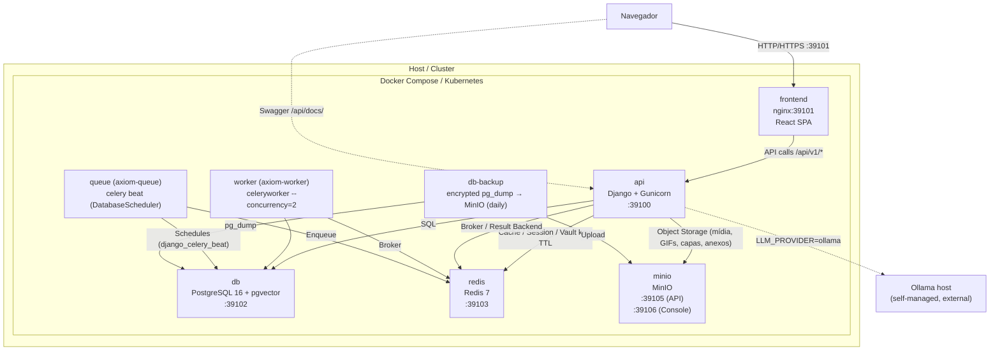
```mermaid
graph TB
    subgraph "Host / Cluster"
        subgraph "Docker Compose / Kubernetes"
            FE["frontend\nnginx:39101\nReact SPA"]
            API["api\nDjango + Gunicorn\n:39100"]
            WORKER["worker (axiom-worker)\nceleryworker --concurrency=2"]
            BEAT["queue (axiom-queue)\ncelery beat (DatabaseScheduler)"]
            DB["db\nPostgreSQL 16 + pgvector\n:39102"]
            REDIS["redis\nRedis 7\n:39103"]
            MINIO["minio\nMinIO\n:39105 (API)\n:39106 (Console)"]
            BACKUP["db-backup\nencrypted pg_dump → MinIO (daily)"]
        end
    end

    OLLAMA["Ollama host\n(self-managed, external)"]

    Browser["Navegador"] -->|"HTTP/HTTPS :39101"| FE
    FE -->|"API calls /api/v1/*"| API
    API -->|"SQL"| DB
    API -->|"Cache / Session / Vault key TTL"| REDIS
    API -->|"Object Storage (mídia, GIFs, capas, anexos)"| MINIO
    API -->|"Broker / Result Backend"| REDIS
    API -.->|"LLM_PROVIDER=ollama"| OLLAMA
    WORKER -->|"Broker"| REDIS
    WORKER --> DB
    BEAT -->|"Schedules (django_celery_beat)"| DB
    BEAT -->|"Enqueue"| REDIS
    BACKUP -->|"pg_dump"| DB
    BACKUP -->|"Upload"| MINIO
    Browser -.->|"Swagger /api/docs/"| API
```

---

## 2. Diagrama de Componentes do Sistema

Visão de alto nível das camadas e responsabilidades.

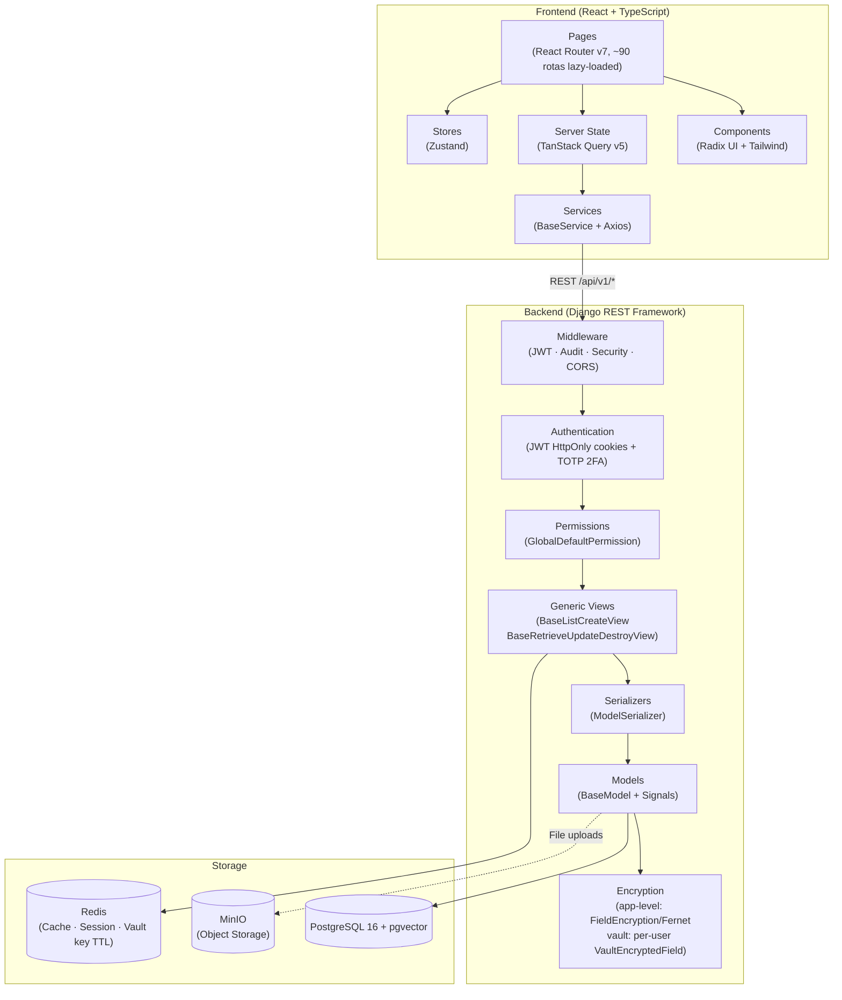
```mermaid
graph TB
    subgraph Frontend["Frontend (React + TypeScript)"]
        Pages["Pages\n(React Router v7, ~90 rotas lazy-loaded)"]
        Components["Components\n(Radix UI + Tailwind)"]
        Stores["Stores\n(Zustand)"]
        TQ["Server State\n(TanStack Query v5)"]
        Services["Services\n(BaseService + Axios)"]
    end

    subgraph Backend["Backend (Django REST Framework)"]
        Middleware["Middleware\n(JWT · Audit · Security · CORS)"]
        Auth["Authentication\n(JWT HttpOnly cookies + TOTP 2FA)"]
        Perms["Permissions\n(GlobalDefaultPermission)"]
        Views["Generic Views\n(BaseListCreateView\nBaseRetrieveUpdateDestroyView)"]
        Serializers["Serializers\n(ModelSerializer)"]
        Models["Models\n(BaseModel + Signals)"]
        Encryption["Encryption\n(app-level: FieldEncryption/Fernet\nvault: per-user VaultEncryptedField)"]
    end

    subgraph Storage["Storage"]
        PG[("PostgreSQL 16 + pgvector")]
        Cache[("Redis\n(Cache · Session · Vault key TTL)")]
        S3[("MinIO\n(Object Storage)")]
    end

    Pages --> Components
    Pages --> TQ
    Pages --> Stores
    TQ --> Services
    Services -->|"REST /api/v1/*"| Middleware

    Middleware --> Auth
    Auth --> Perms
    Perms --> Views
    Views --> Serializers
    Serializers --> Models
    Models --> Encryption
    Models --> PG
    Views --> Cache
    Models -.->|"File uploads"| S3
```

---

## 3. Diagrama de Componentes dos Módulos Backend

Módulos Django e suas dependências internas. **Nota de estrutura**: `library`, `security` e `personal_planning` são apps Django **flat** — um único `models.py`/`views.py`/`serializers.py` por app, agrupado internamente em seções por comentários (`# ====`), e **não** fisicamente divididos em sub-pacotes de diretório como versões anteriores desta documentação afirmavam.

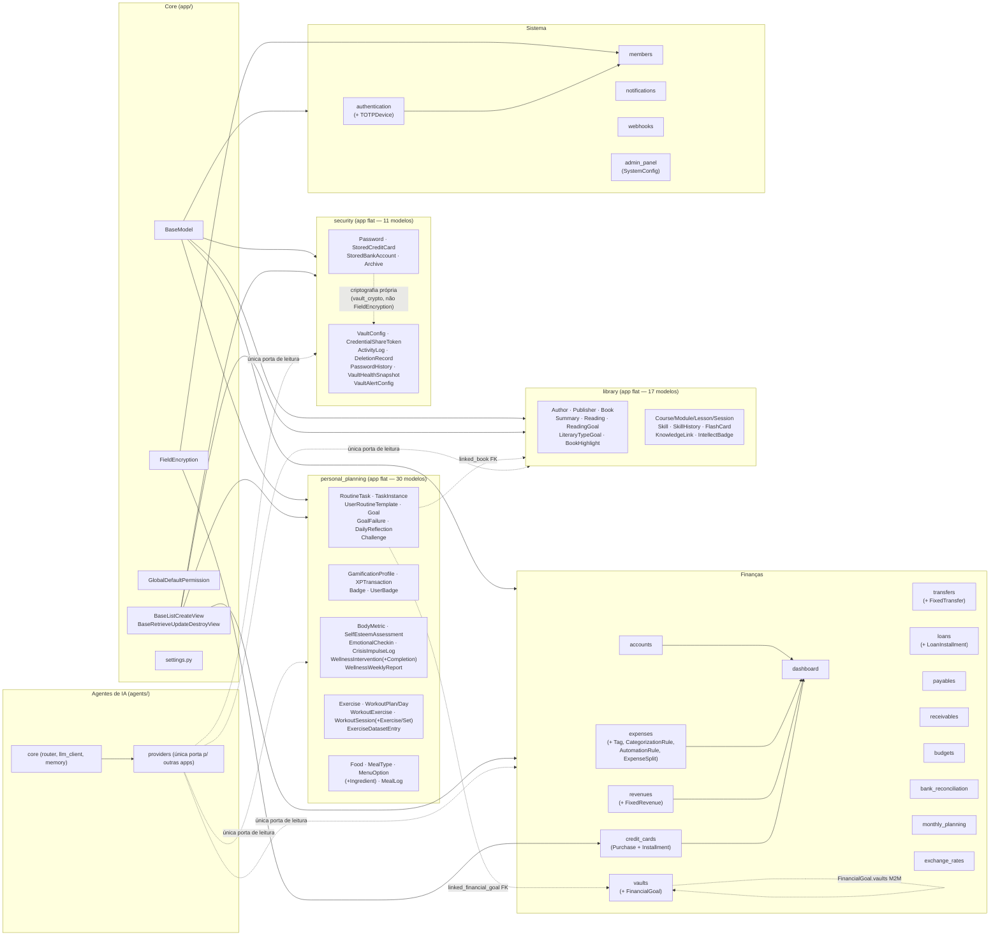
```mermaid
graph LR
    subgraph Core["Core (app/)"]
        BaseModel["BaseModel"]
        BaseViews["BaseListCreateView\nBaseRetrieveUpdateDestroyView"]
        Perms["GlobalDefaultPermission"]
        Enc["FieldEncryption"]
        Settings["settings.py"]
    end

    subgraph Finance["Finanças"]
        Accounts["accounts"]
        Expenses["expenses\n(+ Tag, CategorizationRule,\nAutomationRule, ExpenseSplit)"]
        Revenues["revenues\n(+ FixedRevenue)"]
        CreditCards["credit_cards\n(Purchase + Installment)"]
        Transfers["transfers\n(+ FixedTransfer)"]
        Loans["loans\n(+ LoanInstallment)"]
        Payables["payables"]
        Receivables["receivables"]
        Vaults["vaults\n(+ FinancialGoal)"]
        Budgets["budgets"]
        BankReconciliation["bank_reconciliation"]
        MonthlyPlanning["monthly_planning"]
        ExchangeRates["exchange_rates"]
        Dashboard["dashboard"]
    end

    subgraph Security["security (app flat — 11 modelos)"]
        SecCore["Password · StoredCreditCard\nStoredBankAccount · Archive"]
        SecOps["VaultConfig · CredentialShareToken\nActivityLog · DeletionRecord\nPasswordHistory · VaultHealthSnapshot\nVaultAlertConfig"]
    end

    subgraph Library["library (app flat — 17 modelos)"]
        LibCore["Author · Publisher · Book\nSummary · Reading · ReadingGoal\nLiteraryTypeGoal · BookHighlight"]
        LibIntellect["Course/Module/Lesson/Session\nSkill · SkillHistory · FlashCard\nKnowledgeLink · IntellectBadge"]
    end

    subgraph Planning["personal_planning (app flat — 30 modelos)"]
        RoutineTasks["RoutineTask · TaskInstance\nUserRoutineTemplate · Goal\nGoalFailure · DailyReflection\nChallenge"]
        Gamification["GamificationProfile · XPTransaction\nBadge · UserBadge"]
        Wellness["BodyMetric · SelfEsteemAssessment\nEmotionalCheckin · CrisisImpulseLog\nWellnessIntervention(+Completion)\nWellnessWeeklyReport"]
        Workout["Exercise · WorkoutPlan/Day\nWorkoutExercise · WorkoutSession(+Exercise/Set)\nExerciseDatasetEntry"]
        Nutrition["Food · MealType · MenuOption\n(+Ingredient) · MealLog"]
    end

    subgraph System["Sistema"]
        Authentication["authentication\n(+ TOTPDevice)"]
        Members["members"]
        Notifications["notifications"]
        Webhooks["webhooks"]
        AdminPanel["admin_panel\n(SystemConfig)"]
    end

    subgraph Agents["Agentes de IA (agents/)"]
        AgentsCore["core (router, llm_client, memory)"]
        AgentsProviders["providers (única porta p/ outras apps)"]
    end

    BaseModel --> Finance
    BaseModel --> Security
    BaseModel --> Library
    BaseModel --> Planning
    BaseModel --> System

    BaseViews --> Finance
    BaseViews --> Security
    BaseViews --> Library
    BaseViews --> Planning

    Enc --> CreditCards
    Enc --> Members
    SecCore -.->|"criptografia própria\n(vault_crypto, não FieldEncryption)"| SecOps

    Accounts --> Dashboard
    Expenses --> Dashboard
    Revenues --> Dashboard
    CreditCards --> Dashboard
    Vaults -.->|"FinancialGoal.vaults M2M"| Vaults

    Authentication --> Members
    RoutineTasks -.->|"linked_financial_goal FK"| Vaults
    RoutineTasks -.->|"linked_book FK"| Library

    AgentsProviders -.->|"única porta de leitura"| Finance
    AgentsProviders -.->|"única porta de leitura"| Security
    AgentsProviders -.->|"única porta de leitura"| Library
    AgentsProviders -.->|"única porta de leitura"| Planning
    AgentsCore --> AgentsProviders
```

---

## 4. ERD — Módulo Financeiro (Core)

Entidades principais do módulo financeiro. **Correção importante**: o dono de todo registro financeiro é `owner: ForeignKey(Member)` — não uma FK direta a `User`. `Member` é o modelo unificado de "pessoa" (opcionalmente vinculado 1:1 a um `User` do Django para permitir login); `created_by`/`updated_by`/`deleted_by` (herdados de `BaseModel`) continuam apontando para `User` e servem apenas para auditoria de quem operou a API, não para "quem é o dono do dado".

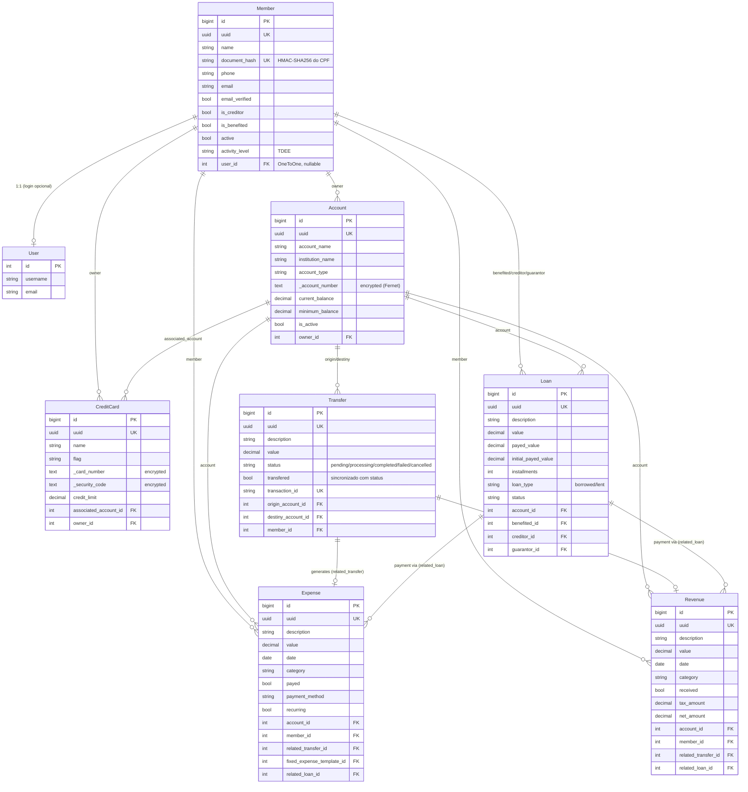
```mermaid
erDiagram
    User {
        int id PK
        string username
        string email
    }

    Member {
        bigint id PK
        uuid uuid UK
        string name
        string document_hash UK "HMAC-SHA256 do CPF"
        string phone
        string email
        bool email_verified
        bool is_creditor
        bool is_benefited
        bool active
        string activity_level "TDEE"
        int user_id FK "OneToOne, nullable"
    }

    Account {
        bigint id PK
        uuid uuid UK
        string account_name
        string institution_name
        string account_type
        text _account_number "encrypted (Fernet)"
        decimal current_balance
        decimal minimum_balance
        bool is_active
        int owner_id FK
    }

    Expense {
        bigint id PK
        uuid uuid UK
        string description
        decimal value
        date date
        string category
        bool payed
        string payment_method
        bool recurring
        int account_id FK
        int member_id FK
        int related_transfer_id FK
        int fixed_expense_template_id FK
        int related_loan_id FK
    }

    Revenue {
        bigint id PK
        uuid uuid UK
        string description
        decimal value
        date date
        string category
        bool received
        decimal tax_amount
        decimal net_amount
        int account_id FK
        int member_id FK
        int related_transfer_id FK
        int related_loan_id FK
    }

    CreditCard {
        bigint id PK
        uuid uuid UK
        string name
        string flag
        text _card_number "encrypted"
        text _security_code "encrypted"
        decimal credit_limit
        int associated_account_id FK
        int owner_id FK
    }

    Transfer {
        bigint id PK
        uuid uuid UK
        string description
        decimal value
        string status "pending/processing/completed/failed/cancelled"
        bool transfered "sincronizado com status"
        string transaction_id UK
        int origin_account_id FK
        int destiny_account_id FK
        int member_id FK
    }

    Loan {
        bigint id PK
        uuid uuid UK
        string description
        decimal value
        decimal payed_value
        decimal initial_payed_value
        int installments
        string loan_type "borrowed/lent"
        string status
        int account_id FK
        int benefited_id FK
        int creditor_id FK
        int guarantor_id FK
    }

    Member ||--o| User : "1:1 (login opcional)"
    Member ||--o{ Account : owner
    Member ||--o{ CreditCard : owner
    Member ||--o{ Expense : member
    Member ||--o{ Revenue : member
    Member ||--o{ Loan : "benefited/creditor/guarantor"

    Account ||--o{ Expense : "account"
    Account ||--o{ Revenue : "account"
    Account ||--o{ Loan : "account"
    Account ||--o{ Transfer : "origin/destiny"
    Account ||--o{ CreditCard : "associated_account"

    Transfer ||--o| Expense : "generates (related_transfer)"
    Transfer ||--o| Revenue : "generates (related_transfer)"
    Loan ||--o{ Expense : "payment via (related_loan)"
    Loan ||--o{ Revenue : "payment via (related_loan)"
```

---

## 5. ERD — Cartões de Crédito

**Correção**: o antigo modelo único `CreditCardExpense` foi substituído por `CreditCardPurchase` (a compra) + `CreditCardInstallment` (cada parcela dela), análogo ao padrão de `Payable`/`PayableInstallment`.

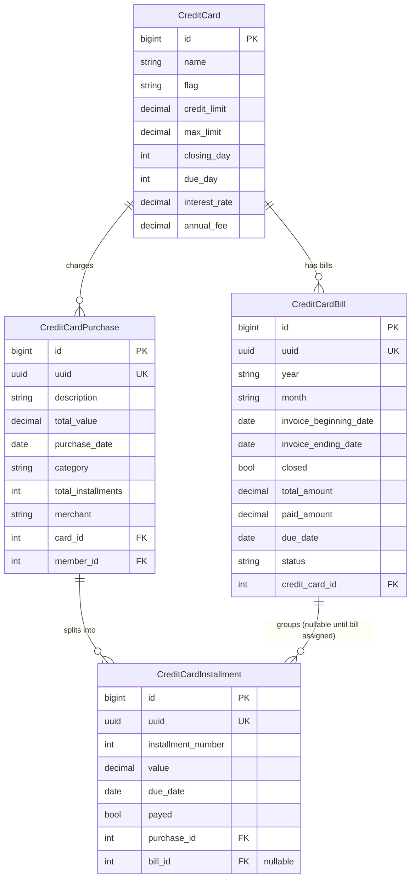
```mermaid
erDiagram
    CreditCard {
        bigint id PK
        string name
        string flag
        decimal credit_limit
        decimal max_limit
        int closing_day
        int due_day
        decimal interest_rate
        decimal annual_fee
    }

    CreditCardBill {
        bigint id PK
        uuid uuid UK
        string year
        string month
        date invoice_beginning_date
        date invoice_ending_date
        bool closed
        decimal total_amount
        decimal paid_amount
        date due_date
        string status
        int credit_card_id FK
    }

    CreditCardPurchase {
        bigint id PK
        uuid uuid UK
        string description
        decimal total_value
        date purchase_date
        string category
        int total_installments
        string merchant
        int card_id FK
        int member_id FK
    }

    CreditCardInstallment {
        bigint id PK
        uuid uuid UK
        int installment_number
        decimal value
        date due_date
        bool payed
        int purchase_id FK
        int bill_id FK "nullable"
    }

    CreditCard ||--o{ CreditCardBill : "has bills"
    CreditCard ||--o{ CreditCardPurchase : "charges"
    CreditCardPurchase ||--o{ CreditCardInstallment : "splits into"
    CreditCardBill ||--o{ CreditCardInstallment : "groups (nullable until bill assigned)"
```

---

## 6. ERD — Automação, Tags e Divisão de Despesas

Extensões do app `expenses` sem paralelo em `revenues`. **Nota**: `Tag`, `CategorizationRule` e `AutomationRule` usam `owner: ForeignKey(User)` diretamente (não `Member`) — inconsistente com o restante do domínio financeiro, que sempre usa `Member`.

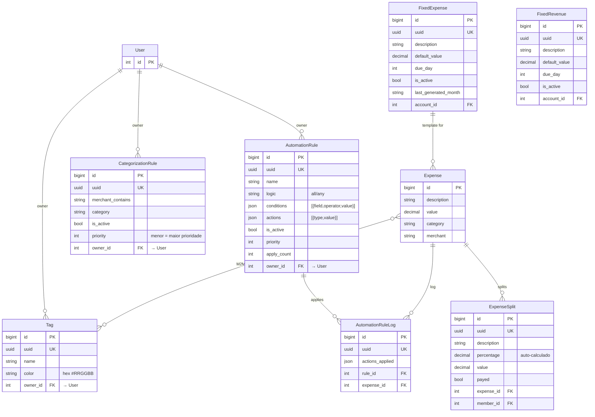
```mermaid
erDiagram
    User {
        int id PK
    }

    Expense {
        bigint id PK
        string description
        decimal value
        string category
        string merchant
    }

    Tag {
        bigint id PK
        uuid uuid UK
        string name
        string color "hex #RRGGBB"
        int owner_id FK "→ User"
    }

    CategorizationRule {
        bigint id PK
        uuid uuid UK
        string merchant_contains
        string category
        bool is_active
        int priority "menor = maior prioridade"
        int owner_id FK "→ User"
    }

    AutomationRule {
        bigint id PK
        uuid uuid UK
        string name
        string logic "all/any"
        json conditions "[{field,operator,value}]"
        json actions "[{type,value}]"
        bool is_active
        int priority
        int apply_count
        int owner_id FK "→ User"
    }

    AutomationRuleLog {
        bigint id PK
        uuid uuid UK
        json actions_applied
        int rule_id FK
        int expense_id FK
    }

    ExpenseSplit {
        bigint id PK
        uuid uuid UK
        string description
        decimal percentage "auto-calculado"
        decimal value
        bool payed
        int expense_id FK
        int member_id FK
    }

    FixedExpense {
        bigint id PK
        uuid uuid UK
        string description
        decimal default_value
        int due_day
        bool is_active
        string last_generated_month
        int account_id FK
    }

    FixedRevenue {
        bigint id PK
        uuid uuid UK
        string description
        decimal default_value
        int due_day
        bool is_active
        int account_id FK
    }

    Expense }o--o{ Tag : "M2M tags"
    Expense ||--o{ ExpenseSplit : "splits"
    Expense ||--o{ AutomationRuleLog : "log"
    AutomationRule ||--o{ AutomationRuleLog : "applies"
    User ||--o{ Tag : owner
    User ||--o{ CategorizationRule : owner
    User ||--o{ AutomationRule : owner
    FixedExpense ||--o{ Expense : "template for"
```

---

## 7. ERD — Valores a Pagar/Receber, Cofres e Orçamentos

`Payable`/`Receivable` são espelhos simétricos (dívidas/créditos avulsos que não são empréstimo). `Vault` é uma reserva com rendimento composto diário; `FinancialGoal` agrega N cofres via M2M para acompanhar uma meta de valor.

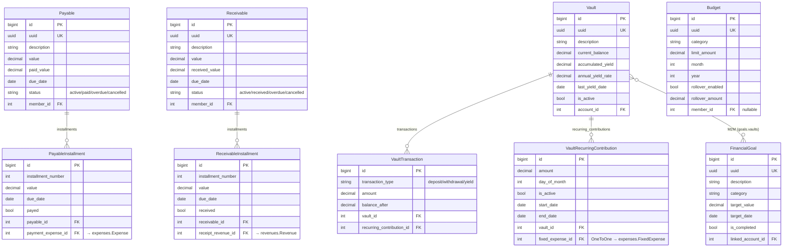
```mermaid
erDiagram
    Payable {
        bigint id PK
        uuid uuid UK
        string description
        decimal value
        decimal paid_value
        date due_date
        string status "active/paid/overdue/cancelled"
        int member_id FK
    }

    PayableInstallment {
        bigint id PK
        int installment_number
        decimal value
        date due_date
        bool payed
        int payable_id FK
        int payment_expense_id FK "→ expenses.Expense"
    }

    Receivable {
        bigint id PK
        uuid uuid UK
        string description
        decimal value
        decimal received_value
        date due_date
        string status "active/received/overdue/cancelled"
        int member_id FK
    }

    ReceivableInstallment {
        bigint id PK
        int installment_number
        decimal value
        date due_date
        bool received
        int receivable_id FK
        int receipt_revenue_id FK "→ revenues.Revenue"
    }

    Vault {
        bigint id PK
        uuid uuid UK
        string description
        decimal current_balance
        decimal accumulated_yield
        decimal annual_yield_rate
        date last_yield_date
        bool is_active
        int account_id FK
    }

    VaultTransaction {
        bigint id PK
        string transaction_type "deposit/withdrawal/yield"
        decimal amount
        decimal balance_after
        int vault_id FK
        int recurring_contribution_id FK
    }

    VaultRecurringContribution {
        bigint id PK
        decimal amount
        int day_of_month
        bool is_active
        date start_date
        date end_date
        int vault_id FK
        int fixed_expense_id FK "OneToOne → expenses.FixedExpense"
    }

    FinancialGoal {
        bigint id PK
        uuid uuid UK
        string description
        string category
        decimal target_value
        date target_date
        bool is_completed
        int linked_account_id FK
    }

    Budget {
        bigint id PK
        uuid uuid UK
        string category
        decimal limit_amount
        int month
        int year
        bool rollover_enabled
        decimal rollover_amount
        int member_id FK "nullable"
    }

    Payable ||--o{ PayableInstallment : "installments"
    Receivable ||--o{ ReceivableInstallment : "installments"
    Vault ||--o{ VaultTransaction : "transactions"
    Vault ||--o{ VaultRecurringContribution : "recurring_contributions"
    Vault }o--o{ FinancialGoal : "M2M (goals.vaults)"
```

---

## 8. ERD — Conciliação Bancária, Planejamento Mensal e Câmbio

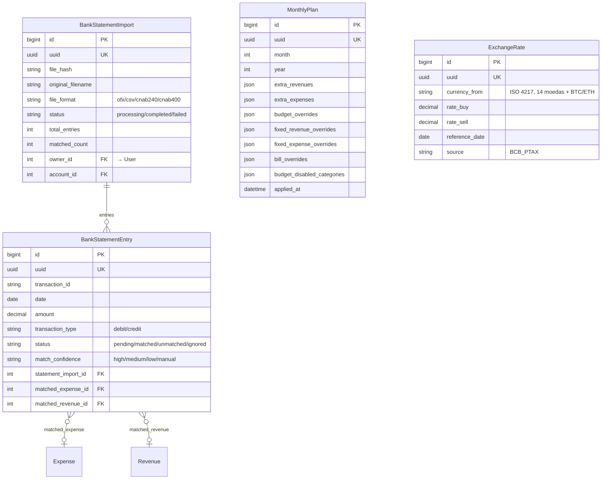
```mermaid
erDiagram
    BankStatementImport {
        bigint id PK
        uuid uuid UK
        string file_hash
        string original_filename
        string file_format "ofx/csv/cnab240/cnab400"
        string status "processing/completed/failed"
        int total_entries
        int matched_count
        int owner_id FK "→ User"
        int account_id FK
    }

    BankStatementEntry {
        bigint id PK
        uuid uuid UK
        string transaction_id
        date date
        decimal amount
        string transaction_type "debit/credit"
        string status "pending/matched/unmatched/ignored"
        string match_confidence "high/medium/low/manual"
        int statement_import_id FK
        int matched_expense_id FK
        int matched_revenue_id FK
    }

    MonthlyPlan {
        bigint id PK
        uuid uuid UK
        int month
        int year
        json extra_revenues
        json extra_expenses
        json budget_overrides
        json fixed_revenue_overrides
        json fixed_expense_overrides
        json bill_overrides
        json budget_disabled_categories
        datetime applied_at
    }

    ExchangeRate {
        bigint id PK
        uuid uuid UK
        string currency_from "ISO 4217, 14 moedas + BTC/ETH"
        decimal rate_buy
        decimal rate_sell
        date reference_date
        string source "BCB_PTAX"
    }

    BankStatementImport ||--o{ BankStatementEntry : "entries"
    BankStatementEntry }o--o| Expense : "matched_expense"
    BankStatementEntry }o--o| Revenue : "matched_revenue"
```

---

## 9. ERD — Módulo Segurança (Cofre de Senhas)

**Correção importante de arquitetura de criptografia**: diferente do restante do sistema (que usa `FieldEncryption`/Fernet com a `ENCRYPTION_KEY` global do `.env`), os campos sensíveis do módulo `security` usam `VaultEncryptedField`/`VaultMaskedEncryptedField` (`security/vault_crypto.py`) — uma chave **por usuário** (`VaultConfig.encrypted_vault_key`), derivada da senha mestre via PBKDF2, mantida em texto plano apenas no Redis com TTL de sessão (padrão 60 min, configurável 15–240 min por `VaultConfig.session_ttl_minutes`). Perder a senha mestre e a `recovery_key` torna os dados do cofre irrecuperáveis — não há "chave mestra" de admin.

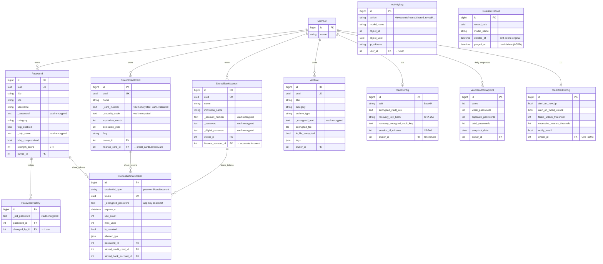
```mermaid
erDiagram
    Member {
        bigint id PK
        string name
    }

    Password {
        bigint id PK
        uuid uuid UK
        string title
        string site
        string username
        text _password "vault-encrypted"
        string category
        bool totp_enabled
        text _totp_secret "vault-encrypted"
        bool hibp_compromised
        int strength_score "0-4"
        int owner_id FK
    }

    PasswordHistory {
        bigint id PK
        text _old_password "vault-encrypted"
        int password_id FK
        int changed_by_id FK "→ User"
    }

    StoredCreditCard {
        bigint id PK
        uuid uuid UK
        string name
        text _card_number "vault-encrypted, Luhn-validated"
        text _security_code "vault-encrypted"
        int expiration_month
        int expiration_year
        string flag
        int owner_id FK
        int finance_card_id FK "→ credit_cards.CreditCard"
    }

    StoredBankAccount {
        bigint id PK
        uuid uuid UK
        string name
        string institution_name
        text _account_number "vault-encrypted"
        text _password "vault-encrypted"
        text _digital_password "vault-encrypted"
        int owner_id FK
        int finance_account_id FK "→ accounts.Account"
    }

    Archive {
        bigint id PK
        uuid uuid UK
        string title
        string category
        string archive_type
        text _encrypted_text "vault-encrypted"
        file encrypted_file
        bool is_file_encrypted
        json tags
        int owner_id FK
    }

    VaultConfig {
        bigint id PK
        string salt "base64"
        text encrypted_vault_key
        string recovery_key_hash "SHA-256"
        text recovery_encrypted_vault_key
        int session_ttl_minutes "15-240"
        int owner_id FK "OneToOne"
    }

    CredentialShareToken {
        bigint id PK
        string credential_type "password/card/account"
        uuid token UK
        text _encrypted_password "app-key snapshot"
        datetime expires_at
        int use_count
        int max_uses
        bool is_revoked
        json allowed_ips
        int password_id FK
        int stored_credit_card_id FK
        int stored_bank_account_id FK
    }

    ActivityLog {
        bigint id PK
        string action "view/create/reveal/shared_reveal/..."
        string model_name
        int object_id
        uuid object_uuid
        string ip_address
        int user_id FK "→ User"
    }

    DeletionRecord {
        bigint id PK
        uuid record_uuid
        string model_name
        datetime deleted_at "soft-delete original"
        datetime purged_at "hard-delete (LGPD)"
    }

    VaultHealthSnapshot {
        bigint id PK
        int score
        int weak_passwords
        int duplicate_passwords
        int total_passwords
        date snapshot_date
        int owner_id FK
    }

    VaultAlertConfig {
        bigint id PK
        bool alert_on_new_ip
        bool alert_on_failed_unlock
        int failed_unlock_threshold
        int excessive_reveals_threshold
        bool notify_email
        int owner_id FK "OneToOne"
    }

    Member ||--o{ Password : owns
    Member ||--o{ StoredCreditCard : owns
    Member ||--o{ StoredBankAccount : owns
    Member ||--o{ Archive : owns
    Member ||--o| VaultConfig : "1:1"
    Member ||--o| VaultAlertConfig : "1:1"
    Member ||--o{ VaultHealthSnapshot : "daily snapshots"
    Password ||--o{ PasswordHistory : "history"
    Password ||--o{ CredentialShareToken : "share_tokens"
    StoredCreditCard ||--o{ CredentialShareToken : "share_tokens"
    StoredBankAccount ||--o{ CredentialShareToken : "share_tokens"
```

---

## 10. ERD — Biblioteca (Core)

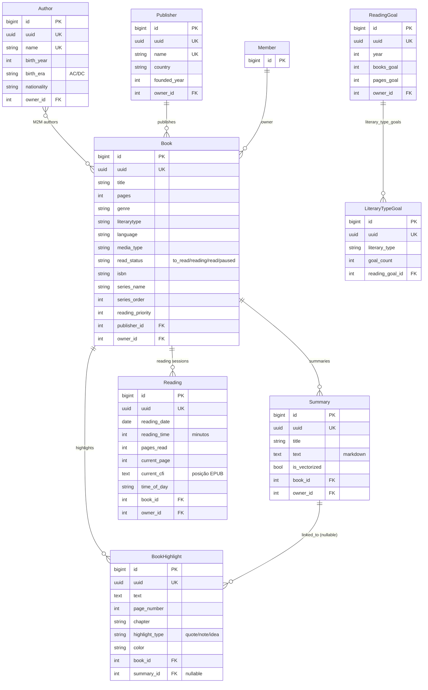
```mermaid
erDiagram
    Member {
        bigint id PK
    }

    Author {
        bigint id PK
        uuid uuid UK
        string name UK
        int birth_year
        string birth_era "AC/DC"
        string nationality
        int owner_id FK
    }

    Publisher {
        bigint id PK
        uuid uuid UK
        string name UK
        string country
        int founded_year
        int owner_id FK
    }

    Book {
        bigint id PK
        uuid uuid UK
        string title
        int pages
        string genre
        string literarytype
        string language
        string media_type
        string read_status "to_read/reading/read/paused"
        string isbn
        string series_name
        int series_order
        int reading_priority
        int publisher_id FK
        int owner_id FK
    }

    Summary {
        bigint id PK
        uuid uuid UK
        string title
        text text "markdown"
        bool is_vectorized
        int book_id FK
        int owner_id FK
    }

    Reading {
        bigint id PK
        uuid uuid UK
        date reading_date
        int reading_time "minutos"
        int pages_read
        int current_page
        text current_cfi "posição EPUB"
        string time_of_day
        int book_id FK
        int owner_id FK
    }

    ReadingGoal {
        bigint id PK
        uuid uuid UK
        int year
        int books_goal
        int pages_goal
        int owner_id FK
    }

    LiteraryTypeGoal {
        bigint id PK
        uuid uuid UK
        string literary_type
        int goal_count
        int reading_goal_id FK
    }

    BookHighlight {
        bigint id PK
        uuid uuid UK
        text text
        int page_number
        string chapter
        string highlight_type "quote/note/idea"
        string color
        int book_id FK
        int summary_id FK "nullable"
    }

    Author }o--o{ Book : "M2M authors"
    Publisher ||--o{ Book : "publishes"
    Book ||--o{ Summary : "summaries"
    Book ||--o{ Reading : "reading sessions"
    Book ||--o{ BookHighlight : "highlights"
    Summary ||--o{ BookHighlight : "linked_to (nullable)"
    ReadingGoal ||--o{ LiteraryTypeGoal : "literary_type_goals"
    Member ||--o{ Book : owner
```

---

## 11. ERD — Biblioteca (Extensão Intellect)

Cursos, habilidades, flashcards e grafo de conhecimento — tudo no mesmo app `library`, sem sub-pacote próprio. Não existe modelo de "nó" do grafo: os nós são montados dinamicamente pela view a partir de `Author`/`Book`/`Summary`/`BookHighlight`/`Course`/`Skill`; só as arestas explícitas (`KnowledgeLink`) são persistidas — arestas implícitas (autoria, resumo, highlight) são derivadas em tempo de leitura.

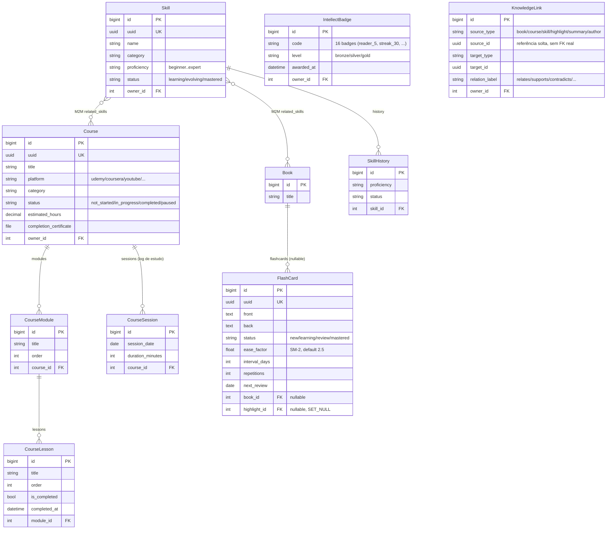
```mermaid
erDiagram
    Book {
        bigint id PK
        string title
    }

    Course {
        bigint id PK
        uuid uuid UK
        string title
        string platform "udemy/coursera/youtube/..."
        string category
        string status "not_started/in_progress/completed/paused"
        decimal estimated_hours
        file completion_certificate
        int owner_id FK
    }

    CourseModule {
        bigint id PK
        string title
        int order
        int course_id FK
    }

    CourseLesson {
        bigint id PK
        string title
        int order
        bool is_completed
        datetime completed_at
        int module_id FK
    }

    CourseSession {
        bigint id PK
        date session_date
        int duration_minutes
        int course_id FK
    }

    Skill {
        bigint id PK
        uuid uuid UK
        string name
        string category
        string proficiency "beginner..expert"
        string status "learning/evolving/mastered"
        int owner_id FK
    }

    SkillHistory {
        bigint id PK
        string proficiency
        string status
        int skill_id FK
    }

    IntellectBadge {
        bigint id PK
        string code "16 badges (reader_5, streak_30, ...)"
        string level "bronze/silver/gold"
        datetime awarded_at
        int owner_id FK
    }

    FlashCard {
        bigint id PK
        uuid uuid UK
        text front
        text back
        string status "new/learning/review/mastered"
        float ease_factor "SM-2, default 2.5"
        int interval_days
        int repetitions
        date next_review
        int book_id FK "nullable"
        int highlight_id FK "nullable, SET_NULL"
    }

    KnowledgeLink {
        bigint id PK
        string source_type "book/course/skill/highlight/summary/author"
        uuid source_id "referência solta, sem FK real"
        string target_type
        uuid target_id
        string relation_label "relates/supports/contradicts/..."
        int owner_id FK
    }

    Course ||--o{ CourseModule : "modules"
    CourseModule ||--o{ CourseLesson : "lessons"
    Course ||--o{ CourseSession : "sessions (log de estudo)"
    Skill ||--o{ SkillHistory : "history"
    Skill }o--o{ Book : "M2M related_skills"
    Skill }o--o{ Course : "M2M related_skills"
    Book ||--o{ FlashCard : "flashcards (nullable)"
```

---

## 12. ERD — Planejamento Pessoal (Hábitos e Metas)

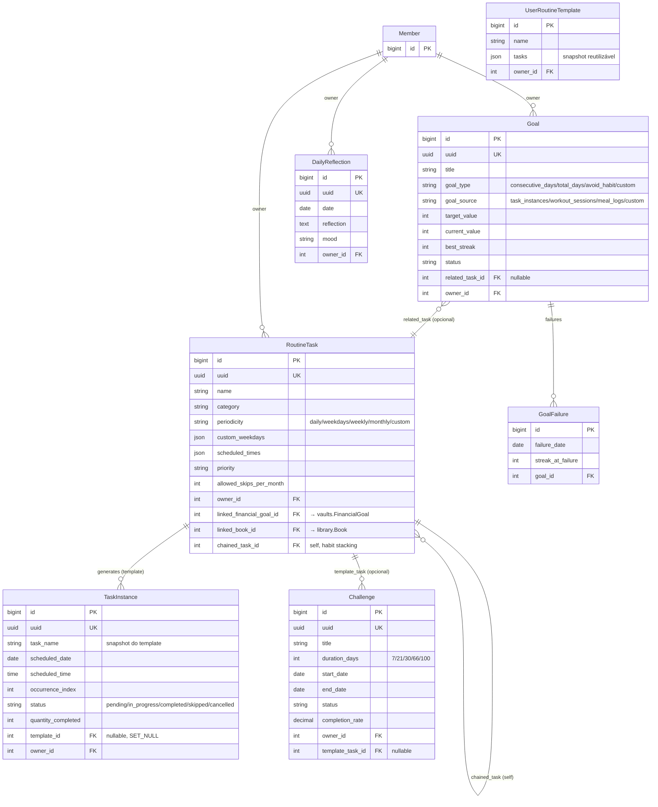
```mermaid
erDiagram
    Member {
        bigint id PK
    }

    RoutineTask {
        bigint id PK
        uuid uuid UK
        string name
        string category
        string periodicity "daily/weekdays/weekly/monthly/custom"
        json custom_weekdays
        json scheduled_times
        string priority
        int allowed_skips_per_month
        int owner_id FK
        int linked_financial_goal_id FK "→ vaults.FinancialGoal"
        int linked_book_id FK "→ library.Book"
        int chained_task_id FK "self, habit stacking"
    }

    UserRoutineTemplate {
        bigint id PK
        string name
        json tasks "snapshot reutilizável"
        int owner_id FK
    }

    TaskInstance {
        bigint id PK
        uuid uuid UK
        string task_name "snapshot do template"
        date scheduled_date
        time scheduled_time
        int occurrence_index
        string status "pending/in_progress/completed/skipped/cancelled"
        int quantity_completed
        int template_id FK "nullable, SET_NULL"
        int owner_id FK
    }

    Goal {
        bigint id PK
        uuid uuid UK
        string title
        string goal_type "consecutive_days/total_days/avoid_habit/custom"
        string goal_source "task_instances/workout_sessions/meal_logs/custom"
        int target_value
        int current_value
        int best_streak
        string status
        int related_task_id FK "nullable"
        int owner_id FK
    }

    GoalFailure {
        bigint id PK
        date failure_date
        int streak_at_failure
        int goal_id FK
    }

    Challenge {
        bigint id PK
        uuid uuid UK
        string title
        int duration_days "7/21/30/66/100"
        date start_date
        date end_date
        string status
        decimal completion_rate
        int owner_id FK
        int template_task_id FK "nullable"
    }

    DailyReflection {
        bigint id PK
        uuid uuid UK
        date date
        text reflection
        string mood
        int owner_id FK
    }

    RoutineTask ||--o{ TaskInstance : "generates (template)"
    RoutineTask ||--o{ Challenge : "template_task (opcional)"
    RoutineTask ||--o{ RoutineTask : "chained_task (self)"
    Goal ||--o{ GoalFailure : "failures"
    Goal }o--|| RoutineTask : "related_task (opcional)"
    Member ||--o{ RoutineTask : owner
    Member ||--o{ Goal : owner
    Member ||--o{ DailyReflection : owner
```

---

## 13. ERD — Planejamento Pessoal (Gamificação)

Bounded context isolado — **não** deve ser confundido com o sistema de badges de leitura (`library.IntellectBadge`, ver diagrama 11), que é totalmente separado apesar do vocabulário parecido (XP, badge, streak). Exposto ao frontend só via `GamificationProfileView` (payload agregado), sem CRUD dedicado para `Badge`/`UserBadge`/`XPTransaction`.

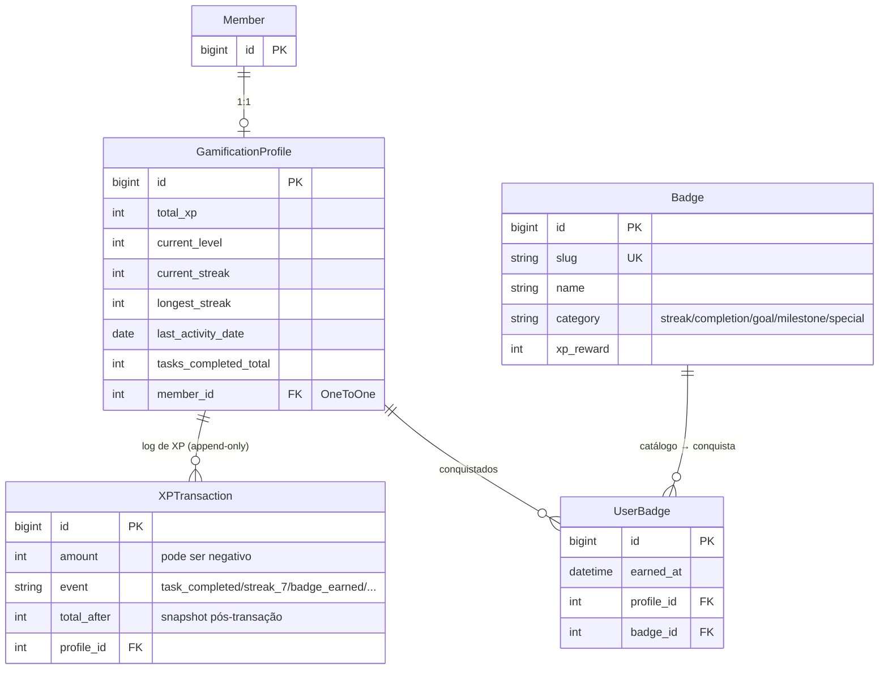
```mermaid
erDiagram
    Member {
        bigint id PK
    }

    GamificationProfile {
        bigint id PK
        int total_xp
        int current_level
        int current_streak
        int longest_streak
        date last_activity_date
        int tasks_completed_total
        int member_id FK "OneToOne"
    }

    XPTransaction {
        bigint id PK
        int amount "pode ser negativo"
        string event "task_completed/streak_7/badge_earned/..."
        int total_after "snapshot pós-transação"
        int profile_id FK
    }

    Badge {
        bigint id PK
        string slug UK
        string name
        string category "streak/completion/goal/milestone/special"
        int xp_reward
    }

    UserBadge {
        bigint id PK
        datetime earned_at
        int profile_id FK
        int badge_id FK
    }

    Member ||--o| GamificationProfile : "1:1"
    GamificationProfile ||--o{ XPTransaction : "log de XP (append-only)"
    GamificationProfile ||--o{ UserBadge : "conquistados"
    Badge ||--o{ UserBadge : "catálogo → conquista"
```

---

## 14. ERD — Planejamento Pessoal (Bem-Estar Emocional)

Módulo "Wellness Center" — não documentado em nenhuma versão anterior desta base. Todos os modelos usam `owner: ForeignKey(Member, on_delete=PROTECT)`.

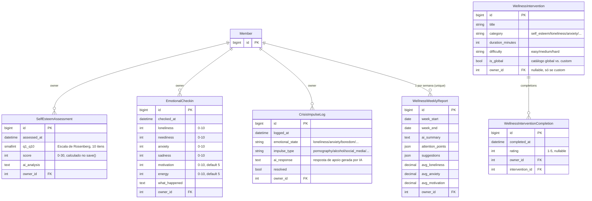
```mermaid
erDiagram
    Member {
        bigint id PK
    }

    SelfEsteemAssessment {
        bigint id PK
        datetime assessed_at
        smallint q1_q10 "Escala de Rosenberg, 10 itens"
        int score "0-30, calculado no save()"
        text ai_analysis
        int owner_id FK
    }

    EmotionalCheckin {
        bigint id PK
        datetime checked_at
        int loneliness "0-10"
        int neediness "0-10"
        int anxiety "0-10"
        int sadness "0-10"
        int motivation "0-10, default 5"
        int energy "0-10, default 5"
        text what_happened
        int owner_id FK
    }

    CrisisImpulseLog {
        bigint id PK
        datetime logged_at
        string emotional_state "loneliness/anxiety/boredom/..."
        string impulse_type "pornography/alcohol/social_media/..."
        text ai_response "resposta de apoio gerada por IA"
        bool resolved
        int owner_id FK
    }

    WellnessIntervention {
        bigint id PK
        string title
        string category "self_esteem/loneliness/anxiety/..."
        int duration_minutes
        string difficulty "easy/medium/hard"
        bool is_global "catálogo global vs. custom"
        int owner_id FK "nullable, só se custom"
    }

    WellnessInterventionCompletion {
        bigint id PK
        datetime completed_at
        int rating "1-5, nullable"
        int owner_id FK
        int intervention_id FK
    }

    WellnessWeeklyReport {
        bigint id PK
        date week_start
        date week_end
        text ai_summary
        json attention_points
        json suggestions
        decimal avg_loneliness
        decimal avg_anxiety
        decimal avg_motivation
        int owner_id FK
    }

    WellnessIntervention ||--o{ WellnessInterventionCompletion : "completions"
    Member ||--o{ SelfEsteemAssessment : owner
    Member ||--o{ EmotionalCheckin : owner
    Member ||--o{ CrisisImpulseLog : owner
    Member ||--o{ WellnessWeeklyReport : "1 por semana (unique)"
```

---

## 15. ERD — Planejamento Pessoal (Treino)

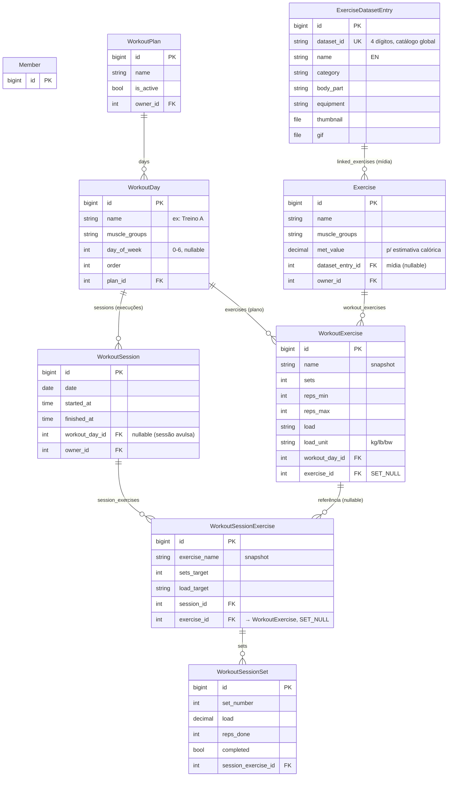
```mermaid
erDiagram
    Member {
        bigint id PK
    }

    ExerciseDatasetEntry {
        bigint id PK
        string dataset_id UK "4 dígitos, catálogo global"
        string name "EN"
        string category
        string body_part
        string equipment
        file thumbnail
        file gif
    }

    Exercise {
        bigint id PK
        string name
        string muscle_groups
        decimal met_value "p/ estimativa calórica"
        int dataset_entry_id FK "mídia (nullable)"
        int owner_id FK
    }

    WorkoutPlan {
        bigint id PK
        string name
        bool is_active
        int owner_id FK
    }

    WorkoutDay {
        bigint id PK
        string name "ex: Treino A"
        string muscle_groups
        int day_of_week "0-6, nullable"
        int order
        int plan_id FK
    }

    WorkoutExercise {
        bigint id PK
        string name "snapshot"
        int sets
        int reps_min
        int reps_max
        string load
        string load_unit "kg/lb/bw"
        int workout_day_id FK
        int exercise_id FK "SET_NULL"
    }

    WorkoutSession {
        bigint id PK
        date date
        time started_at
        time finished_at
        int workout_day_id FK "nullable (sessão avulsa)"
        int owner_id FK
    }

    WorkoutSessionExercise {
        bigint id PK
        string exercise_name "snapshot"
        int sets_target
        string load_target
        int session_id FK
        int exercise_id FK "→ WorkoutExercise, SET_NULL"
    }

    WorkoutSessionSet {
        bigint id PK
        int set_number
        decimal load
        int reps_done
        bool completed
        int session_exercise_id FK
    }

    ExerciseDatasetEntry ||--o{ Exercise : "linked_exercises (mídia)"
    WorkoutPlan ||--o{ WorkoutDay : "days"
    WorkoutDay ||--o{ WorkoutExercise : "exercises (plano)"
    Exercise ||--o{ WorkoutExercise : "workout_exercises"
    WorkoutDay ||--o{ WorkoutSession : "sessions (execuções)"
    WorkoutSession ||--o{ WorkoutSessionExercise : "session_exercises"
    WorkoutExercise ||--o{ WorkoutSessionExercise : "referência (nullable)"
    WorkoutSessionExercise ||--o{ WorkoutSessionSet : "sets"
```

---

## 16. ERD — Planejamento Pessoal (Nutrição)

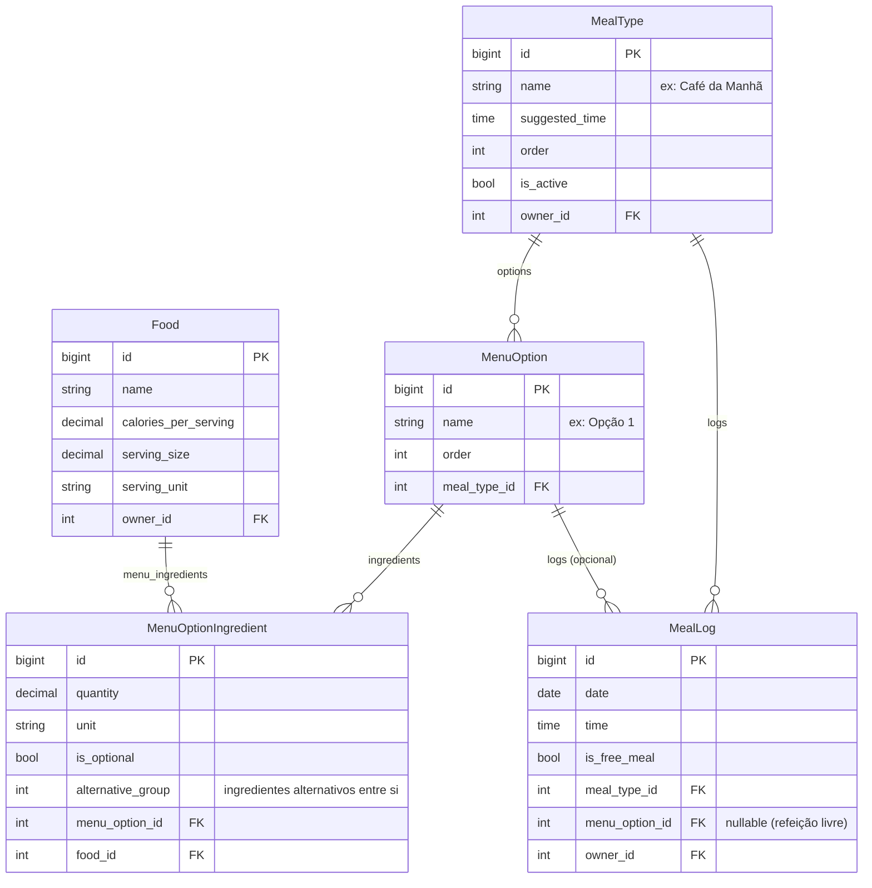
```mermaid
erDiagram
    Food {
        bigint id PK
        string name
        decimal calories_per_serving
        decimal serving_size
        string serving_unit
        int owner_id FK
    }

    MealType {
        bigint id PK
        string name "ex: Café da Manhã"
        time suggested_time
        int order
        bool is_active
        int owner_id FK
    }

    MenuOption {
        bigint id PK
        string name "ex: Opção 1"
        int order
        int meal_type_id FK
    }

    MenuOptionIngredient {
        bigint id PK
        decimal quantity
        string unit
        bool is_optional
        int alternative_group "ingredientes alternativos entre si"
        int menu_option_id FK
        int food_id FK
    }

    MealLog {
        bigint id PK
        date date
        time time
        bool is_free_meal
        int meal_type_id FK
        int menu_option_id FK "nullable (refeição livre)"
        int owner_id FK
    }

    MealType ||--o{ MenuOption : "options"
    MenuOption ||--o{ MenuOptionIngredient : "ingredients"
    Food ||--o{ MenuOptionIngredient : "menu_ingredients"
    MealType ||--o{ MealLog : "logs"
    MenuOption ||--o{ MealLog : "logs (opcional)"
```

---

## 17. ERD — Sistema (Notificações, Webhooks, Admin, Auth, Membros)

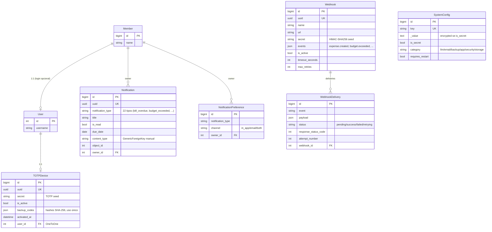
```mermaid
erDiagram
    User {
        int id PK
        string username
    }

    Member {
        bigint id PK
        string name
    }

    Notification {
        bigint id PK
        uuid uuid UK
        string notification_type "22 tipos (bill_overdue, budget_exceeded, ...)"
        string title
        bool is_read
        date due_date
        string content_type "GenericForeignKey manual"
        int object_id
        int owner_id FK
    }

    NotificationPreference {
        bigint id PK
        string notification_type
        string channel "in_app/email/both"
        int owner_id FK
    }

    Webhook {
        bigint id PK
        uuid uuid UK
        string name
        string url
        string secret "HMAC-SHA256 seed"
        json events "expense.created, budget.exceeded, ..."
        bool is_active
        int timeout_seconds
        int max_retries
    }

    WebhookDelivery {
        bigint id PK
        string event
        json payload
        string status "pending/success/failed/retrying"
        int response_status_code
        int attempt_number
        int webhook_id FK
    }

    SystemConfig {
        bigint id PK
        string key UK
        text _value "encrypted se is_secret"
        bool is_secret
        string category "llm/email/backup/app/security/storage"
        bool requires_restart
    }

    TOTPDevice {
        bigint id PK
        uuid uuid UK
        string secret "TOTP seed"
        bool is_active
        json backup_codes "hashes SHA-256, uso único"
        datetime activated_at
        int user_id FK "OneToOne"
    }

    Member ||--o| User : "1:1 (login opcional)"
    Member ||--o{ Notification : owner
    Member ||--o{ NotificationPreference : owner
    Webhook ||--o{ WebhookDelivery : "deliveries"
    User ||--o| TOTPDevice : "1:1"
```

---

## 18. Diagrama de Classes — Camada de Serviços Frontend

Hierarquia de classes de serviço e padrão singleton.

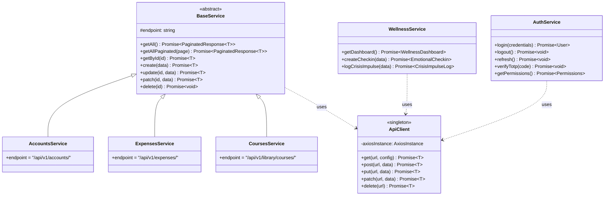
```mermaid
classDiagram
    class BaseService {
        <<abstract>>
        #endpoint: string
        +getAll() Promise~PaginatedResponse~T~~
        +getAllPaginated(page) Promise~PaginatedResponse~T~~
        +getById(id) Promise~T~
        +create(data) Promise~T~
        +update(id, data) Promise~T~
        +patch(id, data) Promise~T~
        +delete(id) Promise~void~
    }

    class AccountsService {
        +endpoint = "/api/v1/accounts/"
    }

    class ExpensesService {
        +endpoint = "/api/v1/expenses/"
    }

    class CoursesService {
        +endpoint = "/api/v1/library/courses/"
    }

    class WellnessService {
        +getDashboard() Promise~WellnessDashboard~
        +createCheckin(data) Promise~EmotionalCheckin~
        +logCrisisImpulse(data) Promise~CrisisImpulseLog~
    }

    class AuthService {
        +login(credentials) Promise~User~
        +logout() Promise~void~
        +refresh() Promise~void~
        +verifyTotp(code) Promise~void~
        +getPermissions() Promise~Permissions~
    }

    class ApiClient {
        <<singleton>>
        -axiosInstance: AxiosInstance
        +get(url, config) Promise~T~
        +post(url, data) Promise~T~
        +put(url, data) Promise~T~
        +patch(url, data) Promise~T~
        +delete(url) Promise~T~
    }

    BaseService <|-- AccountsService
    BaseService <|-- ExpensesService
    BaseService <|-- CoursesService
    BaseService ..> ApiClient : uses
    WellnessService ..> ApiClient : uses
    AuthService ..> ApiClient : uses
```

Nota: páginas novas seguem o padrão TanStack Query (`useQuery`/`useMutation` sobre os services) em vez do antigo `hooks/use-crud-page.ts` — ver `CLAUDE.md#frontend-data-fetching--caching`.

---

## 19. Diagrama de Classes — Camada de Views Backend

Hierarquia de views Django REST Framework.

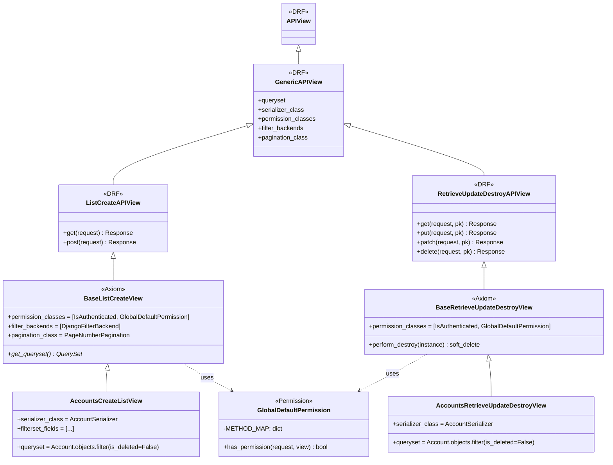
```mermaid
classDiagram
    class APIView {
        <<DRF>>
    }

    class GenericAPIView {
        <<DRF>>
        +queryset
        +serializer_class
        +permission_classes
        +filter_backends
        +pagination_class
    }

    class ListCreateAPIView {
        <<DRF>>
        +get(request) Response
        +post(request) Response
    }

    class RetrieveUpdateDestroyAPIView {
        <<DRF>>
        +get(request, pk) Response
        +put(request, pk) Response
        +patch(request, pk) Response
        +delete(request, pk) Response
    }

    class BaseListCreateView {
        <<Axiom>>
        +permission_classes = [IsAuthenticated, GlobalDefaultPermission]
        +filter_backends = [DjangoFilterBackend]
        +pagination_class = PageNumberPagination
        +get_queryset()* QuerySet
    }

    class BaseRetrieveUpdateDestroyView {
        <<Axiom>>
        +permission_classes = [IsAuthenticated, GlobalDefaultPermission]
        +perform_destroy(instance) soft_delete
    }

    class AccountsCreateListView {
        +queryset = Account.objects.filter(is_deleted=False)
        +serializer_class = AccountSerializer
        +filterset_fields = [...]
    }

    class AccountsRetrieveUpdateDestroyView {
        +queryset = Account.objects.filter(is_deleted=False)
        +serializer_class = AccountSerializer
    }

    class GlobalDefaultPermission {
        <<Permission>>
        +has_permission(request, view) bool
        -METHOD_MAP: dict
    }

    APIView <|-- GenericAPIView
    GenericAPIView <|-- ListCreateAPIView
    GenericAPIView <|-- RetrieveUpdateDestroyAPIView
    ListCreateAPIView <|-- BaseListCreateView
    RetrieveUpdateDestroyAPIView <|-- BaseRetrieveUpdateDestroyView
    BaseListCreateView <|-- AccountsCreateListView
    BaseRetrieveUpdateDestroyView <|-- AccountsRetrieveUpdateDestroyView
    BaseListCreateView ..> GlobalDefaultPermission : uses
    BaseRetrieveUpdateDestroyView ..> GlobalDefaultPermission : uses
```

Nota: nem toda view do sistema segue esse padrão genérico — agregações (`GamificationProfileView`, `LibraryDashboardStatsView`, `KnowledgeGraphView`, `WellnessWeeklyReportsGenerateView`, etc.) são `APIView`s simples que devolvem payloads compostos em vez de CRUD de um único modelo.

---

## 20. Diagrama de Estado — Autenticação

Estados possíveis da sessão do usuário, incluindo o desvio por 2FA (TOTP) quando `TOTPDevice.is_active=True`.

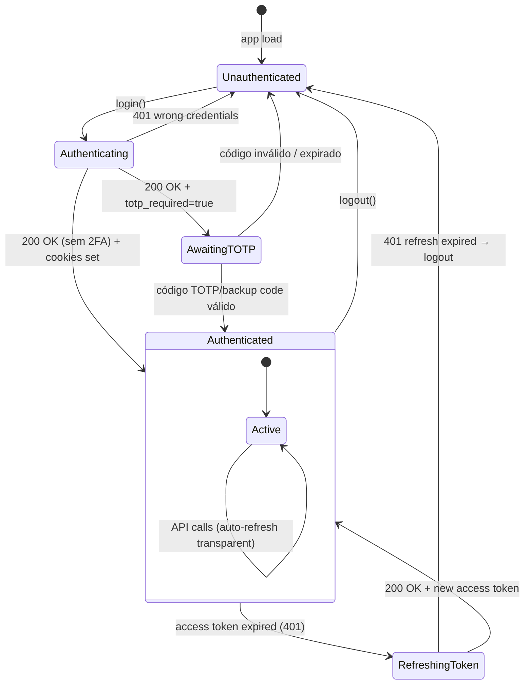
```mermaid
stateDiagram-v2
    [*] --> Unauthenticated : app load

    Unauthenticated --> Authenticating : login()
    Authenticating --> Authenticated : 200 OK (sem 2FA) + cookies set
    Authenticating --> AwaitingTOTP : 200 OK + totp_required=true
    Authenticating --> Unauthenticated : 401 wrong credentials

    AwaitingTOTP --> Authenticated : código TOTP/backup code válido
    AwaitingTOTP --> Unauthenticated : código inválido / expirado

    Authenticated --> RefreshingToken : access token expired (401)
    RefreshingToken --> Authenticated : 200 OK + new access token
    RefreshingToken --> Unauthenticated : 401 refresh expired → logout

    Authenticated --> Unauthenticated : logout()

    state Authenticated {
        [*] --> Active
        Active --> Active : API calls (auto-refresh transparent)
    }
```

---

## 21. Diagrama de Estado — Cofre (Vault)

Estados do cofre de segurança pessoal. A `vault_key` em texto plano nunca é persistida — vive só no Redis, associada à sessão, com TTL configurável por usuário (`VaultConfig.session_ttl_minutes`, padrão 60 min).

```mermaid
stateDiagram-v2
    [*] --> NotCreated : nenhum VaultConfig

    NotCreated --> Locked : create vault\n(define senha mestre → deriva salt + encrypted_vault_key)

    Locked --> Unlocking : unlock(master_password)
    Unlocking --> Unlocked : PBKDF2(senha) decifra vault_key\n→ vault_key cacheada no Redis (TTL)
    Unlocking --> Locked : senha incorreta\n(→ ActivityLog failed_vault_unlock)

    Unlocked --> AccessingItem : read/write/reveal operation
    AccessingItem --> Unlocked : operação concluída\n(→ ActivityLog reveal/view/create/...)

    Unlocked --> Locked : lock manual
    Unlocked --> Locked : TTL da sessão expira no Redis

    Locked --> RecoveringAccess : recovery_key (perdeu a senha mestre)
    RecoveringAccess --> Locked : nova senha mestre definida\n(vault_key re-cifrada)
    RecoveringAccess --> [*] : recovery_key também perdida\n→ dados irrecuperáveis
```

---

## 22. Pipeline de Agentes de IA — Componentes

Visão dos componentes do módulo `apps/api/agents/` e suas dependências.

```mermaid
graph TB
    subgraph Frontend["Frontend (React)"]
        PAGE["Agents.tsx"]
        HOOK["useAgentStream"]
        SVC["AgentService\n(fetch SSE)"]
        PAGE --> HOOK --> SVC
    end

    subgraph API["Backend (Django)"]
        subgraph Views["Views"]
            ASKV["AgentAskView\nPOST /ask/"]
            STMV["AgentStreamView\nPOST /stream/"]
            HISTV["AgentConversationHistoryView\nGET|DELETE /history/"]
            SESSV["AgentNewSessionView\nPOST /sessions/"]
            STATV["AgentStatusView\nGET /status/"]
        end

        subgraph Core["Core"]
            ROUTER["AgentRouter\n(keyword + semantic)"]
            BASE["BaseAgent\n(can_handle / build_context / build_prompt)"]
            LLMC["LLMClient\n(Ollama | Groq | Anthropic | OpenAI)"]
            MEM["ConversationMemory\n(Redis)"]
            TEMP["parse_temporal_intent\n(datas relativas)"]
        end

        subgraph Agents["Agentes"]
            FA["FinanceAgent"]
            BA["BudgetAgent"]
            FCA["ForecastAgent"]
            PA["PlanningAgent"]
            LA["LibraryAgent"]
            IA["InsightAgent"]
        end

        subgraph Tools["Tools"]
            FT["financial_tools"]
            BT["budget_tools"]
            FCT["forecast_tools"]
            PT["planning_tools"]
            RT["rag_tools"]
        end
    end

    subgraph Storage["Storage"]
        PG[("PostgreSQL\nAgentConversation\nAgentEmbedding")]
        REDIS[("Redis\nConversationMemory")]
        OLLAMA["Ollama\n(LLM local / self-managed)"]
        GROQ["Groq API\n(cloud)"]
        ANT["Anthropic API\n(cloud)"]
        OPENAI["OpenAI API\n(cloud)"]
    end

    SVC -->|"POST /stream/ SSE"| STMV
    SVC -->|"POST /ask/"| ASKV

    STMV --> ROUTER
    ASKV --> ROUTER
    ROUTER --> BASE
    BASE --> FA & BA & FCA & PA & LA & IA
    FA --> FT
    BA --> BT
    FCA --> FCT
    PA --> PT
    LA --> RT

    ROUTER --> LLMC
    FA & BA & FCA & PA & LA & IA --> LLMC

    STMV & ASKV --> MEM
    FA & BA --> TEMP
    FT & BT & FCT & PT & RT --> PG
    RT --> PG

    MEM --> REDIS
    STMV --> PG
    ASKV --> PG

    LLMC -->|ollama| OLLAMA
    LLMC -->|groq| GROQ
    LLMC -->|anthropic| ANT
    LLMC -->|openai| OPENAI
    LLMC -->|embeddings| OLLAMA
```

---

## 23. Pipeline de Agentes de IA — Sequência de Streaming

Fluxo detalhado do modo streaming (SSE) desde a digitação do usuário até a resposta completa no frontend.

```mermaid
sequenceDiagram
    actor U as Usuário
    participant FE as Agents.tsx
    participant HS as useAgentStream
    participant AS as AgentService
    participant DJ as AgentStreamView
    participant RT as AgentRouter
    participant AG as Agente
    participant LLM as LLM Provider
    participant MEM as Redis
    participant DB as PostgreSQL

    U->>FE: envia pergunta
    FE->>HS: send(query, sessionId)
    HS->>AS: stream(payload, AbortController.signal)
    AS->>DJ: POST /api/v1/agents/stream/\nfetch com ReadableStream

    DJ->>MEM: get(user_id, session_id)
    MEM-->>DJ: histórico (últimos 10 turnos)

    DJ->>RT: AgentRouter.select(ctx)
    RT->>RT: score por palavras-chave
    RT->>LLM: embed(query) → 768 floats
    RT->>DB: pgvector: TOP-3 por domínio
    RT->>RT: score final → agente selecionado

    DJ->>AG: agent.stream(ctx)
    AG->>DB: build_context() — dados do usuário
    AG->>AG: build_prompt()

    AG->>LLM: stream_chat(messages, model)

    loop tokens em tempo real
        LLM-->>AG: token
        AG-->>DJ: yield token
        DJ-->>AS: data: {"token":"..."}\n\n
        AS-->>HS: yield {token}
        HS->>FE: setState (re-render)
        FE->>U: texto cresce
    end

    LLM-->>AG: FIM
    DJ-->>AS: data: {"done":true,"agent":"...","sources":[...]}\n\n
    AS-->>HS: yield {done:true}
    HS->>FE: setState isStreaming=false

    DJ->>MEM: append(query, full_content)
    DJ->>DB: bulk_create [user_turn, agent_turn]
```

---

## 24. ERD — Módulo Agentes

Modelos de dados do módulo de agentes de IA. **Este ERD já estava correto** em versões anteriores desta documentação — mantido aqui por completude e para deixar claro que não deve ser confundido com o obsoleto "Módulo AI Assistant" (`ContentEmbedding`, 384 dims, `sentence-transformers`) documentado por engano em `database/schema.md` até esta revisão: esse modelo não existe no código atual.

```mermaid
erDiagram
    User {
        int id PK
        string username
    }

    AgentConversation {
        uuid id PK
        string session_id
        uuid query_id
        string role
        text content
        string agent_name
        bool is_deleted
        datetime created_at
        int user FK
    }

    AgentEmbedding {
        uuid id PK
        string domain
        string source_type
        uuid source_id
        string source_title
        text content
        vector embedding "768 dims (nomic-embed-text via Ollama)"
        bool is_deleted
        datetime created_at
        int user FK
    }

    User ||--o{ AgentConversation : "user"
    User ||--o{ AgentEmbedding : "user"
```

---

[Voltar ao índice de Arquitetura](README.md) · [Voltar ao índice da documentação](../README.md)
