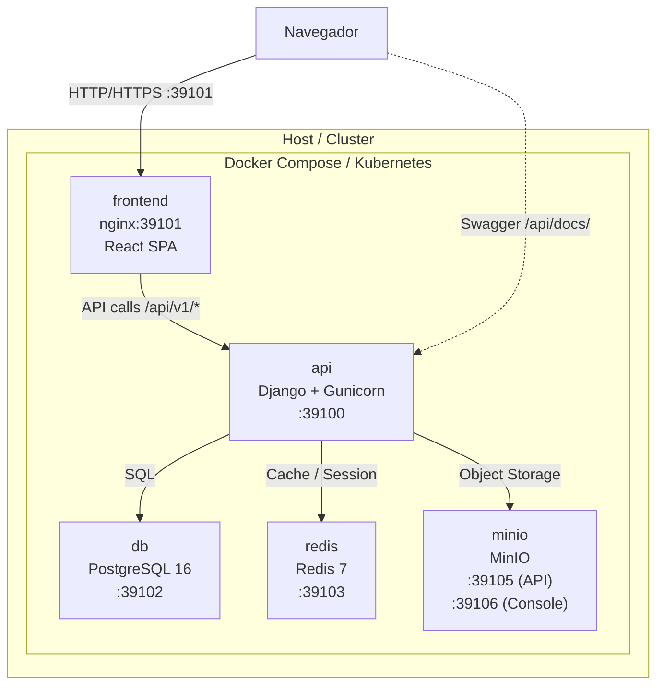
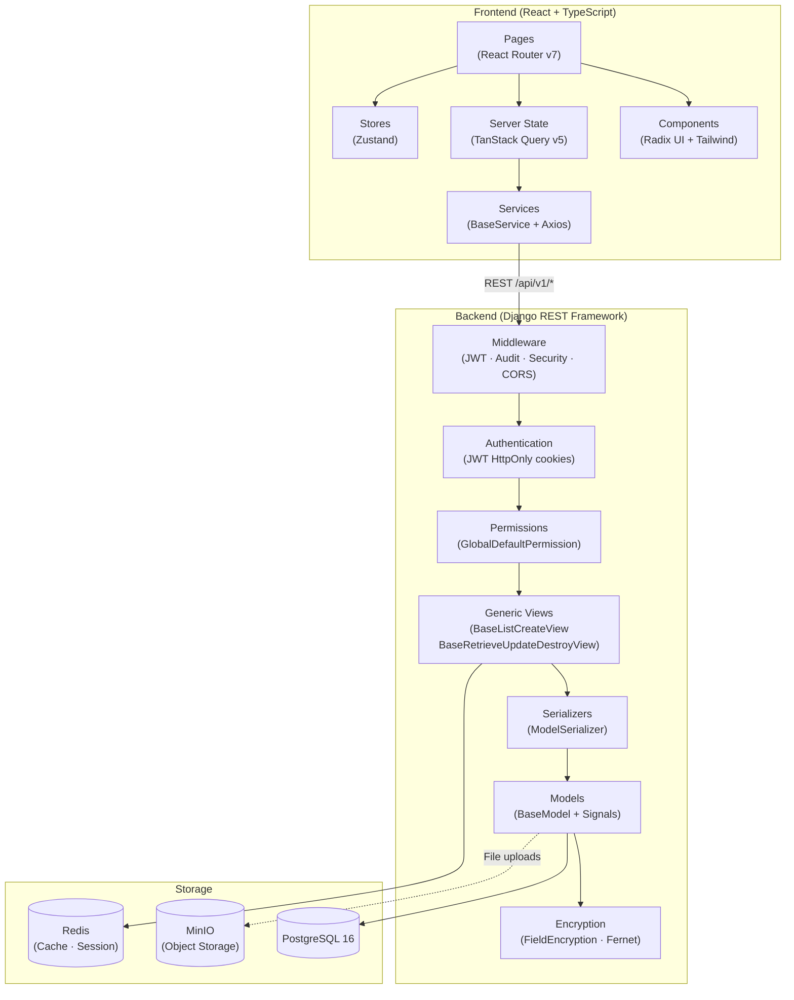
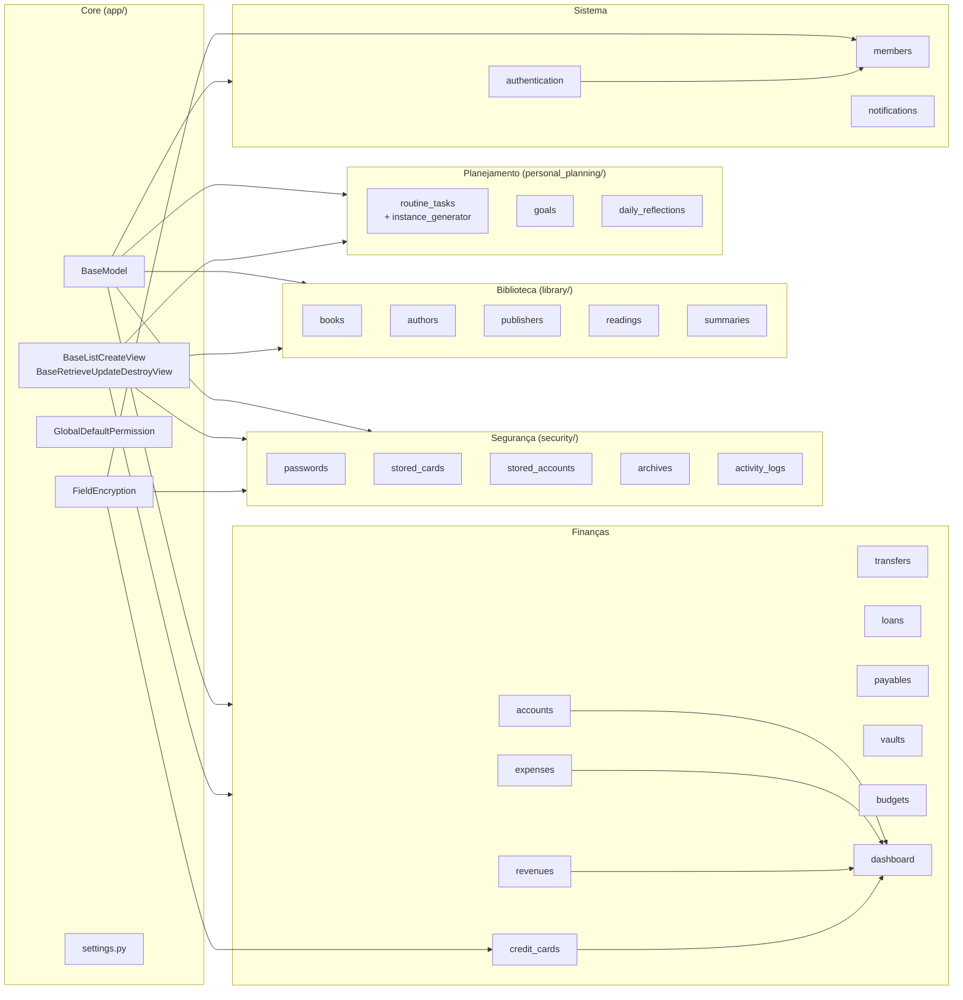
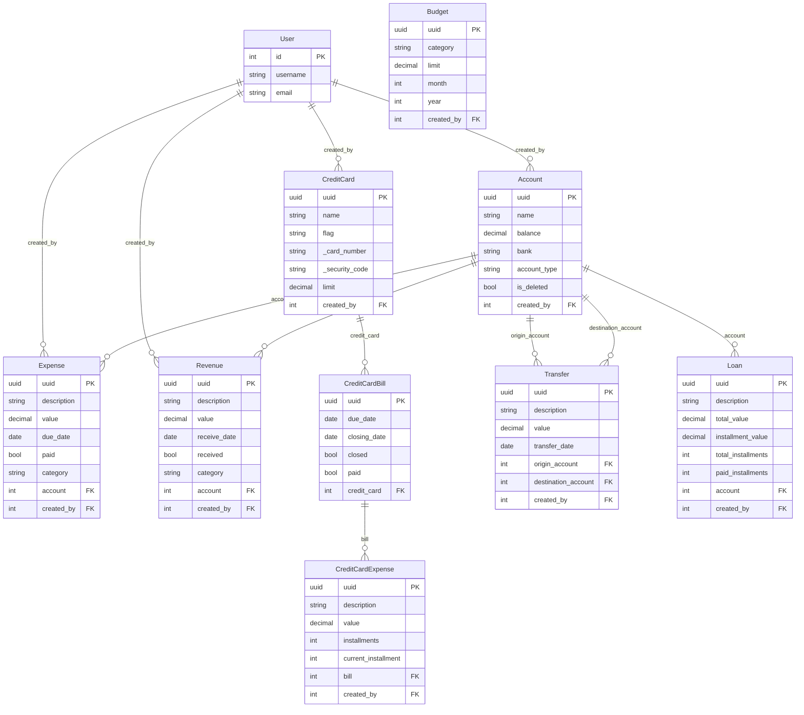
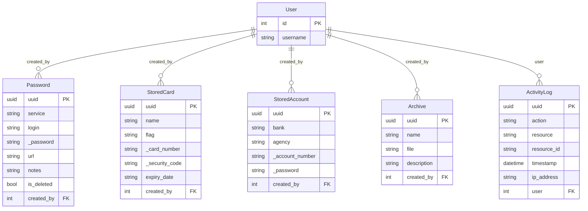
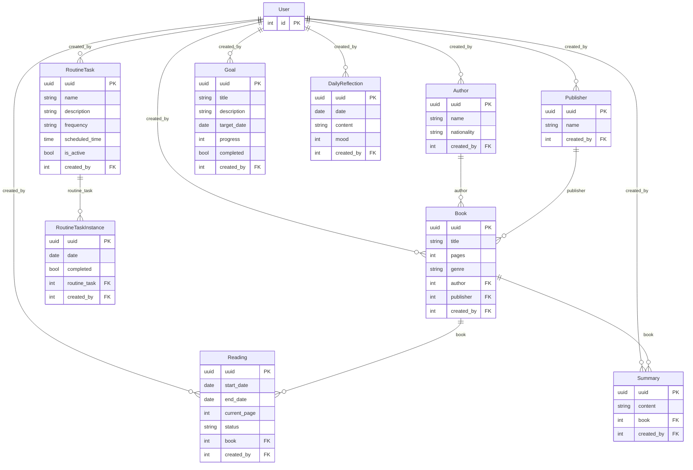
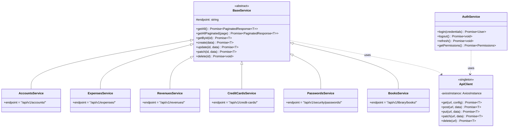
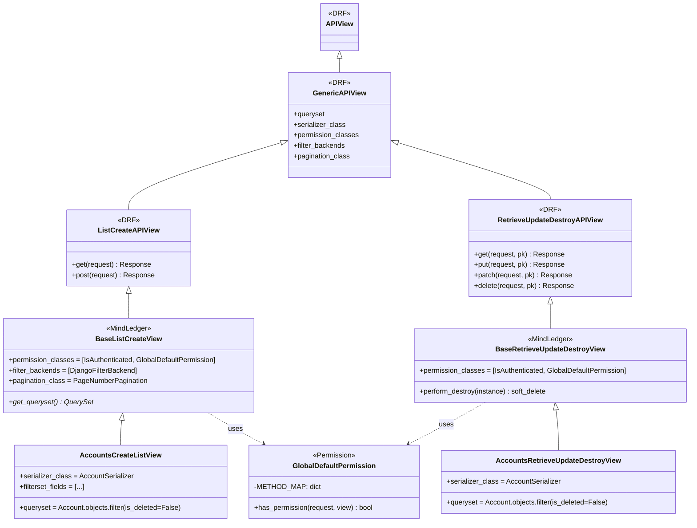
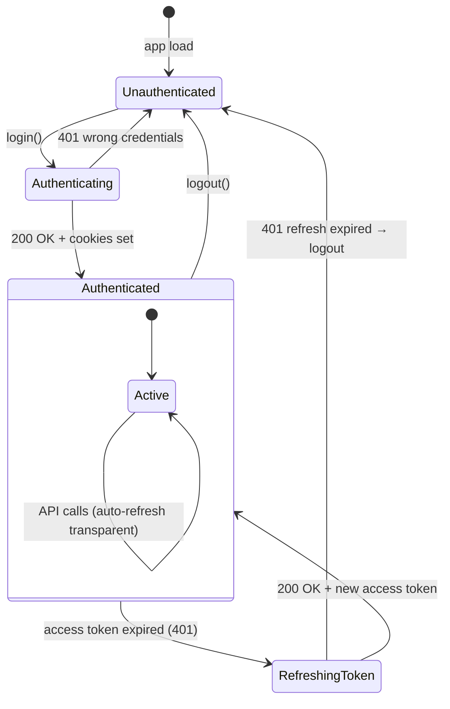
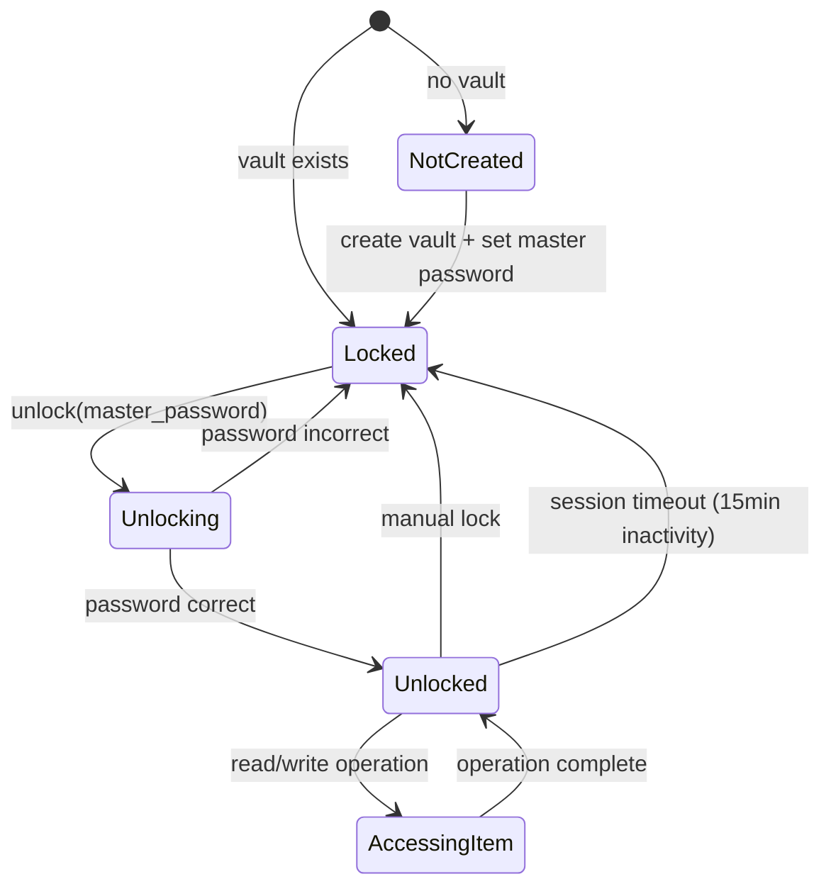

# Diagramas UML

Diagramas em [Mermaid](https://mermaid.js.org/) do MindLedger. Renderizados automaticamente no GitLab, GitHub e VS Code (extensão *Markdown Preview Mermaid Support*).

## Índice

1. [Diagrama de Implantação (Deployment)](#1-diagrama-de-implantação-deployment)
2. [Diagrama de Componentes do Sistema](#2-diagrama-de-componentes-do-sistema)
3. [Diagrama de Componentes dos Módulos Backend](#3-diagrama-de-componentes-dos-módulos-backend)
4. [ERD — Módulo Financeiro](#4-erd--módulo-financeiro)
5. [ERD — Módulo Segurança](#5-erd--módulo-segurança)
6. [ERD — Módulo Biblioteca e Planejamento](#6-erd--módulo-biblioteca-e-planejamento)
7. [Diagrama de Classes — Camada de Serviços Frontend](#7-diagrama-de-classes--camada-de-serviços-frontend)
8. [Diagrama de Classes — Camada de Views Backend](#8-diagrama-de-classes--camada-de-views-backend)
9. [Diagrama de Estado — Autenticação](#9-diagrama-de-estado--autenticação)
10. [Diagrama de Estado — Cofre (Vault)](#10-diagrama-de-estado--cofre-vault)

---

## 1. Diagrama de Implantação (Deployment)

Infraestrutura Docker Compose (desenvolvimento/staging) e Kubernetes (produção).

```mermaid
graph TB
    subgraph "Host / Cluster"
        subgraph "Docker Compose / Kubernetes"
            FE["frontend\nnginx:39101\nReact SPA"]
            API["api\nDjango + Gunicorn\n:39100"]
            DB["db\nPostgreSQL 16\n:39102"]
            REDIS["redis\nRedis 7\n:39103"]
            MINIO["minio\nMinIO\n:39105 (API)\n:39106 (Console)"]
        end
    end

    Browser["Navegador"] -->|"HTTP/HTTPS :39101"| FE
    FE -->|"API calls /api/v1/*"| API
    API -->|"SQL"| DB
    API -->|"Cache / Session"| REDIS
    API -->|"Object Storage"| MINIO
    Browser -.->|"Swagger /api/docs/"| API
```

---

## 2. Diagrama de Componentes do Sistema

Visão de alto nível das camadas e responsabilidades.

```mermaid
graph TB
    subgraph Frontend["Frontend (React + TypeScript)"]
        Pages["Pages\n(React Router v7)"]
        Components["Components\n(Radix UI + Tailwind)"]
        Stores["Stores\n(Zustand)"]
        TQ["Server State\n(TanStack Query v5)"]
        Services["Services\n(BaseService + Axios)"]
    end

    subgraph Backend["Backend (Django REST Framework)"]
        Middleware["Middleware\n(JWT · Audit · Security · CORS)"]
        Auth["Authentication\n(JWT HttpOnly cookies)"]
        Perms["Permissions\n(GlobalDefaultPermission)"]
        Views["Generic Views\n(BaseListCreateView\nBaseRetrieveUpdateDestroyView)"]
        Serializers["Serializers\n(ModelSerializer)"]
        Models["Models\n(BaseModel + Signals)"]
        Encryption["Encryption\n(FieldEncryption · Fernet)"]
    end

    subgraph Storage["Storage"]
        PG[("PostgreSQL 16")]
        Cache[("Redis\n(Cache · Session)")]
        S3[("MinIO\n(Object Storage)")]
    end

    Pages --> Components
    Pages --> TQ
    Pages --> Stores
    TQ --> Services
    Services -->|"REST /api/v1/*"| Middleware

    Middleware --> Auth
    Auth --> Perms
    Perms --> Views
    Views --> Serializers
    Serializers --> Models
    Models --> Encryption
    Models --> PG
    Views --> Cache
    Models -.->|"File uploads"| S3
```

---

## 3. Diagrama de Componentes dos Módulos Backend

Módulos Django e suas dependências internas.

```mermaid
graph LR
    subgraph Core["Core (app/)"]
        BaseModel["BaseModel"]
        BaseViews["BaseListCreateView\nBaseRetrieveUpdateDestroyView"]
        Perms["GlobalDefaultPermission"]
        Enc["FieldEncryption"]
        Settings["settings.py"]
    end

    subgraph Finance["Finanças"]
        Accounts["accounts"]
        Expenses["expenses"]
        Revenues["revenues"]
        CreditCards["credit_cards"]
        Transfers["transfers"]
        Loans["loans"]
        Payables["payables"]
        Vaults["vaults"]
        Budgets["budgets"]
        Dashboard["dashboard"]
    end

    subgraph Security["Segurança (security/)"]
        Passwords["passwords"]
        StoredCards["stored_cards"]
        StoredAccounts["stored_accounts"]
        Archives["archives"]
        ActivityLogs["activity_logs"]
    end

    subgraph Library["Biblioteca (library/)"]
        Books["books"]
        Authors["authors"]
        Publishers["publishers"]
        Readings["readings"]
        Summaries["summaries"]
    end

    subgraph Planning["Planejamento (personal_planning/)"]
        RoutineTasks["routine_tasks\n+ instance_generator"]
        Goals["goals"]
        Reflections["daily_reflections"]
    end

    subgraph System["Sistema"]
        Authentication["authentication"]
        Members["members"]
        Notifications["notifications"]
    end

    BaseModel --> Finance
    BaseModel --> Security
    BaseModel --> Library
    BaseModel --> Planning
    BaseModel --> System

    BaseViews --> Finance
    BaseViews --> Security
    BaseViews --> Library
    BaseViews --> Planning

    Enc --> CreditCards
    Enc --> Members
    Enc --> Security

    Accounts --> Dashboard
    Expenses --> Dashboard
    Revenues --> Dashboard
    CreditCards --> Dashboard

    Authentication --> Members
```

---

## 4. ERD — Módulo Financeiro

Entidades principais do módulo financeiro e seus relacionamentos.

```mermaid
erDiagram
    User {
        int id PK
        string username
        string email
    }

    Account {
        uuid uuid PK
        string name
        decimal balance
        string bank
        string account_type
        bool is_deleted
        int created_by FK
    }

    Expense {
        uuid uuid PK
        string description
        decimal value
        date due_date
        bool paid
        string category
        int account FK
        int created_by FK
    }

    Revenue {
        uuid uuid PK
        string description
        decimal value
        date receive_date
        bool received
        string category
        int account FK
        int created_by FK
    }

    CreditCard {
        uuid uuid PK
        string name
        string flag
        string _card_number
        string _security_code
        decimal limit
        int created_by FK
    }

    CreditCardBill {
        uuid uuid PK
        date due_date
        date closing_date
        bool closed
        bool paid
        int credit_card FK
    }

    CreditCardExpense {
        uuid uuid PK
        string description
        decimal value
        int installments
        int current_installment
        int bill FK
        int created_by FK
    }

    Transfer {
        uuid uuid PK
        string description
        decimal value
        date transfer_date
        int origin_account FK
        int destination_account FK
        int created_by FK
    }

    Loan {
        uuid uuid PK
        string description
        decimal total_value
        decimal installment_value
        int total_installments
        int paid_installments
        int account FK
        int created_by FK
    }

    Budget {
        uuid uuid PK
        string category
        decimal limit
        int month
        int year
        int created_by FK
    }

    User ||--o{ Account : "created_by"
    User ||--o{ Expense : "created_by"
    User ||--o{ Revenue : "created_by"
    User ||--o{ CreditCard : "created_by"
    Account ||--o{ Expense : "account"
    Account ||--o{ Revenue : "account"
    Account ||--o{ Loan : "account"
    Account ||--o{ Transfer : "origin_account"
    Account ||--o{ Transfer : "destination_account"
    CreditCard ||--o{ CreditCardBill : "credit_card"
    CreditCardBill ||--o{ CreditCardExpense : "bill"
```

---

## 5. ERD — Módulo Segurança

Entidades do cofre de segurança (dados sensíveis criptografados com Fernet).

```mermaid
erDiagram
    User {
        int id PK
        string username
    }

    Password {
        uuid uuid PK
        string service
        string login
        string _password
        string url
        string notes
        bool is_deleted
        int created_by FK
    }

    StoredCard {
        uuid uuid PK
        string name
        string flag
        string _card_number
        string _security_code
        string expiry_date
        int created_by FK
    }

    StoredAccount {
        uuid uuid PK
        string bank
        string agency
        string _account_number
        string _password
        int created_by FK
    }

    Archive {
        uuid uuid PK
        string name
        string file
        string description
        int created_by FK
    }

    ActivityLog {
        uuid uuid PK
        string action
        string resource
        string resource_id
        datetime timestamp
        string ip_address
        int user FK
    }

    User ||--o{ Password : "created_by"
    User ||--o{ StoredCard : "created_by"
    User ||--o{ StoredAccount : "created_by"
    User ||--o{ Archive : "created_by"
    User ||--o{ ActivityLog : "user"
```

---

## 6. ERD — Módulo Biblioteca e Planejamento

```mermaid
erDiagram
    User {
        int id PK
    }

    Author {
        uuid uuid PK
        string name
        string nationality
        int created_by FK
    }

    Publisher {
        uuid uuid PK
        string name
        int created_by FK
    }

    Book {
        uuid uuid PK
        string title
        int pages
        string genre
        int author FK
        int publisher FK
        int created_by FK
    }

    Reading {
        uuid uuid PK
        date start_date
        date end_date
        int current_page
        string status
        int book FK
        int created_by FK
    }

    Summary {
        uuid uuid PK
        string content
        int book FK
        int created_by FK
    }

    RoutineTask {
        uuid uuid PK
        string name
        string description
        string frequency
        time scheduled_time
        bool is_active
        int created_by FK
    }

    RoutineTaskInstance {
        uuid uuid PK
        date date
        bool completed
        int routine_task FK
        int created_by FK
    }

    Goal {
        uuid uuid PK
        string title
        string description
        date target_date
        int progress
        bool completed
        int created_by FK
    }

    DailyReflection {
        uuid uuid PK
        date date
        string content
        int mood
        int created_by FK
    }

    User ||--o{ Author : "created_by"
    User ||--o{ Publisher : "created_by"
    User ||--o{ Book : "created_by"
    User ||--o{ Reading : "created_by"
    User ||--o{ Summary : "created_by"
    User ||--o{ RoutineTask : "created_by"
    User ||--o{ Goal : "created_by"
    User ||--o{ DailyReflection : "created_by"
    Author ||--o{ Book : "author"
    Publisher ||--o{ Book : "publisher"
    Book ||--o{ Reading : "book"
    Book ||--o{ Summary : "book"
    RoutineTask ||--o{ RoutineTaskInstance : "routine_task"
```

---

## 7. Diagrama de Classes — Camada de Serviços Frontend

Hierarquia de classes de serviço e padrão singleton.

```mermaid
classDiagram
    class BaseService {
        <<abstract>>
        #endpoint: string
        +getAll() Promise~PaginatedResponse~T~~
        +getAllPaginated(page) Promise~PaginatedResponse~T~~
        +getById(id) Promise~T~
        +create(data) Promise~T~
        +update(id, data) Promise~T~
        +patch(id, data) Promise~T~
        +delete(id) Promise~void~
    }

    class AccountsService {
        +endpoint = "/api/v1/accounts/"
    }

    class ExpensesService {
        +endpoint = "/api/v1/expenses/"
    }

    class RevenuesService {
        +endpoint = "/api/v1/revenues/"
    }

    class CreditCardsService {
        +endpoint = "/api/v1/credit-cards/"
    }

    class PasswordsService {
        +endpoint = "/api/v1/security/passwords/"
    }

    class BooksService {
        +endpoint = "/api/v1/library/books/"
    }

    class AuthService {
        +login(credentials) Promise~User~
        +logout() Promise~void~
        +refresh() Promise~void~
        +getPermissions() Promise~Permissions~
    }

    class ApiClient {
        <<singleton>>
        -axiosInstance: AxiosInstance
        +get(url, config) Promise~T~
        +post(url, data) Promise~T~
        +put(url, data) Promise~T~
        +patch(url, data) Promise~T~
        +delete(url) Promise~T~
    }

    BaseService <|-- AccountsService
    BaseService <|-- ExpensesService
    BaseService <|-- RevenuesService
    BaseService <|-- CreditCardsService
    BaseService <|-- PasswordsService
    BaseService <|-- BooksService
    BaseService ..> ApiClient : uses
    AuthService ..> ApiClient : uses
```

---

## 8. Diagrama de Classes — Camada de Views Backend

Hierarquia de views Django REST Framework.

```mermaid
classDiagram
    class APIView {
        <<DRF>>
    }

    class GenericAPIView {
        <<DRF>>
        +queryset
        +serializer_class
        +permission_classes
        +filter_backends
        +pagination_class
    }

    class ListCreateAPIView {
        <<DRF>>
        +get(request) Response
        +post(request) Response
    }

    class RetrieveUpdateDestroyAPIView {
        <<DRF>>
        +get(request, pk) Response
        +put(request, pk) Response
        +patch(request, pk) Response
        +delete(request, pk) Response
    }

    class BaseListCreateView {
        <<MindLedger>>
        +permission_classes = [IsAuthenticated, GlobalDefaultPermission]
        +filter_backends = [DjangoFilterBackend]
        +pagination_class = PageNumberPagination
        +get_queryset()* QuerySet
    }

    class BaseRetrieveUpdateDestroyView {
        <<MindLedger>>
        +permission_classes = [IsAuthenticated, GlobalDefaultPermission]
        +perform_destroy(instance) soft_delete
    }

    class AccountsCreateListView {
        +queryset = Account.objects.filter(is_deleted=False)
        +serializer_class = AccountSerializer
        +filterset_fields = [...]
    }

    class AccountsRetrieveUpdateDestroyView {
        +queryset = Account.objects.filter(is_deleted=False)
        +serializer_class = AccountSerializer
    }

    class GlobalDefaultPermission {
        <<Permission>>
        +has_permission(request, view) bool
        -METHOD_MAP: dict
    }

    APIView <|-- GenericAPIView
    GenericAPIView <|-- ListCreateAPIView
    GenericAPIView <|-- RetrieveUpdateDestroyAPIView
    ListCreateAPIView <|-- BaseListCreateView
    RetrieveUpdateDestroyAPIView <|-- BaseRetrieveUpdateDestroyView
    BaseListCreateView <|-- AccountsCreateListView
    BaseRetrieveUpdateDestroyView <|-- AccountsRetrieveUpdateDestroyView
    BaseListCreateView ..> GlobalDefaultPermission : uses
    BaseRetrieveUpdateDestroyView ..> GlobalDefaultPermission : uses
```

---

## 9. Diagrama de Estado — Autenticação

Estados possíveis da sessão do usuário.

```mermaid
stateDiagram-v2
    [*] --> Unauthenticated : app load

    Unauthenticated --> Authenticating : login()
    Authenticating --> Authenticated : 200 OK + cookies set
    Authenticating --> Unauthenticated : 401 wrong credentials

    Authenticated --> RefreshingToken : access token expired (401)
    RefreshingToken --> Authenticated : 200 OK + new access token
    RefreshingToken --> Unauthenticated : 401 refresh expired → logout

    Authenticated --> Unauthenticated : logout()

    state Authenticated {
        [*] --> Active
        Active --> Active : API calls (auto-refresh transparent)
    }
```

---

## 10. Diagrama de Estado — Cofre (Vault)

Estados do cofre de segurança pessoal.

```mermaid
stateDiagram-v2
    [*] --> Locked : vault exists

    Locked --> Unlocking : unlock(master_password)
    Unlocking --> Unlocked : password correct
    Unlocking --> Locked : password incorrect

    Unlocked --> AccessingItem : read/write operation
    AccessingItem --> Unlocked : operation complete

    Unlocked --> Locked : manual lock
    Unlocked --> Locked : session timeout (15min inactivity)

    [*] --> NotCreated : no vault
    NotCreated --> Locked : create vault + set master password
```

---

[Voltar ao índice de Arquitetura](README.md) · [Voltar ao índice da documentação](../README.md)
