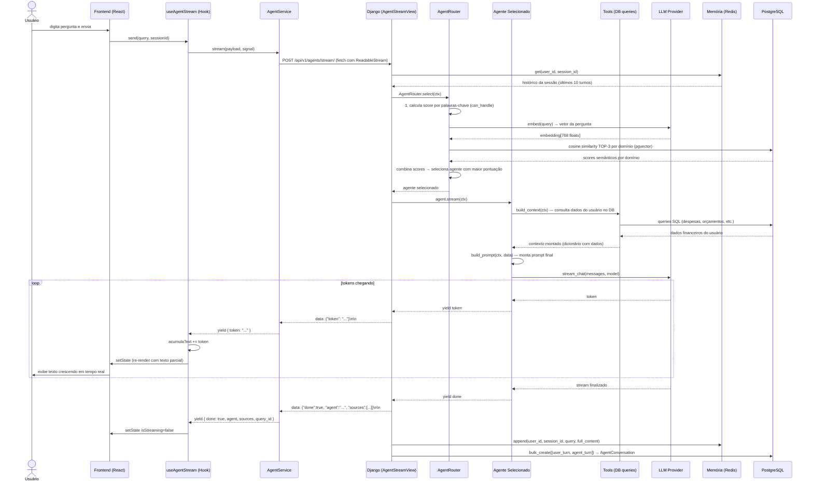
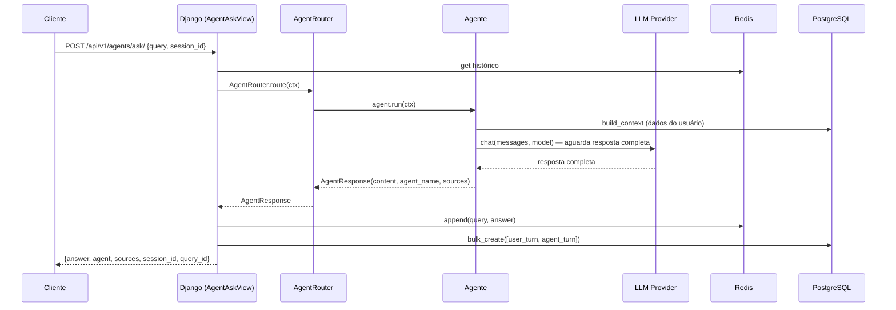
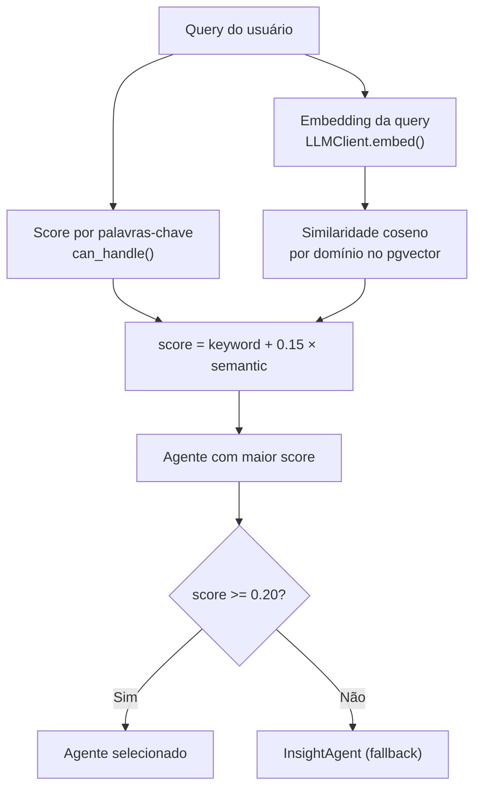
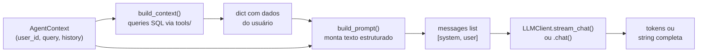
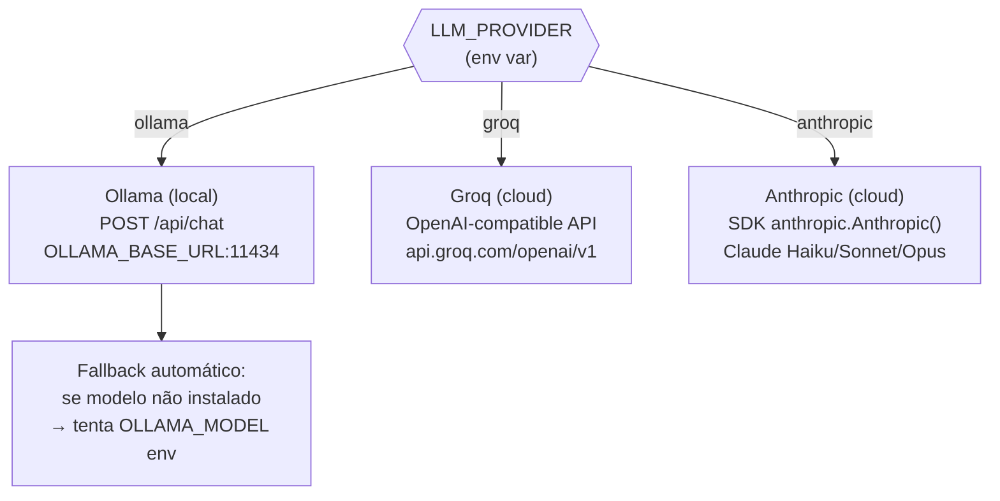
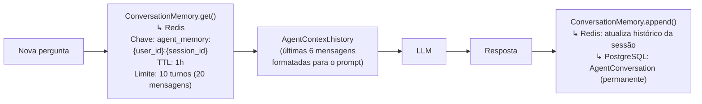
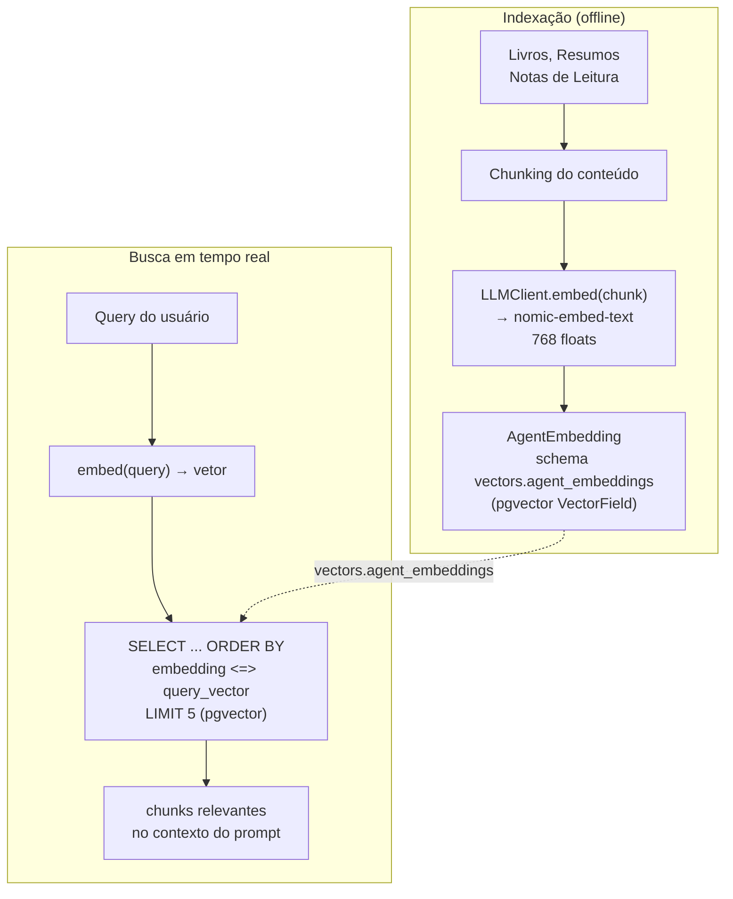
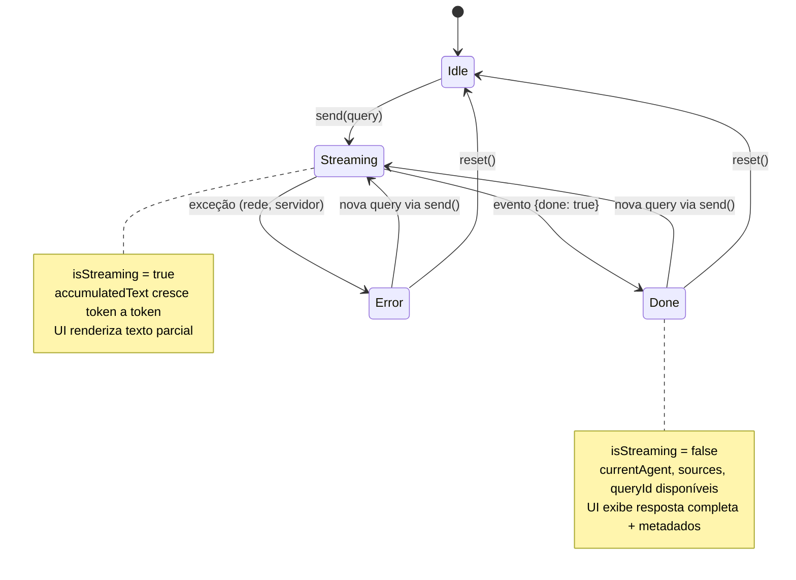

# Sistema de Agentes de IA

O Axiom possui um módulo de IA conversacional (`api/agents/`) composto por agentes especializados que respondem perguntas sobre finanças, orçamento, planejamento pessoal e biblioteca. O sistema suporta respostas em streaming (SSE) e modo síncrono, com memória de sessão via Redis e histórico permanente no banco de dados.

## Índice

1. [Arquitetura Geral](#1-arquitetura-geral)
2. [Pipeline Completo — do Usuário ao Frontend](#2-pipeline-completo--do-usuário-ao-frontend)
   - [Streaming (modo principal)](#21-modo-streaming-sse)
   - [Síncrono (modo ask)](#22-modo-síncrono-ask)
3. [Roteador de Agentes](#3-roteador-de-agentes)
4. [Agentes Especializados](#4-agentes-especializados)
5. [LLM Providers](#5-llm-providers)
6. [Sistema de Memória](#6-sistema-de-memória)
7. [Sistema RAG (Embeddings)](#7-sistema-rag-embeddings)
8. [API Endpoints](#8-api-endpoints)
9. [Frontend — Integração](#9-frontend--integração)
10. [Modelos de Dados](#10-modelos-de-dados)
11. [Configuração](#11-configuração)

---

## 1. Arquitetura Geral

```
api/agents/
├── core/
│   ├── base_agent.py    # Classe base abstrata para todos os agentes
│   ├── llm_client.py    # Abstração sobre Ollama, Groq e Anthropic
│   ├── memory.py        # Memória de conversa por sessão (Redis)
│   ├── prompts.py       # System prompt base em PT-BR
│   ├── router.py        # Seleção inteligente de agente por query
│   └── temporal.py      # Interpretação de datas relativas ("mês passado")
├── agents/
│   ├── finance_agent.py   # Análise de despesas e receitas
│   ├── budget_agent.py    # Monitoramento de orçamentos
│   ├── forecast_agent.py  # Projeção de saldo e fluxo de caixa
│   ├── planning_agent.py  # Rotinas, metas e reflexões
│   ├── library_agent.py   # Resumos de livros (RAG)
│   └── insight_agent.py   # Orquestrador / briefing geral
├── tools/
│   ├── financial_tools.py # Consultas de despesas, receitas, merchants
│   ├── budget_tools.py    # Status de orçamentos e projeções
│   ├── forecast_tools.py  # Projeções de saldo e despesas fixas
│   ├── planning_tools.py  # Resumo de rotinas, metas e tarefas
│   └── rag_tools.py       # Busca vetorial (pgvector / Python fallback)
├── models.py              # AgentConversation, AgentEmbedding
├── serializers.py         # Validação de request/response
├── views.py               # Endpoints (ask, stream, history, status, sessions)
└── urls.py                # Roteamento de URLs
```

---

## 2. Pipeline Completo — do Usuário ao Frontend

### 2.1 Modo Streaming (SSE)

Este é o modo principal de uso. A resposta é transmitida token por token via Server-Sent Events (SSE), proporcionando experiência de "digitação ao vivo" no frontend.



### 2.2 Modo Síncrono (Ask)

Usado para integrações programáticas onde streaming não é necessário. Aguarda a resposta completa antes de retornar.



---

## 3. Roteador de Agentes

O `AgentRouter` (`core/router.py`) combina dois critérios para selecionar o agente mais adequado:

### Pontuação por palavras-chave

Cada agente implementa `can_handle(query) → float (0.0–1.0)`. O método conta quantos termos-gatilho da query correspondem ao domínio do agente e retorna um score proporcional.

```
query: "quanto gastei no restaurante esse mês?"
  → FinanceAgent: 0.60  (hits: "gastei", "mês")
  → BudgetAgent:  0.30  (hits: "mês")
  → ForecastAgent: 0.10
  → InsightAgent:  0.10
```

### Pontuação semântica (RAG)

Após o score por palavras-chave, o router também gera um embedding da query e calcula a similaridade coseno com os documentos vetorizados do usuário no banco (`vectors.agent_embeddings`), agrupados por domínio (`finance`, `budget`, `planning`, `library`, `general`).

O score semântico é ponderado com peso `0.15` sobre o score final, dando um boost ao agente cujo domínio é mais relevante para o histórico de dados do usuário.

```
score_final = score_keywords + 0.15 × cosine_similarity_domain_avg
```

**Fallback**: se nenhum agente superar 0.20, o `InsightAgent` é selecionado como orquestrador padrão.



---

## 4. Agentes Especializados

Todos os agentes herdam de `BaseAgent` (`core/base_agent.py`) e implementam três métodos obrigatórios: `can_handle()`, `build_context()` e `build_prompt()`.

| Agente | `name` | Domínio | Modelo Padrão (Ollama) | Descrição |
|---|---|---|---|---|
| `FinanceAgent` | `finance` | Despesas e receitas | `qwen2.5:7b` | Análise de gastos, categorias, evolução temporal |
| `BudgetAgent` | `budget` | Orçamentos | `qwen2.5:7b` | Status dos orçamentos, desvios, projeções de estouro |
| `ForecastAgent` | `forecast` | Projeções | `mistral:7b-instruct` | Saldo projetado, fluxo de caixa, despesas fixas |
| `PlanningAgent` | `planning` | Planejamento | `mistral:7b-instruct` | Rotinas, metas, reflexões diárias |
| `LibraryAgent` | `library` | Biblioteca | `mistral:7b-instruct` | Resumos de livros via RAG |
| `InsightAgent` | `insight` | Geral | `mistral:7b-instruct` | Orquestrador, briefing diário, perguntas gerais |

### Fluxo interno de cada agente



### Interpretação temporal

Antes de construir o contexto, agentes como `FinanceAgent` e `BudgetAgent` chamam `parse_temporal_intent()` (`core/temporal.py`) para detectar expressões de data relativas na query e ajustar o período de consulta automaticamente.

Expressões suportadas: `hoje`, `ontem`, `esta semana`, `semana passada`, `mês passado`, `últimos N dias`, `último mês`.

---

## 5. LLM Providers

O `LLMClient` (`core/llm_client.py`) abstrai três provedores via variável de ambiente `LLM_PROVIDER`.



**Embeddings**: sempre gerados via Ollama (`nomic-embed-text`), independente do provider de chat configurado. Dimensão: 768 floats.

### Modelos configuráveis por agente

Cada agente define `ollama_model`, `anthropic_model` e `groq_model`. O método `get_model()` retorna o modelo correto para o provider ativo. Isso permite usar modelos mais leves (ex: Haiku) para tarefas simples e modelos mais capazes (Opus) para análises complexas.

```python
class FinanceAgent(BaseAgent):
    ollama_model = "qwen2.5:7b"
    anthropic_model = "claude-haiku-4-5-20251001"
    groq_model = "llama-3.1-8b-instant"
```

### Fallback Ollama

Se o modelo configurado para um agente não estiver instalado no Ollama (HTTP 404), o cliente automaticamente repete a requisição com o modelo global `OLLAMA_MODEL`. Isso evita erros em ambientes onde nem todos os modelos foram baixados.

---

## 6. Sistema de Memória

O sistema usa duas camadas de persistência complementares:



### Redis (curto prazo)

- Chave: `agent_memory:{user_id}:{session_id}`
- TTL: 3600s (1 hora de inatividade)
- Limite: últimos 10 turnos (20 mensagens = 10 pares user/agent)
- Usado para injetar contexto conversacional no prompt

### PostgreSQL (longo prazo)

- Tabela `AgentConversation` (schema `public`)
- Cada par pergunta/resposta gera dois registros (`role=user` e `role=agent`)
- Vinculados por `session_id` e `query_id` (UUID)
- Soft delete (`is_deleted`) para compatibilidade com o padrão da aplicação
- Acessível via `GET /api/v1/agents/history/`

---

## 7. Sistema RAG (Embeddings)

O `LibraryAgent` usa Retrieval-Augmented Generation para responder perguntas sobre livros, resumos e notas de leitura da biblioteca pessoal do usuário.



### Índice vetorial

- Schema PostgreSQL dedicado: `vectors` (isolado do schema `public`)
- Modelo: `AgentEmbedding` com `VectorField(dimensions=768)` do `pgvector`
- Campos: `user`, `domain`, `source_type`, `source_id`, `source_title`, `content`, `embedding`
- Domínios: `finance`, `budget`, `planning`, `library`, `general`

### Operador de distância

Usa o operador `<=>` (distância coseno) do pgvector para buscar os 5 chunks mais similares à query do usuário. Em ambientes de teste (SQLite), o fallback calcula similaridade coseno em Python puro.

### Geração de embeddings

```bash
# Indexar toda a biblioteca do usuário
docker compose exec api python manage.py index_library

# Vetorizar documentos já existentes retroativamente
docker compose exec api python manage.py vectorize_existing
```

---

## 8. API Endpoints

Todos os endpoints requerem autenticação JWT (`IsAuthenticated`). Prefixo: `/api/v1/agents/`.

| Método | Endpoint | View | Descrição |
|---|---|---|---|
| `POST` | `/ask/` | `AgentAskView` | Pergunta síncrona — aguarda resposta completa |
| `POST` | `/stream/` | `AgentStreamView` | Streaming SSE — tokens em tempo real |
| `GET` | `/history/` | `AgentConversationHistoryView` | Histórico de mensagens de uma sessão |
| `DELETE` | `/history/` | `AgentConversationHistoryView` | Limpa histórico de uma sessão |
| `POST` | `/sessions/` | `AgentNewSessionView` | Gera novo `session_id` |
| `GET` | `/status/` | `AgentStatusView` | Status do LLM e lista de agentes disponíveis |
| `GET` | `/embeddings/` | `EmbeddingDocumentListView` | Lista documentos vetorizados (diagnóstico) |

### Request — `/ask/` e `/stream/`

```json
{
  "query": "quanto gastei este mês com alimentação?",
  "session_id": "abc123",
  "date_from": "2025-01-01",
  "date_to": "2025-01-31",
  "forecast_days": 30
}
```

| Campo | Tipo | Obrigatório | Default | Descrição |
|---|---|---|---|---|
| `query` | `string` | sim | — | Pergunta do usuário (máx. 2000 chars) |
| `session_id` | `string` | não | `"default"` | ID da sessão (máx. 64 chars) |
| `date_from` | `date` | não | — | Filtro de data inicial |
| `date_to` | `date` | não | — | Filtro de data final |
| `forecast_days` | `integer` | não | `30` | Dias para projeção (7–90) |

### Response — `/ask/`

```json
{
  "answer": "Em Janeiro você gastou R$ 1.240,00 com alimentação...",
  "agent": "finance",
  "sources": ["Despesas Jan/2025 — restaurantes e mercados"],
  "session_id": "abc123",
  "query_id": "550e8400-e29b-41d4-a716-446655440000"
}
```

### Response — `/stream/` (SSE)

Cada evento SSE tem o formato `data: <json>\n\n`. Existem dois tipos de evento:

```
# Token parcial
data: {"token": "Em Janeiro"}

# Evento final (stream encerrado)
data: {"done": true, "agent": "finance", "sources": [...], "query_id": "..."}
```

### Response — `/status/`

```json
{
  "available": true,
  "provider": "ollama",
  "models": ["mistral:7b-instruct", "qwen2.5:7b", "nomic-embed-text"],
  "agents": [
    {"name": "finance", "description": "Análise de despesas...", "model": "qwen2.5:7b"},
    {"name": "budget", "description": "Monitoramento de orçamentos...", "model": "qwen2.5:7b"}
  ]
}
```

---

## 9. Frontend — Integração

### AgentService (`services/agent-service.ts`)

Singleton que encapsula todas as chamadas à API de agentes. O método `stream()` usa a Fetch API diretamente (não Axios) para lidar com `ReadableStream`, com tratamento manual de 401 para renovar o cookie JWT e retry automático.

```typescript
class AgentService {
  ask(data: AgentAskRequest): Promise<AgentAskResponse>
  getHistory(sessionId: string): Promise<AgentHistoryResponse>
  clearHistory(sessionId: string): Promise<void>
  newSession(): Promise<{ session_id: string }>
  getStatus(): Promise<AgentStatus>
  stream(payload: AgentAskRequest, signal?: AbortSignal): AsyncGenerator<AgentStreamEvent>
}
```

### useAgentStream (`hooks/use-agent-stream.ts`)

Hook React que gerencia o estado completo do streaming. Internamente usa um `AbortController` para cancelamento e itera sobre o `AsyncGenerator` do `AgentService.stream()`.

```typescript
const { isStreaming, accumulatedText, currentAgent, sources, error, send, cancel, reset } =
  useAgentStream();

// Enviar uma pergunta
await send("quanto gastei este mês?", sessionId, { forecast_days: 30 });
```

| Estado | Tipo | Descrição |
|---|---|---|
| `isStreaming` | `boolean` | `true` enquanto tokens estão chegando |
| `accumulatedText` | `string` | Texto acumulado até o momento |
| `currentAgent` | `string \| null` | Nome do agente que respondeu (disponível ao final) |
| `sources` | `string[]` | Fontes de dados usadas (disponível ao final) |
| `queryId` | `string \| null` | ID único da consulta |
| `error` | `string \| null` | Mensagem de erro, se houver |

### Fluxo de estados no frontend



---

## 10. Modelos de Dados

### AgentConversation

Histórico permanente de mensagens. Cada interação gera dois registros (user + agent) vinculados por `query_id`.

```
AgentConversation
├── id            UUID PK
├── user          FK → User
├── session_id    string(64)    — agrupa turnos de uma conversa
├── query_id      UUID          — vincula pergunta e resposta de um turno
├── role          enum(user, agent)
├── content       text          — texto da mensagem
├── agent_name    string(50)?   — qual agente respondeu (null para role=user)
├── created_at    datetime
├── updated_at    datetime
└── is_deleted    boolean       — soft delete
```

Índices: `(user, session_id)`, `(user, -created_at)`.

### AgentEmbedding

Embeddings vetoriais reais armazenados no schema `vectors` do PostgreSQL (pgvector).

```
AgentEmbedding  [schema: vectors.agent_embeddings]
├── id            UUID PK
├── user          FK → User
├── domain        enum(finance, budget, planning, library, general)
├── source_type   enum(expense, revenue, budget, task, goal, ...)
├── source_id     UUID          — ID do objeto de origem
├── source_title  string(255)
├── content       text          — texto original do chunk
├── embedding     VectorField(768)  — pgvector
├── is_deleted    boolean
├── created_at    datetime
└── updated_at    datetime
```

---

## 11. Configuração

### Variáveis de ambiente

| Variável | Padrão | Descrição |
|---|---|---|
| `LLM_PROVIDER` | `ollama` | Provider ativo: `ollama`, `groq`, `anthropic` |
| `OLLAMA_BASE_URL` | `http://ollama:11434` | URL do serviço Ollama |
| `OLLAMA_MODEL` | `mistral:7b-instruct` | Modelo global de chat (fallback) |
| `OLLAMA_EMBED_MODEL` | `nomic-embed-text` | Modelo de embeddings |
| `GROQ_API_KEY` | — | Chave da API Groq |
| `GROQ_MODEL` | `llama-3.1-8b-instant` | Modelo Groq |
| `ANTHROPIC_API_KEY` | — | Chave da API Anthropic |
| `ANTHROPIC_MODEL` | `claude-haiku-4-5-20251001` | Modelo Anthropic |
| `LLM_TIMEOUT_CHAT` | `120` | Timeout em segundos para chat |
| `LLM_TIMEOUT_EMBED` | `30` | Timeout em segundos para embeddings |

### Configuração via Admin Panel

As variáveis `LLM_PROVIDER`, `OLLAMA_MODEL`, `ANTHROPIC_MODEL` e `GROQ_API_KEY` podem ser gerenciadas pelo Django Admin em `http://localhost:39100/admin/` sem necessidade de rebuild do container. Consulte [`admin-panel/llm_ollama_configuration.md`](../admin-panel/llm_ollama_configuration.md).

### Modelos recomendados por provider

| Provider | Chat | Embedding | Observações |
|---|---|---|---|
| Ollama (local) | `qwen2.5:7b` ou `mistral:7b-instruct` | `nomic-embed-text` | Requer GPU ou RAM ≥ 8 GB |
| Groq | `llama-3.1-8b-instant` | via Ollama | Gratuito com limite de tokens/min |
| Anthropic | `claude-haiku-4-5-20251001` | via Ollama | Mais rápido e barato; Sonnet para análises complexas |

---

[Voltar ao índice Backend](README.md) · [Diagramas de Arquitetura](../architecture/diagrams.md) · [Documentação da API](../api/endpoints.md)
