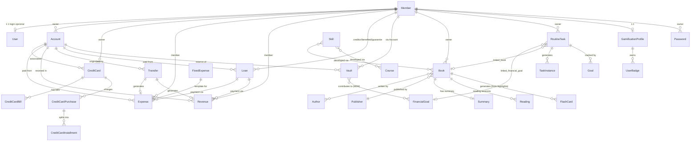

# Schema do Banco de Dados - Axiom

> Documentação completa do schema do banco de dados PostgreSQL com pgvector.
> Auditada e reescrita em 2026-08 contra `apps/api/*/models.py` (todos os apps em `INSTALLED_APPS`). Para os diagramas ER visuais (Mermaid), veja [`architecture/diagrams.md`](../architecture/diagrams.md) — este documento foca em campos, choices e regras de negócio por modelo.

## Índice

- [Visão Geral](#visão-geral)
- [Modelo Base](#modelo-base)
- [Módulos Financeiros](#módulos-financeiros)
- [Módulo de Segurança](#módulo-de-segurança)
- [Módulo de Biblioteca](#módulo-de-biblioteca)
- [Módulo de Planejamento Pessoal](#módulo-de-planejamento-pessoal)
- [Módulo Sistema](#módulo-sistema)
- [Módulo Agentes (IA)](#módulo-agentes-ia)
- [Relacionamentos](#relacionamentos)
- [Notas de Implementação](#notas-de-implementação)

---

## Visão Geral

O Axiom utiliza PostgreSQL com a extensão pgvector para armazenamento de dados financeiros, pessoais e vetoriais. Todos os modelos herdam de `BaseModel` que fornece campos comuns de auditoria e soft delete — **exceto** um pequeno grupo de modelos append-only/imutáveis que herdam de `models.Model` diretamente (`ActivityLog`, `DeletionRecord`, `CredentialShareToken`, `VaultConfig` no app `security`; `ContentEmbedding`-like registros não existem mais — ver nota no [Módulo Agentes](#módulo-agentes-ia)).

### Características Principais

- **Soft Delete**: Registros não são deletados fisicamente, apenas marcados com `is_deleted=True` (exceto os modelos imutáveis citados acima).
- **Auditoria**: Registros `BaseModel` rastreiam quem criou/modificou e quando.
- **Dono do dado = `Member`, não `User`**: praticamente todo modelo de domínio (financeiro, segurança, biblioteca, planejamento) usa `owner: ForeignKey(Member)` — nunca uma FK direta a `User` para representar "de quem é o dado". `Member` é o cadastro unificado de pessoa; um `Member` pode (opcionalmente) estar vinculado 1:1 a um `User` do Django para ter login. `created_by`/`updated_by` (de `BaseModel`) apontam para `User` e servem só para auditoria de quem operou a API — são ortogonais ao dono do dado.
- **Duas famílias de criptografia distintas**:
  1. **App-level (Fernet)** — `app/encryption.py:FieldEncryption`, chave única `ENCRYPTION_KEY` do `.env`. Usada em `Account._account_number`, `CreditCard._card_number/_security_code`, `Member._document`, `CredentialShareToken._encrypted_password` (snapshot).
  2. **Vault-level (per-user)** — `security/vault_crypto.py:VaultEncryptedField`/`VaultMaskedEncryptedField`. Usada exclusivamente pelos modelos do app `security` (`Password`, `StoredCreditCard`, `StoredBankAccount`, `Archive`, `PasswordHistory`). A chave (`vault_key`) é derivada por PBKDF2 da senha mestre do usuário, cifrada em repouso em `VaultConfig.encrypted_vault_key`, e só existe em texto plano no Redis durante a sessão (TTL configurável, padrão 60 min). **Não há chave mestra de admin** — perder a senha mestre e a `recovery_key` torna os dados irrecuperáveis.
- **pgvector**: usado pelo app `agents` (`AgentEmbedding.embedding`, `vector(768)`, `nomic-embed-text` via Ollama) para busca vetorial semântica. Não há mais nenhum modelo de embedding fora de `agents/`.
- **UUID**: Cada registro `BaseModel` possui um `uuid` único além do `id` sequencial (PK interna).

### Convenções

- Prefixo `_` para campos criptografados (ex: `_password`, `_card_number`).
- Choices em português com valores em inglês (a maioria) ou snake_case.
- Timestamps UTC com Django timezone awareness (`America/Sao_Paulo` para exibição).
- Padrão **Purchase → Installment** para compras/dívidas parceladas (`CreditCardPurchase`+`CreditCardInstallment`, `Payable`+`PayableInstallment`, `Receivable`+`ReceivableInstallment`, `Loan`+`LoanInstallment`).
- Padrão **Fixed\* + Fixed\*GenerationLog** para itens recorrentes gerados mensalmente (`FixedExpense`, `FixedRevenue`, `FixedTransfer`), com um log de geração único por mês (`unique=True` em `month`, formato `YYYY-MM`) que previne duplicação.

---

## Modelo Base

### BaseModel (Abstract)

```python
class BaseModel(models.Model):
    id: AutoField (PK)
    uuid: UUIDField (unique, auto-generated)
    created_at: DateTimeField (auto_now_add)
    updated_at: DateTimeField (auto_now)
    created_by: ForeignKey(User, null=True)
    updated_by: ForeignKey(User, null=True)
    is_deleted: BooleanField (default=False)
    deleted_at: DateTimeField (null=True)

    class Meta:
        abstract = True
```

Choices compartilhadas em `app/models.py`: `PAYMENT_METHOD_CHOICES`, `PAYMENT_FREQUENCY_CHOICES`, `LOAN_STATUS_CHOICES`, `BILL_STATUS_CHOICES`.

---

## Módulos Financeiros

### 1. Accounts — `accounts_account`

`Account(BaseModel)`: `account_name`, `institution_name` (choices `ACCOUNT_NAMES`: NUB/SIC/MPG/IFB/CEF), `account_type` (choices `ACCOUNT_TYPES`: CC/CS/FG/VA), `account_image`, `_account_number` (Fernet-encrypted), `agency`, `bank_code`, `current_balance`/`minimum_balance` (Decimal 15,2), `opening_date`, `is_active`, `owner → Member (PROTECT)`. Properties: `account_number` (decrypt), `account_number_masked`. Ordering: `-account_name`.

### 2. Credit Cards — `credit_cards_creditcard` + faturas + compras/parcelas

**`CreditCard(BaseModel)`**: `name`, `on_card_name`, `flag` (choices `FLAGS`: MSC/VSA/ELO/EXP/HCD), `_card_number`/`_security_code` (Fernet-encrypted), `validation_date`, `credit_limit`/`max_limit`, `closing_day`/`due_day` (1-31), `interest_rate`, `annual_fee`, `associated_account → Account`, `owner → Member (PROTECT)`, `is_active`.

**`CreditCardBill(BaseModel)`**: `credit_card → CreditCard`, `year`/`month`, `invoice_beginning_date`/`invoice_ending_date`, `total_amount`, `minimum_payment`, `paid_amount`, `due_date`, `closed`, `status` (choices `BILL_STATUS_CHOICES`).

**`CreditCardPurchase(BaseModel)`** *(substitui o antigo `CreditCardExpense`)*: `description`, `total_value`, `purchase_date`/`purchase_time`, `category` (choices `EXPENSES_CATEGORIES`), `card → CreditCard (PROTECT)`, `total_installments` (default 1), `merchant`, `member → Member`, `receipt`. Property `installment_value = total_value / total_installments`.

**`CreditCardInstallment(BaseModel)`**: `purchase → CreditCardPurchase (CASCADE)`, `installment_number`, `value`, `due_date`, `bill → CreditCardBill (SET_NULL, nullable)`, `payed`. `unique_together`: `(purchase, installment_number)`.

### 3. Expenses — `expenses_expense` + extensões

**`Tag(BaseModel)`**: `name`, `color` (hex `#RRGGBB`), `owner → User (CASCADE)` — **nota**: FK direta a `User`, não `Member`, diferente do resto do domínio financeiro. `unique(name, owner)`. M2M com `Expense.tags`.

**`Expense(BaseModel)`**: `description`, `value`, `category` (choices `EXPENSES_CATEGORIES`, 22 categorias), `date`/`horary`, `account → Account`, `member → Member`, `related_transfer → Transfer (nullable, CASCADE)`, `fixed_expense_template → FixedExpense (nullable, SET_NULL)`, `related_loan → Loan (nullable, SET_NULL)`, `merchant`, `location`, `payment_method` (choices `PAYMENT_METHOD_CHOICES`), `receipt`, `payed`, `recurring`/`frequency`. Índices compostos em `date`, `category+date`, `account+date`, `payed+date`, `account+category`. Ordering: `-date`.

**`FixedExpense(BaseModel)`**: `description`, `default_value`, `category`, `account → Account`, `due_day` (1-31), `is_active`, `allow_value_edit`, `last_generated_month` (`YYYY-MM`). Ordering: `due_day, description`.

**`FixedExpenseGenerationLog(BaseModel)`**: `month` (unique, `YYYY-MM`), `generated_by → User`, `total_generated`, `fixed_expense_ids` (JSON). Previne duplicação de geração por mês.

**`CategorizationRule(BaseModel)`**: `merchant_contains`, `category`, `is_active`, `priority` (menor = maior prioridade), `owner → User (CASCADE)`. Aplicada automaticamente quando uma despesa é criada com `category='others'` e `merchant` preenchido: a primeira regra ativa cujo `merchant_contains` bate (case-insensitive) é aplicada.

**`ExpenseSplit(BaseModel)`**: `expense → Expense (CASCADE)`, `member → Member (nullable)`, `description`, `percentage` (auto-calculado no `save()` se omitido), `value`, `payed`. `UniqueConstraint(expense, member)`. Divide uma despesa entre membros sem alterar o valor total registrado.

**`AutomationRule(BaseModel)`**: regra "SE → ENTÃO" para despesas. `name`, `logic` (`all`/`any`), `conditions` (JSON `[{field, operator, value}]` — campos: merchant/description/category/value/account/payment_method; operadores: contains/not_contains/eq/neq/gt/gte/lt/lte), `actions` (JSON `[{type, value}]` — tipos: `set_category`/`add_tag`/`create_alert`), `is_active`, `priority`, `apply_count` (contador, não editável), `owner → User (CASCADE)`. Métodos `matches(expense)` e `apply(expense)`.

**`AutomationRuleLog(BaseModel)`**: `rule → AutomationRule (CASCADE)`, `expense → Expense (CASCADE)`, `actions_applied` (JSON). Um registro por aplicação de regra a uma despesa.

### 4. Revenues — `revenues_revenue` + recorrência

**`Revenue(BaseModel)`**: `description`, `value`, `category` (choices `REVENUES_CATEGORIES`, 10 categorias), `date`/`horary`, `account → Account`, `member → Member`, `related_transfer`/`related_loan` (nullable), `tax_amount`, `net_amount` (auto-calculado: `value - tax_amount`), `source`, `receipt`, `received`, `recurring`/`frequency`. Índices análogos a `Expense`. Ordering: `-date`.

**`FixedRevenue(BaseModel)`** / **`FixedRevenueGenerationLog(BaseModel)`**: análogos a `FixedExpense`/`FixedExpenseGenerationLog` — receitas fixas recorrentes (ex: salário), com `default_value`, `due_day`, `is_active`, `last_generated_month`, geração idempotente por mês.

### 5. Loans — `loans_loan` + parcelas

**`Loan(BaseModel)`**: `description`, `value`, `payed_value`, `initial_payed_value` (baseline não editável, somado ao apurado de despesas/receitas vinculadas), `date`/`horary`/`due_date`, `category` (choices `EXPENSES_CATEGORIES`), `account → Account`, `benefited`/`creditor`/`guarantor → Member (PROTECT, nullable no guarantor)`, `interest_rate`, `installments`, `payment_frequency`, `late_fee`, `contract_document`, `status` (choices `LOAN_STATUS_CHOICES`), `loan_type` (`borrowed`/`lent`). `payed` é derivado automaticamente (`payed_value >= value`) no `save()`. Validação: `payed_value` não pode exceder `value`.

**`LoanInstallment(BaseModel)`**: `loan → Loan (CASCADE)`, `installment_number`, `value`, `due_date`, `payed`, `payment_expense → Expense (SET_NULL, nullable)`. Gerada automaticamente quando `Loan.installments > 1`. `unique_together`: `(loan, installment_number)`.

### 6. Transfers — `transfers_transfer` + recorrência

**`Transfer(BaseModel)`**: `description`, `value`, `category` (choices `TRANSFER_CATEGORIES`: doc/ted/pix), `date`/`horary`, `origin_account`/`destiny_account → Account (PROTECT)`, `member → Member`, `fee`, `exchange_rate`, `processed_at`, `transaction_id` (unique), `confirmation_code`, `receipt`, `transfered` (bool), `status` (choices: pending/processing/completed/failed/cancelled — sincronizado com `transfered` no `save()`). Validação: `origin_account ≠ destiny_account`. Ao processar, gera automaticamente `Expense` (origem) e `Revenue` (destino) via `related_transfer`.

**`FixedTransfer(BaseModel)`** / **`FixedTransferGenerationLog(BaseModel)`**: transferências mensais recorrentes, análogas a `FixedExpense`, com geração manual via endpoint `/fixed-transfers/generate/`.

### 7. Payables / Receivables — espelhos para dívidas/créditos avulsos

**`Payable(BaseModel)`**: `description`, `value`, `paid_value`, `date`/`due_date`, `category` (choices `EXPENSES_CATEGORIES`), `member → Member`, `status` (choices `PAYABLE_STATUS_CHOICES`: active/paid/overdue/cancelled). Diferente de `Loan`, criar um `Payable` **não** gera receita correspondente. Property `remaining_value`.

**`PayableInstallment(BaseModel)`**: `payable → Payable (CASCADE)`, `installment_number`, `value`, `due_date`, `payed`, `payment_expense → Expense (SET_NULL)`.

**`Receivable(BaseModel)`**: espelho de `Payable` para o lado de receitas — `value`, `received_value`, `category` (choices `REVENUES_CATEGORIES`), `member` (devedor), `status` (choices `RECEIVABLE_STATUS_CHOICES`: active/received/overdue/cancelled). Registrar o `Receivable` **não** cria despesa; só registrar `received_value` completo dispara `status='received'`.

**`ReceivableInstallment(BaseModel)`**: `receivable → Receivable (CASCADE)`, `installment_number`, `value`, `due_date`, `received`, `receipt_revenue → Revenue (SET_NULL)`.

### 8. Vaults — `vaults_vault` + metas financeiras

**`Vault(BaseModel)`**: `description`, `account → Account (PROTECT)`, `current_balance`, `accumulated_yield`, `yield_rate` (legado, diário), `annual_yield_rate` (atual), `last_yield_date`, `is_active`, `currency_code`. Métodos: `calculate_yield()`/`apply_yield()` (rendimento composto sobre dias úteis: `V = P·(1+r)^n − P`), `deposit()`/`withdraw()` (validam saldo, aplicam rendimento pendente antes da operação, criam `VaultTransaction`), `recalculate_yields()` (reverte e reaplica após mudança de taxa).

**`VaultTransaction(BaseModel)`**: `vault → Vault (PROTECT)`, `transaction_type` (deposit/withdrawal/yield), `amount`, `balance_after`, `transaction_date`, `recurring_contribution → VaultRecurringContribution (SET_NULL, nullable)`.

**`VaultRecurringContribution(BaseModel)`**: `vault → Vault (CASCADE)`, `amount`, `day_of_month`, `is_active`, `start_date`/`end_date`, `fixed_expense → FixedExpense (OneToOne, SET_NULL)` — gera automaticamente um template de despesa fixa espelhado; `last_generated_month`. Property `next_contribution_date`.

**`FinancialGoal(BaseModel)`**: `description`, `category` (choices `GOAL_CATEGORIES`: savings/investment/emergency/travel/education/property/vehicle/retirement/health/reduce_expenses/increase_revenue/other), `target_value`, `vaults` (**M2M** com `Vault`, um cofre pode contribuir para várias metas), `target_date`, `is_active`/`is_completed`/`completed_at`, `linked_expense_category` (para metas de redução de despesas), `linked_account → Account (SET_NULL)`. Properties calculadas: `current_value` (soma dos `Vault.current_balance` associados), `progress_percentage`, `remaining_value`, `days_remaining`, `monthly_required`. Método `check_completion()`.

### 9. Budgets — `budgets_budget`

**`Budget(BaseModel)`**: `category` (choices `EXPENSES_CATEGORIES`), `limit_amount`, `month`/`year`, `member → Member (SET_NULL, nullable — orçamento pode ser "da casa")`, `rollover_enabled`/`rollover_amount` (soma o saldo não usado do mês anterior). `UniqueConstraint(category, month, year, member)`.

### 10. Bank Reconciliation — `bank_reconciliation_*`

**`BankStatementImport(BaseModel)`**: `owner → User`, `account → Account`, `file_hash` (SHA-256, dedupe), `original_filename`, `file_format` (choices: ofx/csv/cnab240/cnab400), `status` (processing/completed/failed), `total_entries`/`matched_count`/`unmatched_count`/`ignored_count`, `error_message`.

**`BankStatementEntry(BaseModel)`**: `statement_import → BankStatementImport (CASCADE)`, `transaction_id`, `date`, `amount`, `description`, `transaction_type` (debit/credit), `status` (pending/matched/unmatched/ignored), `matched_expense`/`matched_revenue → Expense/Revenue (SET_NULL)`, `match_confidence` (high/medium/low/manual).

### 11. Monthly Planning — `monthly_planning_monthlyplan`

**`MonthlyPlan(BaseModel)`**: por usuário/mês/ano — `month`/`year`, `extra_revenues`/`extra_expenses` (JSON, overrides ad-hoc), `budget_overrides`, `fixed_revenue_overrides`, `fixed_expense_overrides`, `bill_overrides`, `budget_disabled_categories`, `applied_at`. Ver `CLAUDE.md` para os endpoints (`summary/`, `<pk>/`, `<pk>/apply/`).

### 12. Exchange Rates — `exchange_rates_exchangerate`

**`ExchangeRate(BaseModel)`**: `currency_from` (ISO 4217 — 12 moedas fiat + BTC/ETH), `rate_buy`/`rate_sell` (Decimal 20,8), `reference_date`, `source` (default `BCB_PTAX`). `unique_together(currency_from, reference_date)`. Property `mid_rate`. Métodos de classe `latest_rate()` e `convert(amount, from_currency, to_currency)` — cross-rate sempre via BRL.

### 13. Members — `members_member`

**`Member(BaseModel)`**: `name`, `_document` (Fernet-encrypted CPF) + `document_hash` (HMAC-SHA256, unique — permite lookup de unicidade sem descriptografar), `phone`, `email`/`email_verified`/`email_verification_token`, `sex`, `user → User (OneToOne, nullable)`, `is_creditor`/`is_benefited`, `active`, `birth_date`, `address`, `profile_photo`, `emergency_contact`, `monthly_income`, `occupation`, `activity_level` (choices `ACTIVITY_LEVEL_CHOICES` — usado para TDEE no módulo de nutrição). Descriptor `document` (get/set transparente, mantém `document_hash` em sincronia). Método `anonymize()` (pré-requisito LGPD antes de hard-delete). Properties: `is_user`, `age`.

---

## Módulo de Segurança

Todos os modelos de dado sensível usam **criptografia por usuário** (`VaultEncryptedField`, ver [Visão Geral](#visão-geral)) — não a `FieldEncryption`/Fernet global usada no restante do sistema.

### 1. Password — `security_password`

`title`, `site`, `username`, `_password` (vault-encrypted), `category` (choices `PASSWORD_CATEGORIES`: social/email/banking/work/entertainment/shopping/streaming/gaming/other), `last_password_change`, `is_favorite`, `owner → Member (PROTECT)`, `totp_enabled`/`_totp_secret` (2FA por credencial, vault-encrypted), `hibp_compromised`/`hibp_last_checked` (Have I Been Pwned), `strength_score` (0-4, calculado por `Password.calculate_strength()`).

### 2. PasswordHistory — `security_passwordhistory`

`password → Password (CASCADE)`, `_old_password` (vault-encrypted), `changed_by → User`. Snapshot de cada troca de senha.

### 3. StoredCreditCard — `security_storedcreditcard`

`name`, `_card_number`/`_security_code` (vault-encrypted; número validado por algoritmo de Luhn, 13-19 dígitos), `expiration_month`/`expiration_year`, `cardholder_name`, `flag` (choices `FLAGS` — inclui `DIN`/`OTHER` além das 5 do Finance), `is_favorite`, `owner → Member (PROTECT)`, `finance_card → credit_cards.CreditCard (SET_NULL, opcional)`.

### 4. StoredBankAccount — `security_storedbankaccount`

`name`, `institution_name`, `institution_code` (ISPB/COMPE), `account_type` (choices `ACCOUNT_TYPES`: CC/CS/CP/CI/OTHER), `_account_number`/`_password`/`_digital_password` (vault-encrypted), `agency`, `is_favorite`, `owner → Member (PROTECT)`, `finance_account → accounts.Account (SET_NULL, opcional)`.

### 5. Archive — `security_archive`

`title`, `category` (choices `ARCHIVE_CATEGORIES`), `archive_type` (choices `ARCHIVE_TYPES`), `_encrypted_text` (vault-encrypted, modo texto) **ou** `encrypted_file` (modo arquivo — cifrado antes do upload se `is_file_encrypted=True`), `file_name`/`file_size`, `tags` (JSON), `is_favorite`, `owner → Member (PROTECT)`. Métodos `has_text_content()`/`has_file_content()`.

### 6. VaultConfig — `security_vaultconfig` *(não é `BaseModel`)*

`owner → Member (OneToOne)`, `salt` (base64), `encrypted_vault_key` (cifrada com a chave derivada da senha mestre), `recovery_key_hash` (SHA-256, plaintext nunca armazenado), `recovery_encrypted_vault_key` (envelope encryption pela recovery key), `session_ttl_minutes` (15-240, padrão global 60 se nulo).

### 7. CredentialShareToken — `security_credentialsharetoken` *(não é `BaseModel`)*

Link temporário de compartilhamento. `credential_type` (password/stored_credit_card/stored_bank_account), FK opcional para cada um dos três (só uma preenchida), `token` (UUID, unique), `_encrypted_password` (snapshot re-cifrado com a **app key**, não a vault_key — permite resgate sem o cofre desbloqueado), `expires_at`, `used_at`, `use_count`/`max_uses`, `is_revoked`, `allowed_ips` (JSON, vazio = qualquer IP), `created_by → User`. Properties: `is_expired`, `is_exhausted`, `is_valid`.

### 8. ActivityLog — `security_activitylog` *(não é `BaseModel` — logs não são editáveis/excluíveis)*

`action` (choices `ACTION_TYPES` — 14 valores: view/create/update/delete/reveal/download/login/logout/failed_login/failed_vault_unlock/other/purge/shared_reveal/copy), `model_name`/`object_id`/`object_uuid`, `description` (+ `description_key`/`description_params` para i18n), `ip_address`, `user_agent`, `user → User (SET_NULL)`. Método de classe `log_action(...)`.

### 9. DeletionRecord — `security_deletionrecord` *(não é `BaseModel`)*

Certificado imutável de hard-delete (LGPD/GDPR), criado por `purge_deleted_records`. `record_uuid`, `model_name`, `deleted_at` (soft-delete original), `purged_at` (auto_now_add).

### 10. VaultHealthSnapshot — `security_vaulthealthsnapshot`

`owner → Member (CASCADE)`, `score`, `weak_passwords`/`medium_passwords`/`duplicate_passwords`/`outdated_passwords`/`total_passwords`, `snapshot_date` (auto_now_add). `unique_together(owner, snapshot_date)` — um snapshot diário por usuário, alimenta o histórico do Dashboard de Saúde.

### 11. VaultAlertConfig — `security_vaultalertconfig`

`owner → Member (OneToOne)`, flags de alerta (`alert_on_new_ip`, `alert_on_failed_unlock` + `failed_unlock_threshold`, `alert_on_reveal`, `alert_on_excessive_reveals` + `excessive_reveals_threshold`, `alert_on_card_reveal`), `notify_email`.

---

## Módulo de Biblioteca

O app `library` é **flat** (um único `models.py`) — 17 modelos agrupados logicamente em "Core" (acervo/leitura) e "Intellect" (aprendizado estruturado), não fisicamente separados em sub-pacotes.

### Core

**`Author(BaseModel)`**: `name` (unique), `birth_year`/`birth_era` (AC/DC), `death_year`/`death_era`, `nationality` (choices `NATIONALITY_CHOICES`, 39 nacionalidades), `biography`, `photo`, `owner → Member (PROTECT)`.

**`Publisher(BaseModel)`**: `name` (unique), `description`, `website`, `country` (choices `COUNTRIES`), `founded_year`, `owner → Member (PROTECT)`.

**`Book(BaseModel)`**: `title`, `authors` (**M2M** com `Author`), `pages`, `publisher → Publisher (PROTECT)`, `language` (choices `LANGUAGES`), `genre` (choices `GENRES`), `literarytype` (choices `LITERARY_TYPES`), `publish_date`, `synopsis`, `edition`, `media_type` (Dig/Phi), `rating` (1-5), `cover`, `book_file` (upload por pk, permite leitor integrado), `read_status` (choices `READ_STATUS_CHOICES`: to_read/reading/read/**paused**), `isbn`, `series_name`/`series_order`, `reading_priority`, `pause_reason`, `owner → Member (PROTECT)`. `UniqueConstraint(title, owner)` entre não-deletados.

**`Summary(BaseModel)`**: `title`, `book → Book (PROTECT)`, `text` (Markdown), `is_vectorized`/`vectorization_date` (indexação pelo `LibraryAgent` via RAG), `owner → Member`. `unique_together(title, book, owner)`.

**`Reading(BaseModel)`**: `book → Book (PROTECT)`, `reading_date`, `reading_time` (minutos), `pages_read`, `current_page`, `current_cfi` (posição EPUB para retomar leitura digital), `time_of_day` (choices `TIME_OF_DAY_CHOICES`), `owner → Member`. Validação: soma de `pages_read` de todas as leituras não pode exceder `book.pages`.

**`ReadingGoal(BaseModel)`**: `year`, `name`, `books_goal` (default 12), `pages_goal`, `owner → Member`. Properties calculadas: `books_read_this_year`, `pages_read_this_year`, `progress_percentage`, `pages_progress_percentage`.

**`LiteraryTypeGoal(BaseModel)`**: `reading_goal → ReadingGoal (CASCADE)`, `literary_type`, `goal_count`. Meta por tipo literário dentro de uma `ReadingGoal` do ano. `UniqueConstraint(reading_goal, literary_type)` entre ativos.

**`BookHighlight(BaseModel)`**: `book → Book (PROTECT)`, `text`, `page_number`, `chapter`, `highlight_type` (quote/note/idea), `color` (5 opções), `summary → Summary (SET_NULL, opcional)`, `owner → Member`.

### Extensão Intellect

**`Course(BaseModel)`**: `title`, `platform` (choices `COURSE_PLATFORM_CHOICES`: udemy/coursera/youtube/linkedin/alura/pluralsight/other), `category` (choices `INTELLECT_CATEGORY_CHOICES`), `description`, `url`, `estimated_hours`, `status` (choices `COURSE_STATUS_CHOICES`), `start_date`/`end_date`, `completion_certificate`, `owner → Member (PROTECT)`. Properties: `total_lessons`, `completed_lessons`, `progress_percentage`, `invested_hours` (soma de `CourseSession.duration_minutes`).

**`CourseModule(BaseModel)`**: `course → Course (CASCADE)`, `title`, `order`.

**`CourseLesson(BaseModel)`**: `module → CourseModule (CASCADE)`, `title`, `order`, `is_completed`/`completed_at`. Método `toggle_completed()`.

**`CourseSession(BaseModel)`**: `course → Course (CASCADE)`, `session_date`, `duration_minutes`, `notes`. Log de estudo (usado tanto para `invested_hours` quanto para o streak unificado leitura+estudo).

**`Skill(BaseModel)`**: `name`, `category` (mesmo enum de `Course`), `proficiency` (choices `SKILL_PROFICIENCY_CHOICES`: beginner/basic/intermediate/advanced/expert), `status` (choices `SKILL_STATUS_CHOICES`: learning/evolving/mastered), `books`/`courses` (**M2M**, `related_name="related_skills"` em ambos), `owner → Member`. `UniqueConstraint(name, owner)` entre ativos.

**`SkillHistory(BaseModel)`**: `skill → Skill (CASCADE)`, `proficiency`, `status`, `notes`. Snapshot histórico de evolução de uma skill.

**`IntellectBadge(BaseModel)`**: `owner → Member (CASCADE)`, `code` (choices `BADGE_CODE_CHOICES`, 16 badges: `first_book`, `reader_5/10/25`, `first_course`, `learner_3/10`, `streak_7/30`, `first_highlight`, `annotator_10/50`, `knowledge_builder/master`, `first_skill`, `skill_collector`), `level` (bronze/silver/gold), `awarded_at`. `unique_together(owner, code)`. **Bounded context separado** do sistema de gamificação de `personal_planning` (ver [Módulo de Planejamento Pessoal](#módulo-de-planejamento-pessoal)) — vocabulário parecido, sem relação de dados.

**`FlashCard(BaseModel)`**: spaced repetition (algoritmo SM-2). `book → Book (CASCADE, nullable)`, `highlight → BookHighlight (SET_NULL, nullable)`, `front`/`back`, `status` (choices `FLASHCARD_STATUS_CHOICES`: new/learning/review/mastered), `ease_factor` (float, default 2.5), `interval_days`, `repetitions`, `next_review`, `last_reviewed`, `owner → Member`. Método `apply_review(rating 0-5)` recalcula os campos SM-2 in-place — **não existe histórico de revisões persistido**, cada review sobrescreve o próprio registro. Endpoint `books/<pk>/flashcards/generate/` gera automaticamente um flashcard por `BookHighlight` do livro.

**`KnowledgeLink(BaseModel)`**: aresta explícita do grafo de conhecimento. `source_type`/`target_type` (choices `KNOWLEDGE_NODE_TYPE_CHOICES`: book/course/skill/highlight/summary/author), `source_id`/`target_id` (UUIDField — **referência solta, sem FK real de banco**; integridade é responsabilidade da aplicação), `relation_label` (choices `KNOWLEDGE_LINK_RELATION_CHOICES`: relates/supports/contradicts/deepens/derived_from/applies), `owner → Member`. `unique_together(source_type, source_id, target_type, target_id, owner)` entre ativos. **Não existe modelo de "nó"** — os nós do grafo são montados dinamicamente pela view `KnowledgeGraphView` a partir de `Author`/`Book`/`Summary`/`BookHighlight` (opcional)/`Course`/`Skill`; arestas implícitas (autoria, "tem resumo", "tem highlight") são derivadas em tempo de leitura e combinadas com as explícitas de `KnowledgeLink`.

---

## Módulo de Planejamento Pessoal

O app `personal_planning` é **flat** (um único `models.py`, ~2770 linhas, 30 modelos) cobrindo cinco sub-domínios: hábitos/metas, gamificação, bem-estar emocional, treino e nutrição.

### Hábitos e Metas

**`RoutineTask(BaseModel)`**: template de hábito recorrente. `name`, `category` (choices `TASK_CATEGORY_CHOICES`, 11 categorias — inclui `intellect`), `icon` (nome de ícone Lucide), `periodicity` (choices `PERIODICITY_CHOICES`: daily/weekdays/weekly/monthly/custom), `weekday`/`day_of_month` (conforme periodicidade), `custom_weekdays`/`custom_month_days`/`times_per_week`/`times_per_month`/`interval_days`/`interval_start_date` (periodicidade custom), `target_quantity`/`unit` (choices `UNIT_CHOICES`, 16 unidades), `default_time`/`closing_time`/`daily_occurrences`/`interval_hours`/`scheduled_times` (agendamento intradiário), `priority` (choices `PRIORITY_CHOICES`), `allowed_skips_per_month` (tolerância de streak), `linked_financial_goal → vaults.FinancialGoal (SET_NULL)`, `linked_book → library.Book (SET_NULL)`, `chained_task → self (SET_NULL — habit stacking: dispara outra tarefa ao concluir esta)`, `owner → Member (PROTECT)`. Método `should_appear_on_date(date)` calcula ocorrência sem persistir instâncias futuras.

**`UserRoutineTemplate(BaseModel)`**: `name`, `icon`, `tasks` (JSON — lista de tarefas no formato de import em lote), `owner → Member (CASCADE)`. Template de rotina reutilizável salvo pelo próprio usuário.

**`TaskInstance(BaseModel)`**: ocorrência concreta de uma tarefa em um dia/horário — gerada lazy a partir de `RoutineTask` (nunca para datas futuras ainda não visitadas) ou avulsa. `template → RoutineTask (SET_NULL, nullable)`, snapshot (`task_name`, `task_description`, `category`, `icon`, `priority`), `scheduled_date`/`scheduled_time`/`occurrence_index`, `status` (choices `INSTANCE_STATUS_CHOICES`: pending/in_progress/completed/skipped/cancelled), `target_quantity`/`quantity_completed`/`unit`, `started_at`/`completed_at` (setados automaticamente pela transição de `status` no `save()`), `owner → Member (PROTECT)`. `unique_together(template, scheduled_date, occurrence_index, owner)`. Properties: `is_overdue`, `time_display`.

**`Goal(BaseModel)`**: `title`, `goal_type` (choices `GOAL_TYPE_CHOICES`: consecutive_days/total_days/avoid_habit/custom), `goal_source` (choices `GOAL_SOURCE_CHOICES`: task_instances/workout_sessions/meal_logs/custom — de onde vem o progresso automático), `related_task → RoutineTask (SET_NULL, opcional)`, `target_value`/`current_value`/`best_streak`, `start_date`/`end_date`, `status` (choices `GOAL_STATUS_CHOICES`), `owner → Member`. Tipos em `AUTO_COMPLETION_GOAL_TYPES` (consecutive_days/total_days/avoid_habit) têm progresso recalculado automaticamente via signals/endpoint/tarefa periódica.

**`GoalFailure(BaseModel)`**: `goal → Goal (CASCADE)`, `failure_date`, `streak_at_failure`. Histórico de quebras de sequência — permite exibir a melhor sequência já alcançada mesmo após falhas.

**`Challenge(BaseModel)`**: desafio de duração fixa (ex: "30 dias sem açúcar"). `title`, `duration_days` (choices: 7/21/30/66/100), `start_date`/`end_date`, `status` (active/completed/failed/cancelled), `completion_rate`, `template_task → RoutineTask (SET_NULL, opcional)`, `owner → Member (CASCADE)`.

**`DailyReflection(BaseModel)`**: `date`, `reflection` (texto livre), `mood` (choices `MOOD_CHOICES`), `owner → Member (PROTECT)`. `unique_together(date, owner)` — no máximo uma reflexão por dia.

### Gamificação

Bounded context isolado, exposto só via `GamificationProfileView` (payload agregado — sem CRUD dedicado para `Badge`/`UserBadge`/`XPTransaction`). **Não relacionado** ao sistema de badges de leitura (`library.IntellectBadge`).

**`GamificationProfile(BaseModel)`**: `member → Member (OneToOne, CASCADE)`, `total_xp`, `current_level` (curva quadrática `100 × level²`), `current_streak`/`longest_streak`, `last_activity_date`, `tasks_completed_total`. Métodos `add_xp()` (cria `XPTransaction`, recalcula nível) e `update_streak()` (ao atingir 7/30/100 dias, concede XP + badge de streak via `UserBadge`).

**`XPTransaction(BaseModel)`**: `profile → GamificationProfile (CASCADE)`, `amount` (pode ser negativo), `event` (choices `XP_EVENT_CHOICES`: task_completed/goal_completed/streak_7/30/100/badge_earned/daily_reflection), `total_after` (snapshot). Log append-only.

**`Badge(BaseModel)`**: catálogo global (sem FK de owner). `slug` (unique), `name`, `category` (choices `BADGE_CATEGORY_CHOICES`), `icon`, `xp_reward`. Criado dinamicamente via `get_or_create` pelo próprio `GamificationProfile`.

**`UserBadge(BaseModel)`**: `profile → GamificationProfile (CASCADE)`, `badge → Badge (CASCADE)`, `earned_at`. `unique_together(profile, badge)`.

### Bem-Estar Emocional (Wellness Center)

Todos com `owner → Member (PROTECT, na maioria)`.

**`SelfEsteemAssessment(BaseModel)`**: Escala de Rosenberg (10 itens `q1`..`q10`, Likert 0-3), `score` (0-30, calculado automaticamente no `save()`), `ai_analysis` (texto gerado por IA), `assessed_at`.

**`EmotionalCheckin(BaseModel)`**: escalas 0-10 (`loneliness`, `neediness`, `anxiety`, `sadness`, `motivation` default 5, `energy` default 5), `what_happened`/`occupying_thoughts` (texto livre), `checked_at`. Sem `unique_together` por dia — permite múltiplos check-ins diários.

**`CrisisImpulseLog(BaseModel)`**: "Modo Crise". `emotional_state`/`emotional_state_other` (choices `EMOTIONAL_STATE_CHOICES` + campo livre), `impulse_type`/`impulse_type_other` (choices `IMPULSE_TYPE_CHOICES` + campo livre), `ai_response` (JSON estruturado, resposta de apoio gerada por IA), `resolved`, `logged_at`.

**`WellnessIntervention(BaseModel)`**: catálogo de técnicas/exercícios de bem-estar. `title`, `description`, `category` (choices `WELLNESS_INTERVENTION_CATEGORY_CHOICES`: self_esteem/loneliness/neediness/anxiety/emotional_dependency), `duration_minutes`, `difficulty` (easy/medium/hard), `expected_benefit`, `is_global` (default True; `owner` só preenchido se customizada por um usuário).

**`WellnessInterventionCompletion(BaseModel)`**: `owner → Member`, `intervention → WellnessIntervention (PROTECT)`, `completed_at`, `rating` (1-5, opcional), `notes`.

**`WellnessWeeklyReport(BaseModel)`**: `week_start`/`week_end`, `ai_summary`, `attention_points`/`suggestions` (JSON, listas), médias agregadas (`avg_loneliness`, `avg_anxiety`, `avg_motivation`), `latest_self_esteem_score`. `unique_together(owner, week_start)` — um relatório por semana. Gerado sob demanda via endpoint `.../generate/`.

### Treino

**`ExerciseDatasetEntry(BaseModel)`**: catálogo público vendorizado (`hasaneyldrm/exercises-dataset`, MinIO), **sem `owner`** — dado global compartilhado. `dataset_id` (4 dígitos, unique), `name`, `category`/`body_part`/`equipment`/`target`, `thumbnail`/`gif`. Populado via `manage.py import_exercise_dataset`.

**`Exercise(BaseModel)`**: catálogo pessoal de exercícios. `name`, `muscle_groups`, `met_value` (estimativa calórica: `kcal = MET × peso_kg × horas`), `dataset_entry → ExerciseDatasetEntry (SET_NULL, opcional — única fonte de GIF/thumbnail)`, `owner → Member (PROTECT)`.

**`WorkoutPlan(BaseModel)`**: `name`, `description`, `is_active`, `owner → Member (PROTECT)`.

**`WorkoutDay(BaseModel)`**: divisão dentro de um plano (ex: "Treino A"). `plan → WorkoutPlan (CASCADE)`, `name`, `muscle_groups`, `day_of_week` (opcional), `order`, `default_start_time`/`default_duration_minutes`.

**`WorkoutExercise(BaseModel)`**: exercício planejado dentro de uma divisão. `workout_day → WorkoutDay (CASCADE)`, `exercise → Exercise (SET_NULL)`, `name` (snapshot), `sets`, `reps_min`/`reps_max`, `rest_seconds`, `load`/`load_unit` (kg/lb/bw), `order`.

**`WorkoutSession(BaseModel)`**: sessão executada (log real). `workout_day → WorkoutDay (SET_NULL, nullable — permite sessão avulsa)`, `date`, `started_at`/`finished_at`, `owner → Member (PROTECT)`. Property `duration_minutes`.

**`WorkoutSessionExercise(BaseModel)`**: exercício dentro de uma sessão executada. `session → WorkoutSession (CASCADE)`, `exercise → WorkoutExercise (SET_NULL, nullable)`, `exercise_name` (snapshot), `sets_target`/`reps_target_min/max`, `load_target`/`load_target_unit`, `order`.

**`WorkoutSessionSet(BaseModel)`**: série individual executada. `session_exercise → WorkoutSessionExercise (CASCADE)`, `set_number`, `load`/`load_unit`, `reps_done`, `completed`. `unique_together(session_exercise, set_number)`.

### Nutrição

**`Food(BaseModel)`**: `name`, `calories_per_serving`, `serving_size`/`serving_unit`, `owner → Member (PROTECT)`. `unique_together(name, owner)`.

**`MealType(BaseModel)`**: tipo de refeição definido pelo usuário (ex: "Café da Manhã"). `name`, `suggested_time`, `order`, `is_active`.

**`MenuOption(BaseModel)`**: opção de cardápio dentro de um `MealType` (ex: "Opção 1"). `meal_type → MealType (CASCADE)`, `name`, `order`.

**`MenuOptionIngredient(BaseModel)`**: `menu_option → MenuOption (CASCADE)`, `food → Food (PROTECT)`, `quantity`/`unit`, `is_optional`, `alternative_group` (ingredientes com o mesmo número são alternativas entre si, ex: "3 ovos OU 120g carne"), `order`.

**`MealLog(BaseModel)`**: refeição realizada. `meal_type → MealType (PROTECT)`, `menu_option → MenuOption (SET_NULL, nullable — nulo se refeição livre)`, `is_free_meal`, `date`/`time`, `owner → Member (PROTECT)`.

---

## Módulo Sistema

### Notifications — `notifications_notification`

**`Notification(BaseModel)`**: `owner → Member (CASCADE)`, `notification_type` (choices, 22 tipos: task_today/task_overdue/payable_due_soon/loan_overdue/bill_overdue/budget_exceeded/financial_goal_reached/agent_insight/reading_goal_achieved/reconciliation_pending/stored_card_expiring/credential_share_accessed/vault_breach_detected/vault_weekly_report/vault_anomaly_detected/learning_weekly_recommendations/...), `title`/`message`, `is_read`, `due_date`, `content_type`/`object_id` (GenericForeignKey manual, não `django.contrib.contenttypes`). `unique_together(owner, notification_type, content_type, object_id)`.

**`NotificationPreference(BaseModel)`**: `owner → Member (CASCADE)`, `notification_type`, `channel` (in_app/email/both). `unique_together(owner, notification_type)`.

### Webhooks — `webhooks_webhook`

**`Webhook(BaseModel)`**: `name`, `url`, `secret` (assina payload via HMAC-SHA256, header `X-Axiom-Signature`), `events` (JSON — lista de `WEBHOOK_EVENT_CHOICES`: expense.\*/revenue.\*/transfer.created/loan.\*/budget.exceeded/vault.deposit|withdrawal/notification.created/health_score.updated), `is_active`, `timeout_seconds`, `max_retries`. Método `sign_payload(body)`.

**`WebhookDelivery(BaseModel)`**: `webhook → Webhook (CASCADE)`, `event`, `payload` (JSON), `status` (pending/success/failed/retrying), `response_status_code`/`response_body`, `attempt_number`, `duration_ms`, `error_message`.

### Admin Panel — `admin_panel_systemconfig`

**`SystemConfig`** *(não é `BaseModel`)*: `key` (unique), `_value` (Fernet-encrypted se `is_secret`), `is_secret`, `category` (choices `CATEGORY_CHOICES`: llm/email/backup/app/security/storage), `label`/`description`, `requires_restart`, `is_editable`, `updated_by → User`. Métodos `get_value()`/`set_value()` (encriptam/decriptam transparentemente), property `masked_value` (`••••••••` se secreto).

### Authentication — `authentication_totpdevice`

**`TOTPDevice(BaseModel)`**: `user → User (OneToOne, CASCADE)`, `secret` (seed TOTP), `is_active` (False até confirmação do primeiro código), `backup_codes` (JSON — lista de hashes SHA-256, plaintext nunca armazenado), `activated_at`. Métodos: `generate_provisioning_uri()` (para QR code), `verify_token()` (janela ±30s), `verify_backup_code()` (consumo único), classmethod `generate_backup_codes()` (8 códigos).

---

## Módulo Agentes (IA)

> **Correção**: versões anteriores desta documentação descreviam um módulo "AI Assistant" com modelo `ContentEmbedding` (384 dimensões, `sentence-transformers/all-MiniLM-L6-v2`). **Esse modelo não existe no código atual.** O módulo real é `agents/` (`apps/api/agents/`), com os modelos abaixo. Ver `documentation/backend/agents.md` para o pipeline completo (roteador, providers LLM, RAG, endpoints).

**`AgentConversation`**: `session_id`, `query_id`, `role`, `content`, `agent_name`, `user → User`. Histórico de turnos de conversa, persistido em PostgreSQL além do cache de curto prazo no Redis.

**`AgentEmbedding`**: `domain`, `source_type`, `source_id`, `source_title`, `content`, `embedding` (`vector(768)`, `nomic-embed-text` via Ollama — **não** 384 dims/sentence-transformers), `user → User`. Índice pgvector, busca por distância de cosseno (`<=>`).

---

## Relacionamentos

### Diagrama de Relacionamentos Principais



### Relacionamentos Cascata

**CASCADE** (deleta filho ao deletar pai): `Transfer` → `Expense`/`Revenue` (`related_transfer`); `Member` → `AgentEmbedding`; `Course` → `CourseModule` → `CourseLesson`; `WorkoutPlan` → `WorkoutDay` → `WorkoutSession`/`WorkoutExercise`; `MealType` → `MenuOption` → `MenuOptionIngredient`; `Vault` → `VaultRecurringContribution`; `Password` → `PasswordHistory`/`CredentialShareToken`.

**PROTECT** (impede deleção do pai se houver filhos): a maioria dos FKs financeiros e de segurança usa `PROTECT` — garante integridade referencial e evita apagar um `Account`/`Member`/`Vault` com histórico associado.

**SET_NULL** (define NULL ao deletar pai): `FixedExpense` → `Expense.fixed_expense_template`; `Loan` → `Expense.related_loan`/`Revenue.related_loan`; `RoutineTask` → `TaskInstance.template`/`Goal.related_task`; `Exercise`/`WorkoutExercise` → suas referências dentro de sessões executadas (preserva snapshot histórico mesmo se o exercício for editado/removido); `BookHighlight` → `FlashCard.highlight`.

---

## Notas de Implementação

### Criptografia de Campos — duas famílias, não confundir

```python
# App-level (Fernet, chave única global) — app/encryption.py
from app.encryption import FieldEncryption
self._card_number = FieldEncryption.encrypt_data(plain_value)   # save()
return FieldEncryption.decrypt_data(self._card_number)          # @property

# Vault-level (por usuário, só no app `security`) — security/vault_crypto.py
from security.vault_crypto import VaultEncryptedField
password = VaultEncryptedField("_password")   # descritor de classe, get/set transparente
```

**CRÍTICO**: NUNCA mudar `ENCRYPTION_KEY` sem rodar `rotate_encryption_key` primeiro (dados app-level ficam irrecuperáveis). Para o cofre (`security.*`), a chave efetiva é por usuário (derivada da senha mestre) — perder senha mestre **e** `recovery_key` torna os dados daquele usuário irrecuperáveis, independentemente de `ENCRYPTION_KEY`.

### Soft Delete

```python
instance.is_deleted = True
instance.deleted_at = timezone.now()
instance.save()

Model.objects.filter(is_deleted=False)  # queries devem filtrar
```

Exceções (nunca soft-deletados, pois são registros de auditoria/compliance imutáveis): `ActivityLog`, `DeletionRecord`. `purge_deleted_records` faz hard-delete de registros soft-deletados há mais de 90 dias e grava um `DeletionRecord` por remoção.

### Snapshot Pattern

Vários modelos "de execução" copiam campos do seu template no momento da criação, para preservar histórico mesmo que o template mude ou seja removido: `TaskInstance` (snapshot de `RoutineTask`), `WorkoutSessionExercise` (snapshot de `WorkoutExercise`), `WorkoutSessionSet` (carga real vs. planejada). Isso é o motivo de `SET_NULL` em vez de `CASCADE` nesses FKs.

### Performance

- `select_related()` para ForeignKeys, `prefetch_related()` para M2M/reverse FK.
- `defer('_campo_criptografado')` em querysets de listagem para não carregar/decriptar campos desnecessários.
- Índices compostos definidos por app — ver `Meta.indexes` de cada modelo listado acima.

Veja [Índices e Otimização](./index_otimization.md) para detalhes, [pgvector](./pgvector.md) para a extensão vetorial, e [Migrations](./migrations.md) para o fluxo de migração.

---

**Última Atualização**: 2026-08-19
**Versão do Schema**: PostgreSQL 16 com pgvector
