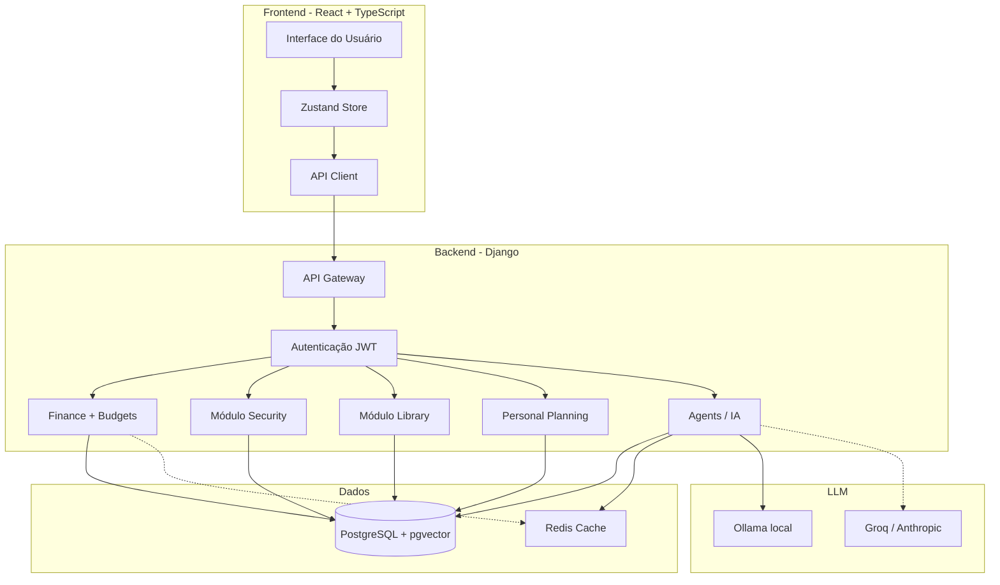

# Introdução ao Axiom

## O que é o Axiom?

Axiom é um sistema completo de gerenciamento pessoal que integra três módulos principais: **Finanças**, **Segurança** e **Biblioteca**. O sistema foi projetado para oferecer controle total sobre diferentes aspectos da vida pessoal através de uma plataforma unificada, segura e intuitiva.

## Visão Geral

O Axiom é construído como uma aplicação full-stack moderna, combinando:

- **Backend robusto** em Django REST Framework
- **Frontend responsivo** em React com TypeScript
- **Banco de dados PostgreSQL** com extensão pgvector para busca semântica
- **Assistente de IA** com tecnologia RAG (Retrieval Augmented Generation)

## Módulos Principais

### 1. Módulo Finance (ExpenseLit)

Sistema completo de gestão financeira pessoal que permite:

- Gerenciamento de contas bancárias e cartões de crédito
- Controle detalhado de despesas (22 categorias) e receitas (10 categorias)
- Sistema de empréstimos e transferências
- Dashboard com visualizações e métricas financeiras
- Categorização automática de transações
- Criptografia de dados sensíveis (CVV, números de conta)

### 2. Módulo Budgets

Controle orçamentário mensal integrado às despesas:

- Criação de orçamentos por categoria e período
- Monitoramento de consumo em tempo real
- Sugestão automática de orçamentos baseada no histórico
- Alertas visuais ao se aproximar do limite

### 3. Módulo Personal Planning

Planejamento pessoal e produtividade:

- Rotinas recorrentes com geração automática de instâncias
- Metas pessoais com acompanhamento de progresso
- Reflexões diárias e anotações

### 4. Módulo Bank Reconciliation

Conciliação bancária via importação de extratos:

- Parser de arquivos OFX 1.x SGML e CSV
- Detecção automática de duplicatas por hash SHA-256
- Auto-matching com despesas/receitas existentes

### 5. Módulo Security (StreamFort)

Gerenciador seguro de credenciais e informações confidenciais:

- Armazenamento criptografado de senhas
- Gestão segura de cartões de crédito
- Credenciais bancárias protegidas
- Arquivos confidenciais com criptografia
- Sistema de auditoria e logs de atividade
- Organização por categorias e tags

### 6. Módulo Library (CodexDB)

Biblioteca pessoal digital com recursos avançados:

- Catálogo completo de livros
- Gestão de autores e editoras
- Resumos de leitura com busca semântica (pgvector RAG)
- Controle de progresso de leitura
- Metadados completos (ISBN, ano, páginas)
- Sistema de avaliações e notas

### 7. Módulo Agents (IA Conversacional)

Assistente de IA especializado em domínios financeiros e pessoais:

- 6 agentes especializados: finanças, orçamento, projeção, planejamento, biblioteca, insights
- Suporte a 3 providers de LLM: Ollama (local), Groq e Anthropic Claude
- Respostas em streaming (SSE) ou modo síncrono
- Memória de sessão via Redis + histórico permanente no PostgreSQL
- RAG via pgvector para o `LibraryAgent`

## Tecnologias Core

### Backend

- **Django 5.2.12** - Framework web principal
- **Django REST Framework 3.16.1** - API RESTful
- **PostgreSQL 16** com **pgvector** - Banco de dados
- **Ollama** - LLM local (padrão: `mistral:7b-instruct`, embeddings: `nomic-embed-text` 768 dims)
- **Groq / Anthropic** - Providers cloud alternativos via `LLM_PROVIDER`
- **Cryptography (Fernet)** - Criptografia de dados

### Frontend

- **React 19** - Biblioteca UI
- **TypeScript 5.9** - Tipagem estática
- **Vite 7** - Build tool e dev server
- **TailwindCSS 3** - Framework CSS
- **Radix UI** - Componentes primitivos acessíveis
- **Zustand** - Gerenciamento de estado global
- **React Router v7** - Roteamento
- **Framer Motion** - Animações
- **Recharts** - Visualização de dados
- **TanStack Query v5** - Cache e sincronização de dados do servidor
- **Zod** - Validação de formulários (com React Hook Form)

### Infraestrutura

- **Docker & Docker Compose** - Containerização
- **Nginx** - Proxy reverso e servidor de assets do frontend
- **MinIO** - Armazenamento de objetos (mídia)
- **Sentry** - Error tracking (frontend, via `VITE_SENTRY_DSN`)
- **Prometheus** - Coleta de métricas (via django-prometheus)
- **JWT** - Autenticação baseada em tokens (HttpOnly cookies)

## Arquitetura de Alto Nível

## Principais Características

### Segurança

- **Criptografia end-to-end** para dados sensíveis usando Fernet
- **Autenticação JWT** com tokens armazenados em HttpOnly cookies
- **Sistema de permissões** granular baseado no Django
- **Logs de auditoria** para ações críticas
- **Soft delete** preservando histórico de dados
- **Validações robustas** em todas as camadas

### Performance

- **Índices otimizados** no banco de dados
- **Lazy loading** de componentes no frontend
- **Embeddings locais** sem dependência de APIs externas
- **Cache estratégico** para dados frequentemente acessados
- **Queries otimizadas** com select_related e prefetch_related

### Usabilidade

- **Interface responsiva** que se adapta a qualquer dispositivo
- **Tema dark mode** (Dracula) por padrão
- **Traduções em português** para toda a interface
- **Feedback visual** em todas as ações
- **Navegação intuitiva** com sidebar e breadcrumbs

### Manutenibilidade

- **Código limpo** seguindo padrões PEP8 e clean code
- **Tipagem forte** em TypeScript
- **Arquitetura modular** com separação de responsabilidades
- **Documentação completa** em português
- **Testes automatizados** backend (pytest) e frontend (Vitest)

## Público-Alvo

O Axiom é ideal para:

- Indivíduos que buscam controle financeiro detalhado
- Profissionais que necessitam gerenciar múltiplas credenciais
- Leitores que desejam organizar sua biblioteca pessoal
- Usuários que valorizam privacidade e segurança de dados
- Pessoas que querem centralizar informações pessoais em um único lugar

## Próximos Passos

Para começar a usar o Axiom, consulte:

- [Guia de Instalação](../development/installation.md)
- [Configuração Inicial](../development/configuration.md)
- [Arquitetura do Sistema](../architecture/overview.md)

## Suporte e Comunidade

- **Documentação**: Este repositório de documentação
- **Issues**: GitLab Issues (repositório interno)
- **Email**: tarcisio.ribeiro.1840@hotmail.com

## Licença

Este projeto está sob a licença MIT. Consulte o arquivo LICENSE para mais detalhes.
